# RepoAtlas

RepoAtlas turns unfamiliar codebases into evidence-backed Candidate Briefs for interviews, take-homes, and open-source contribution prep.

## Problem It Solves

Candidates, new contributors, and reviewers often explore repositories ad hoc. They jump between the README, entrypoints, tests, configuration, and large files without a clear reading order or a defensible explanation of what they found.

RepoAtlas compresses that process into a structured brief. It analyzes repository files without executing project code, ranks useful starting points, identifies risk signals, and turns those findings into interview-ready talking points with references back to the analyzed evidence.

## Demo

RepoAtlas currently runs locally:

1. Download or create a zip of a repository.
2. Start RepoAtlas and upload the zip.
3. Open the Candidate Brief tab.
4. Review the repo summary, reading path, interview talking points, first PR plan, and evidence references.
5. Explore the supporting Folder Map, Architecture Map, Start Here, Danger Zones, and Run & Contribute tabs.
6. Export the complete report as Markdown, PDF, or PNG.

Screenshots coming soon.

## Features

- **Candidate Brief**: deterministic interview-prep output built from analyzed repository signals
- **Evidence-backed repo summary**: describes only what the available files and analysis support
- **Ranked reading path**: prioritizes docs, entrypoints, routes, and central modules
- **Interview talking points**:
  - Walk me through this codebase
  - What are the riskiest areas?
  - What would you improve first?
  - How would you contribute in your first week?
- **First PR plan**: three scoped contribution ideas based on docs, commands, CI, warnings, architecture, tests, and danger-zone signals
- **Resume and LinkedIn bullets**: concise descriptions of the RepoAtlas analysis without invented product impact
- **Evidence references and confidence notes**: connect generated statements to files, commands, docs, CI, architecture, scores, and warnings
- **Folder Map**: recursive repository tree
- **Architecture Map**: interactive ELK-based dependency graph with pan and zoom
- **Start Here**: deterministic onboarding priority with explanations
- **Danger Zones**: risk-ranked files using size, coupling, complexity, and test-proximity signals
- **Run & Contribute**: detected `package.json` scripts, key docs, and CI configuration
- **Export**: Markdown, PDF, and PNG reports including the Candidate Brief

Deep language analysis currently supports TypeScript/JavaScript, Python, and Java.

## How It Works

1. The user uploads a repository zip.
2. `POST /api/analyze` saves the upload to a temporary path.
3. The ingest layer extracts the repository into a temporary workspace.
4. The indexing pipeline collects the folder tree, file metadata, language hints, key docs, CI configs, and `package.json` scripts.
5. Supported language packs analyze imports, entrypoints, complexity proxies, and test proximity.
6. Scoring produces the Start Here ranking and Danger Zones.
7. A deterministic Candidate Brief builder repackages those signals into interview-prep output with evidence references.
8. The report is stored as JSON and the API returns a report ID.
9. The UI fetches the stored report and renders the report tabs and export controls.

No AI model or API key is required.

## Candidate Brief Output

The stored report includes an optional `candidate_brief` object. Its shape is similar to:

```json
{
  "repo_summary": {
    "headline": "A concise evidence-backed orientation",
    "plain_english": "A summary based on detected repository signals",
    "primary_evidence": ["start-1", "risk-1", "arch-1"],
    "confidence": "high"
  },
  "reading_path": [
    {
      "order": 1,
      "path": "README.md",
      "why": "root README documentation",
      "evidence_refs": ["start-1"]
    }
  ],
  "interview_talking_points": {
    "walk_me_through_codebase": {},
    "riskiest_areas": {},
    "improve_first": {},
    "first_week_contribution": {}
  },
  "first_pr_plan": [],
  "resume_bullets": [],
  "evidence_refs": [],
  "warnings": []
}
```

This is an example schema, not output claimed from a specific external repository.

## Tech Stack

- Next.js 14 App Router
- React 18
- TypeScript 5
- Tailwind CSS
- ELK.js for graph layout
- `react-zoom-pan-pinch` for architecture navigation
- Vitest for tests
- `html2canvas` and jsPDF for PNG/PDF export
- Mermaid syntax in Markdown architecture exports
- `adm-zip` for zip extraction
- Vercel Blob as optional report storage when `BLOB_READ_WRITE_TOKEN` is configured

## Architecture

```mermaid
flowchart LR
    Upload["Upload zip"] --> API["POST /api/analyze"]
    API --> Ingest["Extract repository"]
    Ingest --> Index["Index files, docs, CI, commands"]
    Index --> Packs["TS/JS, Python, Java packs"]
    Packs --> Scoring["Start Here + Danger Zones"]
    Scoring --> Brief["Deterministic Candidate Brief"]
    Brief --> Storage["Filesystem or Vercel Blob"]
    Storage --> ReportAPI["GET /api/reports/:id"]
    ReportAPI --> UI["Report tabs"]
    UI --> Export["Markdown / PDF / PNG"]
```



The analyzer runs in-process as TypeScript. Local reports are stored under `reports/` unless another `REPORTS_DIR` is configured. Vercel deployments require Blob storage configuration.

## Setup

Requirements:

- Node.js 18+
- npm 9+

```bash
npm install
npm run dev
```

Open `http://localhost:3000`.

Run verification separately:

```bash
npm test
npm run build
```

## How To Use

1. Zip the repository you want to inspect. A GitHub repository can be downloaded through `Code -> Download ZIP`.
2. Open RepoAtlas locally.
3. Select the zip and click **Analyze Repository**.
4. Wait for the analyzer to produce and store the report.
5. Start with **Candidate Brief**:
   - use the repo summary for a plain-language orientation
   - follow the reading path through the highest-priority files
   - rehearse the interview talking points
   - review the three proposed first PR ideas
   - inspect evidence IDs before repeating a claim
6. Use the supporting tabs to inspect the underlying folder, architecture, score, command, doc, and CI signals.
7. Export the report as Markdown, PDF, or PNG.

The primary UI flow is zip upload. JSON `{ "zipRef": "..." }` input remains available for local testing and CLI-style use.

## Key Technical Decisions

- **Deterministic v1 instead of AI**: interview claims are generated from measured repository signals, avoiding an unconstrained rewrite layer that could hallucinate.
- **Evidence references instead of generic summaries**: Candidate Brief sections cite evidence IDs that resolve to files, commands, docs, CI, architecture facts, scores, or warnings.
- **Local zip upload instead of required GitHub authentication**: the main workflow works without OAuth or private-repository credentials.
- **Portable report export**: the same Candidate Brief can be reviewed in the UI or exported as an interview-prep artifact.
- **No repository code execution**: RepoAtlas reads files as static input and does not run the analyzed project's scripts.
- **Graceful degradation**: unsupported languages still receive the universal folder/docs/CI layer, while warnings explain missing deep analysis.

## Limits

- RepoAtlas does not execute the analyzed repository.
- It is not a vulnerability scanner and does not claim that danger-zone files contain bugs.
- It is not a full semantic code-understanding engine.
- Deep analysis is currently focused on TypeScript/JavaScript, Python, and Java.
- Candidate Brief quality depends on the files, docs, commands, imports, tests, and configuration available in the uploaded repository.
- Run-command extraction currently reads `package.json` scripts only.
- Architecture graphs are reduced to folder or package level and capped for readability.
- Upload size is limited to approximately 100 MB, indexing is capped at 10,000 files, directory depth is capped at 10, and analysis is limited to 120 seconds.
- An optional AI rewrite layer is future work, not current behavior.

## Future Work

- Extract run commands from Makefile, `pyproject.toml`, `pom.xml`, `build.gradle`, and README instructions
- Improve test coverage and test-gap signals
- Add an optional AI rewrite layer that can only rewrite statements linked to evidence references
- Add screenshots and a short demo video
- Improve the existing internal GitHub URL ingestion path before exposing it as a primary UI workflow

## API

Implemented routes:

| Method | Endpoint | Purpose |
| --- | --- | --- |
| `POST` | `/api/analyze` | Accept multipart zip upload or JSON `zipRef`; returns `{ reportId }` |
| `GET` | `/api/reports/:id` | Return a stored report |
| `GET` | `/api/reports/:id/export/md` | Return the report as downloadable Markdown |

## Testing

Fixture repositories cover TypeScript, Python, Java, Maven, and docs-only cases.

```bash
npm test
```

The suite covers language packs, scoring, deterministic Candidate Brief generation, ingest behavior, report APIs, and Markdown export.

## License

RepoAtlas is licensed under the MIT License. See [LICENSE](LICENSE).
