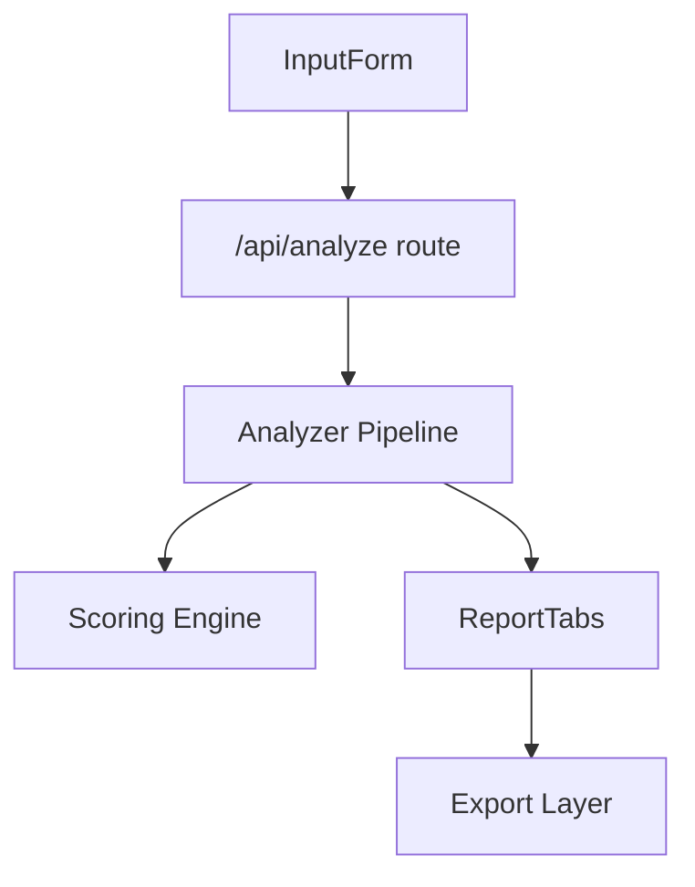

<!-- Generated from buildSampleReport() in src/lib/buildSampleReport.ts — bundled sample output, not from a live deployment. -->

# Example Candidate Brief (sample output)

RepoAtlas produces deterministic, evidence-backed Candidate Briefs **without AI**. This file shows the Markdown export shape for the bundled homepage sample report (`repo-atlas`).

---

# Repo Analysis: repo-atlas

- **Source**: https://github.com/owner/repo-atlas
- **Branch**: main
- **Analyzed**: 2026-02-14T12:34:00Z

## Candidate Brief

### Repo Summary

repo-atlas appears to be a Next.js application

Evidence-backed Candidate Briefs for interviews and onboarding \(extracted from README.md\). RepoAtlas also found 3 reading candidates, 2 risk-ranked files, and 3 run commands.

- **Confidence**: high
- **Primary evidence**: `start-1`, `risk-1`, `arch-1`, `cmd-1`, `doc-1`

### Reading Path

| Order | Path | Why | Evidence |
|-------|------|-----|----------|
| 1 | `README.md` | Project scope, setup, and quick start for onboarding. | `start-1` |
| 2 | `src/app/page.tsx` | Main app shell, UX, and report wiring. | `start-2` |
| 3 | `src/app/api/analyze/route.ts` | Entry point for analysis and report generation. | `start-3` |

### Interview Talking Points

### Walk me through this codebase

Walk through the repository from the ranked reading path, then connect that path to run commands, docs, and the architecture graph. Keep the explanation tied to detected files and commands.

- **Confidence**: high
- Start with \`README.md\`, \`src/app/page.tsx\`, \`src/app/api/analyze/route.ts\` because those files were ranked by deterministic reading signals.
- Use \`npm run dev\`, \`npm run build\` to understand the available run workflow.
- Reference \`README.md\`, \`docs/guardrails.md\` for onboarding or contribution context.
- Describe the architecture as 6 graph nodes and 5 graph edges from supported import/dependency analysis.
- **Evidence**: `start-1`, `start-2`, `start-3`, `cmd-1`, `cmd-2`, `doc-1`, `doc-2`, `arch-1`

### What are the riskiest areas?

The riskiest areas are the top danger-zone files because they combine measurable signals such as size, fan-in, fan-out, complexity, and test proximity.

- **Confidence**: high
- src/analyzer/scoring.ts: risk 82; Dense logic with multiple weighted heuristics and branching.
- src/analyzer/packs/tsjs.ts: risk 76; High fan-out and parser-like control flow patterns.
- **Evidence**: `risk-1`, `risk-2`

### What tradeoffs does this repository contain?

The repository directly shows Next.js, Tailwind CSS, Vitest as technical choices. These are defensible places to discuss tradeoffs, but the files do not prove why maintainers chose them or what alternatives they rejected.

- **Confidence**: high
- framework: Next.js. The evidence supports the choice itself, not its motivation or runtime effect.
- styling: Tailwind CSS. The evidence supports the choice itself, not its motivation or runtime effect.
- testing: Vitest. The evidence supports the choice itself, not its motivation or runtime effect.
- **Evidence**: `sample-decision-package`

### What would you improve first?

Improve the repository through small, evidence-backed changes: clarify how to run it, tighten contribution guidance, or add coverage around risk-ranked files.

- **Confidence**: medium
- Verify and document the detected run commands: The report found run commands; a realistic first PR is to confirm they work and improve nearby setup notes if the current docs are thin.
- Add or expand contributor guidance: No CONTRIBUTING guide was detected. A focused first PR can clarify setup, test commands, and how contributors should validate changes.
- Map behavior around src/analyzer/scoring.ts: The top danger-zone file is a useful place to add clarifying tests or notes after reading its callers and dependencies.
- **Evidence**: `cmd-1`, `cmd-2`, `cmd-3`, `doc-1`, `doc-2`, `risk-1`

#### Extra preparation

### How would you contribute in your first week?

In the first week, use the reading path to build context, validate the run workflow, inspect the highest-risk files, and propose one small documentation, test, or validation PR.

- **Confidence**: high
- Day 1: read \`README.md\` and the next ranked files.
- Validate the detected command path: \`npm run dev\`, \`npm run build\`.
- Review the top risk-ranked file: \`src/analyzer/scoring.ts\`.
- Open with a scoped PR idea: Verify and document the detected run commands.
- **Evidence**: `start-1`, `start-2`, `cmd-1`, `cmd-2`, `risk-1`, `cmd-1`, `cmd-2`, `cmd-3`, `doc-1`, `doc-2`

### First PR Plan

- **Verify and document the detected run commands** (low risk): The report found run commands; a realistic first PR is to confirm they work and improve nearby setup notes if the current docs are thin. Suggested files: `README.md`, `docs/guardrails.md`. Evidence: `cmd-1`, `cmd-2`, `cmd-3`, `doc-1`, `doc-2`.
- **Add or expand contributor guidance** (low risk): No CONTRIBUTING guide was detected. A focused first PR can clarify setup, test commands, and how contributors should validate changes. Suggested files: `README.md`, `docs/guardrails.md`. Evidence: `doc-1`, `doc-2`, `cmd-1`, `cmd-2`.
- **Map behavior around src/analyzer/scoring.ts** (medium risk): The top danger-zone file is a useful place to add clarifying tests or notes after reading its callers and dependencies. Suggested files: `src/analyzer/scoring.ts`. Evidence: `risk-1`.

### Resume / LinkedIn Bullets

- **resume**: Analyzed repo-atlas with RepoAtlas-style static signals, mapping 3 reading candidates, 2 risk-ranked files, 3 run commands, and 6 architecture nodes into an interview-ready technical brief. Evidence: `start-1`, `start-2`, `risk-1`, `risk-2`, `cmd-1`, `arch-1`.
- **linkedin**: Analyzed repo-atlas with RepoAtlas-style static signals, mapping 3 reading candidates, 2 risk-ranked files, 3 run commands, and 6 architecture nodes into an interview-ready technical brief. Evidence: `start-1`, `start-2`, `risk-1`, `risk-2`, `cmd-1`, `arch-1`.

### Candidate Brief Warnings

_No Candidate Brief warnings._

### Evidence References

- `arch-1` - architecture: Architecture graph summary; 6 nodes and 5 edges detected from supported import/dependency analysis.
- `sample-decision-package` - decision: Technical decision source: package.json; path=package.json; Bundled sample manifest used for deterministic technical-decision detection.
- `start-1` - start\_here: Reading candidate: README.md; path=README.md; Priority 95: Project scope, setup, and quick start for onboarding.
- `start-2` - start\_here: Reading candidate: src/app/page.tsx; path=src/app/page.tsx; Priority 90: Main app shell, UX, and report wiring.
- `start-3` - start\_here: Reading candidate: src/app/api/analyze/route.ts; path=src/app/api/analyze/route.ts; Priority 86: Entry point for analysis and report generation.
- `risk-1` - danger\_zone: Risk candidate: src/analyzer/scoring.ts; path=src/analyzer/scoring.ts; Risk 82: Dense logic with multiple weighted heuristics and branching.
- `risk-2` - danger\_zone: Risk candidate: src/analyzer/packs/tsjs.ts; path=src/analyzer/packs/tsjs.ts; Risk 76: High fan-out and parser-like control flow patterns.
- `cmd-1` - command: Run command: npm run dev; command=npm run dev; Source: package.json; Start dev server
- `cmd-2` - command: Run command: npm run build; command=npm run build; Source: package.json; Build for production
- `cmd-3` - command: Run command: npm run test; command=npm run test; Source: package.json; Run test suite
- `doc-1` - doc: Project document: README.md; path=README.md
- `doc-2` - doc: Project document: docs/guardrails.md; path=docs/guardrails.md
- `ci-1` - ci: CI config: .github/workflows/ci.yml; path=.github/workflows/ci.yml

## Folder Map

- **src**/
  - **src/app**/
    - src/app/page.tsx
    - src/app/layout.tsx
    - **src/app/api**/
      - src/app/api/analyze/route.ts
  - **src/analyzer**/
    - src/analyzer/index.ts
    - src/analyzer/scoring.ts
  - **src/components**/
    - src/components/InputForm.tsx
    - src/components/ReportTabs.tsx

## Architecture

## Start Here

| Path | Score | Signals |
|------|-------|---------|
| `README.md` | 95 | Project scope, setup, and quick start for onboarding. |
| `src/app/page.tsx` | 90 | Main app shell, UX, and report wiring. |
| `src/app/api/analyze/route.ts` | 86 | Entry point for analysis and report generation. |

## Danger Zones

| Path | Score | Breakdown |
|------|-------|----------|
| `src/analyzer/scoring.ts` | 82 | Dense logic with multiple weighted heuristics and branching. |
| `src/analyzer/packs/tsjs.ts` | 76 | High fan-out and parser-like control flow patterns. |

## Run & Contribute

### Run Commands

- `npm run dev` (from package.json) - Start dev server
- `npm run build` (from package.json) - Build for production
- `npm run test` (from package.json) - Run test suite

### Key Docs

- README.md
- docs/guardrails.md

### CI Configs

- .github/workflows/ci.yml
