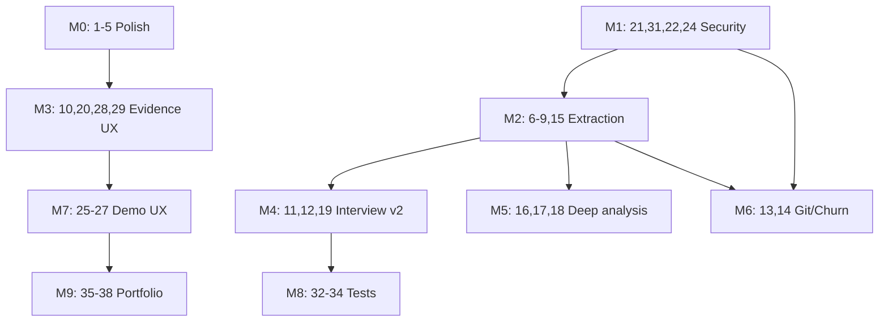

# RepoAtlas Roadmap

Evidence-backed Candidate Briefs for interviews, take-homes, and open-source contribution prep — without AI.

This document maps improvement items **1–38** to concrete files, dependencies, acceptance criteria, and suggested PR sequence. Work is grouped into **milestones** that can ship incrementally; you do not need to implement everything at once.

**Related docs:** [spec.md](./spec.md) (engineering spec), [guardrails.md](./guardrails.md) (constraints)

---

## Table of Contents

- [Current State](#current-state)
- [Items at a Glance (1–38)](#items-at-a-glance-138)
- [Integration Choke Points](#integration-choke-points)
- [Guiding Principles](#guiding-principles)
- [Policy Decisions](#policy-decisions)
- [Spec Sync Checklist](#spec-sync-checklist)
- [Implementation Workflow](#implementation-workflow)
- [Milestone Overview](#milestone-overview)
- [M0 — Product Polish (1–5)](#m0--product-polish-15)
- [M1 — Security & Reliability (21, 31, 22, 24)](#m1--security--reliability-21-31-22-24)
- [M2 — Evidence Extraction v1 (6–9, 15)](#m2--evidence-extraction-v1-69-15)
- [M3 — Evidence UX (10, 20, 28, 29)](#m3--evidence-ux-10-20-28-29)
- [M4 — Interview Content v2 (11, 12, 19)](#m4--interview-content-v2-11-12-19)
- [M5 — Deep Analysis (16, 17, 18)](#m5--deep-analysis-16-17-18)
- [M6 — History & Churn (13, 14)](#m6--history--churn-13-14)
- [M7 — Platform UX (23, 25–27, 30)](#m7--platform-ux-23-2527-30)
- [M8 — Test Matrix (32, 33, 34)](#m8--test-matrix-32-33-34)
- [M9 — Portfolio (35–38)](#m9--portfolio-3538)
- [Schema Evolution](#schema-evolution)
- [Suggested PR Sequence](#suggested-pr-sequence)
- [Commit & Push Checkpoints](#commit--push-checkpoints)
- [Deferred & Future Items](#deferred--future-items)
- [Out of Scope](#out-of-scope)
- [Risk Register](#risk-register)
- [Definition of Done](#definition-of-done)
- [Changelog](#changelog)

---

## Current State

RepoAtlas already has a working analysis pipeline and Candidate Brief layer:

```
Zip / zipRef → POST /api/analyze → ingest → pipeline → language packs → scoring → interview builder → storage → UI + export
```

| Area | Status | Key files |
|------|--------|-----------|
| Candidate Brief types | Done | `src/types/report.ts` |
| Deterministic brief builder | Done | `src/analyzer/interview.ts` |
| Candidate Brief UI (first tab) | Done | `src/components/CandidateBriefPanel.tsx`, `ReportTabs.tsx` |
| Markdown export | Done | `src/lib/export.ts` |
| Run commands | Partial | `src/analyzer/pipeline.ts` — `package.json` scripts only |
| Zip extraction | Partial | `src/lib/ingest.ts` — `extractAllTo`, 100MB limit, no traversal checks |
| Project type / purpose | Missing | Heuristics in `scoring.ts` / packs only |
| Source snippets | Missing | Evidence refs are file paths only |
| Commit / churn | Missing | Homepage mentions churn; `scoring.ts` does not compute it |
| README positioning | Stale | Describes "Repo Brief" for onboarding; omits Candidate Brief |
| Landing page (`page.tsx`) | Stale | "What you get" cards omit Candidate Brief; Danger Zones claims "churn" |
| `docs/spec.md` | Stale | No `candidate_brief` in data model; still says "Repo Brief" |
| Demo sample | Partial | `SAMPLE_REPORT` in `page.tsx` lacks `candidate_brief` |
| E2E tests | Missing | Vitest only |
| PDF/PNG export | Raster only | `html2canvas` + `jspdf` snapshots — not structured PDF |
| Analysis timeout | Hard fail | `analyze/route.ts` uses `Promise.race` → 504; no partial report saved today |
| GitHub URL ingest | Legacy | `ingest.ts` supports GitHub archive download; UI is zip-primary |
| Legacy reports | No versioning | `candidate_brief` optional on `Report`; old JSON loads without brief |

**Candidate Brief already ships (do not rebuild):**

| Section | Source in `interview.ts` |
|---------|--------------------------|
| Repo summary | `buildRepoSummary()` — signal counts today; purpose extraction is item 8 |
| Reading path | `buildReadingPath()` from Start Here |
| Talking points (×4) | walkthrough, risk, improve-first, first-week |
| First PR plan (×3) | `buildFirstPrPlan()` |
| Resume / LinkedIn bullets | `buildResumeBullets()` |
| Evidence index | `buildEvidenceIndex()` |
| Confidence notes | `buildCandidateWarnings()` + per-answer `confidenceFor()` |

**Core insight:** The brief builder (`buildCandidateBrief`) synthesizes everything from `startHere`, `dangerZones`, `runCommands`, `contributeSignals`, `architecture`, and `warnings`. New report-level fields (`project_profile`, etc.) must be threaded through `src/analyzer/index.ts` into `BuildCandidateBriefInput` — not only added to `Report`.

---

## Guiding Principles

1. **Evidence first** — Every new claim in Candidate Brief must trace to an `EvidenceRef` (ideally with line snippets after item 15).
2. **Deterministic only** — No LLM calls; templates plus extracted signals.
3. **Naming contract**
   - **Candidate Brief** — interview-facing output (tab, export section, filenames)
   - **Repo Analysis** — raw maps, scores, architecture (other tabs)
   - Retire **Repo Brief** and **Interview Mode**
4. **Do not overpromise** — Remove or gate marketing copy (e.g. "churn") until the signal exists.
5. **Security before scale** — Zip hardening (21) before optional git ingest modes (13).
6. **Spec stays canonical** — Any behavior, schema, API, or limit change updates `docs/spec.md` in the same PR (see [Spec Sync Checklist](#spec-sync-checklist)).
7. **Commit often, push often** — Small checkpoints with tests green; see [Implementation Workflow](#implementation-workflow).
8. **Guardrails-aligned** — Follow `docs/guardrails.md` §6 (evidence-only), §9 (documented scoring formulas), §12 (fixture tests for parsers/scoring).

---

## Items at a Glance (1–38)

Quick reference. See milestone sections for files, acceptance criteria, and checkpoints.

| # | Item | Milestone | PR |
|---|------|-----------|-----|
| 1 | README + landing positioning | M0 | PR-1 |
| 2 | Rename Repo Brief → Candidate Brief / Repo Analysis | M0 | PR-1 |
| 3 | Better fallback messages | M0 | PR-1 |
| 4 | Interview microcopy | M0 | PR-2 |
| 5 | Copy buttons | M0 | PR-2 |
| 6 | Command extraction beyond package.json | M2 | PR-5, PR-6 |
| 7 | Project type detection | M2 | PR-7 |
| 8 | Project purpose evidence | M2 | PR-7 |
| 9 | Technical decision detector | M2 | PR-8 |
| 10 | Evidence UI (scroll, groups, used-by) | M3 | PR-9 |
| 11 | Project walkthrough script (tiered) | M4 | PR-11 |
| 12 | Behavioral interview hooks | M4 | PR-11 |
| 13 | Commit history (optional git/GitHub) | M6 | PR-15 |
| 14 | Churn × risk scoring | M6 | PR-15 |
| 15 | Source snippets in evidence | M2 | PR-8 |
| 16 | Symbol extraction | M5 | PR-12 |
| 17 | Test inventory | M5 | PR-10 |
| 18 | Architecture boundary analysis | M5 | PR-16 |
| 19 | Interview question generator | M4 | PR-12 |
| 20 | Explainable confidence | M3 | PR-9 |
| 21 | Zip extraction hardening | M1 | PR-3 |
| 22 | Timeout + partial reports | M1 | PR-13 |
| 23 | Report cleanup / TTL | M7 | PR-17 |
| 24 | Binary / generated-file filtering | M1 | PR-4 |
| 25 | Analysis progress stages | M7 | PR-13 |
| 26 | Sample analyze button | M7 | PR-14, PR-2b |
| 27 | Screenshot / demo mode | M7 | PR-14 |
| 28 | Side-by-side answer vs evidence | M3 | PR-9 |
| 29 | Better export filenames | M3 | PR-9 |
| 30 | Report sharing | M7 | PR-17 (later) |
| 31 | Malicious zip tests | M1 | PR-3 |
| 32 | Fixture repos by type | M8 | PR-18 |
| 33 | Candidate Brief snapshots | M8 | PR-7+, PR-18 |
| 34 | Playwright smoke tests | M8 | PR-18 |
| 35 | Real screenshots | M9 | PR-19 |
| 36 | Demo GIF / video | M9 | PR-19 |
| 37 | "No AI required" positioning | M0 | PR-1 |
| 38 | "What we will not claim" | M9 | PR-19 |

---

## Integration Choke Points

When adding signals, touch these files in order:

```
1. src/types/report.ts          — schema
2. src/analyzer/*.ts            — extract / compute
3. src/analyzer/index.ts        — wire into analyzeRepository()
4. src/analyzer/interview.ts    — extend BuildCandidateBriefInput + builders
5. src/components/*             — render
6. src/lib/export.ts            — markdown
7. docs/spec.md                 — if behavior/schema changed
8. *.test.ts                    — unit + integration
```

**`BuildCandidateBriefInput` today** (`interview.ts`): `repoName`, `startHere`, `dangerZones`, `runCommands`, `contributeSignals`, `architecture`, `warnings`. New fields (profile, purpose, decisions, test inventory) should extend this interface so the brief builder can consume them without reading global report state.

**Pack outputs** (`tsjs.ts`, `python.ts`, `java.ts`): return `testFiles`, import graphs, entrypoints — aggregate at `index.ts` rather than duplicating in interview.ts.

---

## Policy Decisions

Resolve these before implementing the referenced items. Document the chosen option in `docs/spec.md` when it changes enforced behavior.

| Topic | Current state | Decision to make | Recommended default |
|-------|---------------|------------------|---------------------|
| **Zip compressed limit** | 100 MB upload (`analyze/route.ts`, `ingest.ts`) | Keep 100 MB or lower | Keep 100 MB compressed |
| **Zip uncompressed limit** | Not enforced; spec says 50 MB | Enforce on extract | **50 MB cumulative uncompressed** (per spec) |
| **Zip library** | `adm-zip` + `extractAllTo` | `yauzl` (spec) vs hardened `adm-zip` | **Harden `adm-zip` first** (no new dep); revisit `yauzl` if streaming needed |
| **Extract error code** | `CLONE_FAILED` 502 on bad extract | Align with spec | **`ZIP_INVALID` 400** corrupt/invalid; **`REPO_TOO_LARGE` 413** bomb limits; traversal → 400 |
| **Export PDF** | Raster screenshot | Structured PDF later? | Out of scope for 1–38; note in portfolio screenshots (35) |
| **Blob access** | `access: "public"` in `storage.ts` | Sharing model | **Private blob + signed URL** before item 30 ships |

---

## Spec Sync Checklist

Per `docs/guardrails.md`, `docs/spec.md` is canonical. When a roadmap PR changes behavior, update the spec in the **same PR**:

| Change type | Update in `docs/spec.md` |
|-------------|--------------------------|
| `Report` / `CandidateBrief` fields | §7 Data Models — add field + example JSON |
| New error codes | Error tables + API reference |
| Zip limits / validation | §Zip Upload Strategy + security table |
| New API routes (`DELETE`, share) | Route table + request/response |
| Candidate Brief as product output | §1 Product Summary, §2 UX tab list |
| Scoring formula (churn, etc.) | Scoring / Danger Zones section |
| `BuildCandidateBriefInput` changes | Document new brief inputs in §7 or analyzer section |

Also update `README.md` when user-facing workflow, tabs, or limits change. Pure UI copy changes (item 4) may skip spec updates per guardrails §3.

---

## Implementation Workflow

Use **frequent bite-sized commits** and **push after every 1–3 commits** on feature branches. Do not batch an entire milestone into one commit.

### Branch naming

```
cursor/<short-description>-176d
```

### Commit message format

```
type(scope): imperative summary
```

Types: `docs`, `feat`, `fix`, `test`, `refactor`, `chore`. Scopes: `readme`, `ingest`, `analyzer`, `brief`, `ui`, `api`, `export`.

### Push rules

1. **Push after each checkpoint** below, or after every 2–3 related commits.
2. Run `npm run test` before push when touching `src/analyzer/**`, `src/lib/ingest.ts`, or API routes.
3. Run `npm run lint` before opening/updating a PR.
4. Use `git push -u origin <branch>` on first push; plain `git push` after.

### Verification commands

```bash
npm run test          # Vitest — required before analyzer/ingest/API pushes
npm run lint          # Before PR ready for review
npm run build         # After schema or Next.js changes
npm run dev           # Manual UI check for items 4, 5, 10, 27
```

### PR checklist (from guardrails §13)

Each implementation PR should state:

- **Scope:** UI-only / API-only / analyzer-only / mixed
- **Roadmap items:** e.g. `items 6, 24`
- **What / why / how tested**
- **Spec updated:** yes/no + section

### Snapshot stability (items 33+)

Reports include `repo_metadata.analyzed_at` and generated IDs. Snapshot tests should:

- Normalize or strip volatile fields before compare
- Assert structure + key phrases, not full JSON dumps, until golden files are stable
- Pin evidence ref IDs only when builder ID scheme is stable

### Checkpoint sizing

| Good checkpoint | Too large |
|-----------------|-----------|
| One parser (e.g. Makefile commands) | All of item 6 |
| One UI section microcopy | Entire Candidate Brief panel |
| One security test case + fixture | Full zip hardening without tests |
| Schema field + builder + test | M2 in a single commit |

### PR hygiene

- One roadmap PR (PR-1 … PR-19) per branch when possible.
- Draft PR early after first push; update description as checkpoints land.
- Mark item checkboxes in commit bodies: `roadmap: item 6 (Makefile parser)`.

---

## Milestone Overview

| Milestone | Items | Theme | Outcome |
|-----------|-------|-------|---------|
| **M0** | 1–5 | Product polish | Story, naming, microcopy, copy UX |
| **M1** | 21, 31, 22, 24 | Security & reliability | Safe ingest, partial reports, consistent filtering |
| **M2** | 6–9, 15 | Evidence extraction v1 | Commands, project type, purpose, decisions, snippets |
| **M3** | 10, 20, 28, 29 | Evidence UX | Trustworthy, navigable evidence |
| **M4** | 11, 12, 19 | Interview content v2 | Walkthrough script, behavioral hooks, questions |
| **M5** | 16, 17, 18 | Deep analysis | Symbols, tests, architecture boundaries |
| **M6** | 13, 14 | History & churn | Optional git modes, churn × risk |
| **M7** | 23, 25–27, 30 | Platform UX | Progress, demo, cleanup, sharing |
| **M8** | 32–34 | Test matrix | Fixtures, snapshots, Playwright |
| **M9** | 35–38 | Portfolio | Screenshots, demo media, trust positioning |

**Recommended ship order:** M0 → M1 → M2 → M3 → M4 → (M5 ∥ M6) → M7 → M8 → M9

M8 can start earlier (item 31 with M1; item 33 after M2/M4).

**Highest-leverage first slice:** M0 + M1 + M2 through items 6–8, plus **PR-2b** (preview mock brief).

**Quick trust fixes in PR-1:** Remove false "churn" copy on landing; align `docs/spec.md` with Candidate Brief.

**Parallel tracks after PR-3:** PR-4 (ignore rules) can proceed in parallel with PR-5 once zip hardening merges.

### Milestone readiness (exit criteria)

| Milestone | Ship when |
|-----------|-----------|
| M0 | PR-1 + PR-2 merged; landing/README/spec aligned |
| M1 | PR-3 + PR-4 merged; malicious zip tests green |
| M2 | PR-5–8 merged; `repo-python`/`repo-java-maven` commands; profile on `repo-ts` |
| M3 | PR-9 merged; evidence scroll + confidence reasons |
| M4 | PR-11–12 merged; walkthrough + questions on `repo-ts` fixture |
| M5 | PR-10 + PR-16 merged (or PR-12 for symbols) |
| M6 | PR-15 merged; churn gated on `commit_insights` |
| M7 | PR-14 merged; sample button works on Vercel |
| M8 | PR-18 merged; Playwright smoke green in CI |
| M9 | PR-19 merged; README screenshots + trust section |

---

## M0 — Product Polish (1–5)

### 1. Fix README positioning

**Goal:** README sells Candidate Brief as the primary outcome.

**Files**

- `README.md` — hero, features, usage tabs, export, how-it-works
- `src/app/page.tsx` — hero, "What you get" cards (add Candidate Brief card), How it works
- `docs/spec.md` — product definition, data model example, tab list
- `src/app/layout.tsx` — metadata description

**Changes**

- Top line: *"RepoAtlas turns unfamiliar codebases into evidence-backed Candidate Briefs for interviews, take-homes, and open-source contribution prep."*
- Add Candidate Brief to feature list, tab list, export section, architecture flow, **and landing page feature cards**.
- Document naming: Candidate Brief vs Repo Analysis.
- Cross-link this roadmap.
- **Trust fix (can land in same PR):** remove "churn" from Danger Zones card on `page.tsx` until item 14 ships (see guiding principle 4).

**Acceptance**

- README mentions Candidate Brief in at least four sections.
- Landing page includes a Candidate Brief feature card.
- Tab list matches `src/components/ReportTabs.tsx` (Candidate Brief is first).
- No contradiction with zip-primary workflow.
- `docs/spec.md` §1 and §2 mention Candidate Brief.

**Depends on:** nothing  
**Enables:** 35–38

---

### 2. Rename "Repo Brief" consistently

**Goal:** Single vocabulary across UI, export, API, and docs.

**Files**

- `src/lib/export.ts` — title `# Repo Analysis: {name}`; keep `## Candidate Brief` subsection
- `src/components/ReportTabs.tsx` — heading, export filenames
- `src/app/api/reports/[id]/export/md/route.ts` — `Content-Disposition`
- `src/app/page.tsx` — marketing copy
- Tests: `src/lib/export.test.ts`, `src/app/api/reports/reports-api.integration.test.ts`, export route tests
- `README.md`, `docs/spec.md`

**Naming rules**

| Context | Label |
|---------|-------|
| Interview tab & export section | Candidate Brief |
| Full report / other tabs | Repo Analysis |
| Deprecated | Repo Brief, Interview Mode |

**Acceptance**

- No user-facing "Repo Brief" strings remain (or one explicit deprecation note).
- All tests updated.

**Depends on:** 1  
**Enables:** 29, 35

---

### 3. Improve empty/fallback messages

**Goal:** Actionable guidance when `candidate_brief` is missing.

**Files**

- `src/components/CandidateBriefPanel.tsx` (lines 94–99)

**Note:** `ReportDocument.tsx` delegates to `CandidateBriefPanel` — no separate fallback to update.

**Target copy**

> Candidate Brief is not available for this report. Re-run analysis with the latest analyzer, or check whether the repository has supported source files, docs, and run commands.

**Acceptance**

- Preview and stale reports show new copy.
- Message does not use retired term "interview-mode".

**Depends on:** nothing (can ship before item 2)  
**Enables:** 26, 34

---

### 4. Add "why this matters" microcopy

**Goal:** Each section frames interview use.

**Files**

- `src/components/CandidateBriefPanel.tsx` — subtitle under each `Section`
- `src/components/StartHereTable.tsx`
- `src/components/DangerZonesTable.tsx`
- `src/components/RunContributeSection.tsx`
- `src/lib/export.ts` — optional one-line intros in markdown export

**Examples**

| Section | Microcopy |
|---------|-----------|
| Reading Path | Use this to decide what to review first before an interview. |
| Interview Talking Points | Ready-made answers tied to evidence in this repo. |
| First PR Plan | Use this to explain how you would contribute after joining a team. |
| Danger Zones tab | Prepare for questions about tradeoffs and future improvements. |
| Run & Contribute | Validate how you'd run and test the project locally. |

**Acceptance**

- Every Candidate Brief section and Start Here / Danger Zones tabs have interview-oriented helper text (one sentence each).

**Depends on:** 2  
**Enables:** 27, 35

---

### 5. Add copy buttons

**Goal:** One-click copy for job-search outputs.

**Files**

- New `src/components/CopyButton.tsx`
- `src/components/CandidateBriefPanel.tsx`:
  - Resume bullet (`audience: resume`)
  - LinkedIn bullet (`audience: linkedin`)
  - `walk_me_through_codebase` answer
  - `first_week_contribution` answer

**Acceptance**

- Four copy targets work in modern browsers.
- Graceful fallback if `navigator.clipboard` is denied.
- Optional: same buttons on `ReportDocument.tsx` export canvas.

**Depends on:** 4  
**Enables:** 35, 36

---

## M1 — Security & Reliability (21, 31, 22, 24)

### 21. Fix zip extraction hardening

**Goal:** Safe extraction aligned with `docs/spec.md` Zip Upload Strategy.

**Files**

- `src/lib/ingest.ts` — replace naive `extractAllTo` (lines ~300, ~389)
- New `src/lib/safeZipExtract.ts` (recommended isolated module)
- `src/lib/errors.ts` — emit `ZIP_INVALID` (code exists but is unused today)

**Implementation checklist**

- [ ] Validate magic bytes `PK\x03\x04` / `PK\x05\x06`
- [ ] Reject `..`, absolute paths, drive prefixes
- [ ] Resolve each entry under extract root (path jail)
- [ ] Reject symlinks if the library exposes them
- [ ] Max cumulative uncompressed size (**50 MB** per spec — see [Policy Decisions](#policy-decisions))
- [ ] Max file count (align with pipeline cap: 10,000)
- [ ] Max single-file uncompressed size
- [ ] Return **`ZIP_INVALID` 400** for corrupt/invalid zip; **400** for path traversal (not `CLONE_FAILED` 502)
- [ ] Clean up temp dir on any rejection

**Library note:** Prefer hardened `adm-zip` wrapper first (no new dependency per guardrails). Revisit `yauzl` if streaming/bomb detection requires it. Record choice in spec.

**Spec sync:** Update `docs/spec.md` §Zip Upload Strategy and error tables.

**Acceptance**

- Malicious zips never write outside temp root.
- Valid fixture zips still analyze successfully.

**Depends on:** nothing — prioritize early  
**Enables:** 13 Mode A, 26 sample zip upload

---

### 31. Security tests for malicious zips

**Goal:** Regression suite for item 21.

**Files**

- `src/lib/ingest.test.ts` or `src/lib/safeZipExtract.test.ts`
- `fixtures/zips/` — minimal evil zips (generated in test or checked in)

**Test cases**

- `../../../evil.txt` path traversal
- Absolute path entries
- Oversized uncompressed (zip bomb pattern)
- Too many entries
- Corrupted / non-zip with `.zip` extension
- Nested zip bomb pattern

**Acceptance**

- All cases expect typed `AppError`, not uncaught exceptions.
- Runs in CI via `npm run test`.

**Depends on:** 21 — ship in same PR when possible

---

### 22. Server-side timeout and partial report behavior

**Goal:** On timeout, return useful partial output when safe.

**Current behavior:** `src/app/api/analyze/route.ts` wraps `analyzeRepository()` in `Promise.race` at 120s. On timeout → **504 `TIMEOUT`**, no report persisted. Partial reports require refactoring the analyzer to checkpoint before the race rejects.

**Files**

- `src/app/api/analyze/route.ts` — `MAX_ANALYSIS_TIME_MS = 120_000`
- `src/analyzer/index.ts` — staged analysis with checkpoint `Report` builder
- `src/types/report.ts` — `partial?: boolean` or warning convention
- `src/lib/errors.ts` — partial success vs hard fail

**Behavior**

| Failure | Response |
|---------|----------|
| Zip / security fail | No report, 4xx |
| Timeout after folder map | 200 + `reportId`, warnings, partial sections |
| Timeout before any output | 504 TIMEOUT |

**Checkpoint stages**

1. Metadata + folder map  
2. Run commands + docs  
3. Language packs + architecture  
4. Scoring  
5. Candidate Brief  

**Acceptance**

- Integration test: slow stage → partial report saved.
- UI shows timeout warning in Confidence Notes.

**Depends on:** 21  
**Enables:** 25

---

### 24. Improve binary and generated-file filtering

**Goal:** One shared skip list across pipeline and packs.

**Files**

- New `src/analyzer/ignoreRules.ts`
- `src/analyzer/pipeline.ts` — folder walk
- `src/analyzer/packs/tsjs.ts`, `python.ts`, `java.ts`

**Skip targets**

- `dist`, `.next`, `coverage`, `build`, `target`
- `node_modules`, `vendor`, `.git`
- Images, fonts, videos, minified `*.min.js`
- Lockfiles: optional parse for deps, skip content indexing

**Acceptance**

- Fixture analysis ignores `.next` if present.
- Packs import shared `shouldSkipPath()`.

**Depends on:** nothing  
**Enables:** 6, 15, 16

---

## M2 — Evidence Extraction v1 (6–9, 15)

### 6. Command extraction beyond package.json

**Goal:** Interview-useful run/test commands from many sources.

**Files**

- `src/analyzer/pipeline.ts` — expand `extractRunCommands()`
- New `src/analyzer/commands/` modules:
  - `makefile.ts`
  - `python.ts` — pyproject, Poetry, Pipfile
  - `java.ts` — pom.xml, build.gradle
  - `docker.ts` — docker-compose.yml
  - `readme.ts` — fenced bash blocks, common patterns
- `src/types/report.ts` — expand `RunCommand.source`
- `src/analyzer/integration.test.ts`

**Parser priority**

1. `package.json` (existing)
2. `Makefile`
3. `pyproject.toml` / `setup.py`
4. `pom.xml` / `build.gradle`
5. `docker-compose.yml`
6. README fences (tag `source: "README"`, lower confidence)

**Acceptance**

- `fixtures/repo-python` yields non–package.json commands.
- `fixtures/repo-java-maven` yields Maven commands.
- Commands deduped by normalized string.

**Depends on:** 24  
**Enables:** 7, 8, 11, 17

---

### 7. Project type detection

**Goal:** Explicit `project_profile` on report with evidence-backed label.

**Files**

- New `src/analyzer/projectType.ts`
- `src/types/report.ts` — new optional field (see [Schema Evolution](#schema-evolution))
- `src/analyzer/index.ts`
- `src/analyzer/interview.ts` — `buildRepoSummary()`
- `src/components/CandidateBriefPanel.tsx`

**Rule examples**

| Type | Signals |
|------|---------|
| Next.js app | `src/app/**/page.tsx`, `next` dependency |
| React SPA | `react`, no `next`, Vite or `src/App.tsx` |
| Node API | `express` / `fastify`, routes dir |
| FastAPI | `fastapi` dep, `FastAPI()` in entry |
| Django | `manage.py`, `django` dep |
| Spring Boot | `@SpringBootApplication` |
| library/package | bin/main only, no app entry |
| docs-only | no code files, README present |

**Acceptance**

- Summary states type **because** of specific files/deps.
- Conflicting signals → `confidence: low`, no false label.

**Depends on:** 24 (can start after PR-4; soft dependency on 6 for richer commands)  
**Enables:** 9, 11, 19

---

### 8. Project purpose evidence (extracted, not inferred)

**Goal:** Purpose from docs/metadata only — never guessed.

**Files**

- New `src/analyzer/purpose.ts`
- `src/types/report.ts` — `project_purpose` field
- `src/analyzer/pipeline.ts`
- `src/analyzer/interview.ts` — replace signal-count paragraph in `buildRepoSummary()` when purpose exists

**Extractors**

- README first `# heading`
- README first non-empty paragraph (max ~500 chars)
- `package.json` `description`
- `pyproject.toml` `description`

**Acceptance**

- No README/description → omit purpose, keep current fallback.
- Markdown attributes source ("Extracted from README").

**Depends on:** 24  
**Enables:** 11, 19, 20

---

### 9. Technical decision detector

**Goal:** "Technical decisions detected" list for project interviews.

**Files**

- New `src/analyzer/decisions.ts`
- `src/types/report.ts` — `technical_decisions[]`
- `src/analyzer/interview.ts`
- `src/components/CandidateBriefPanel.tsx`

**Categories**

| Category | Signals |
|----------|---------|
| Framework | deps, `next.config.js`, Django files |
| Database | prisma, sqlalchemy, `DATABASE_URL` in `.env.example` |
| Auth | next-auth, passport |
| Deployment | vercel.json, Dockerfile, railway.json, render.yaml |
| Testing | vitest, jest, pytest, junit |
| Styling | tailwind.config, styled-components |

**Acceptance**

- Self-analysis of RepoAtlas lists Next.js, Tailwind, Vitest, etc.
- Each decision has at least one evidence ref.
- Missing category omitted, not guessed.

**Depends on:** 6, 7  
**Enables:** 11, 12, 19

---

### 15. Real source snippets

**Goal:** Evidence refs include line-bounded excerpts.

**Files**

- New `src/analyzer/snippets.ts`
- `src/types/report.ts` — extend `EvidenceRef` with `line_start`, `line_end`, `snippet`
- `src/analyzer/pipeline.ts` / packs
- `src/components/CandidateBriefPanel.tsx`
- `src/lib/export.ts`

**Snippet sources (v1)**

- README intro
- package.json scripts block
- Import lines for top architecture edges
- Entrypoint signatures
- Danger zone file header (first N lines)

**Limits:** max 5 lines or 300 chars; never snippet `.env` secrets.

**Acceptance**

- Evidence cards show `path:line` + excerpt.
- Integration test asserts snippet on README fixture.

**Depends on:** 24  
**Enables:** 10, 28, 33

---

## M3 — Evidence UX (10, 20, 28, 29)

### 10. Improve Evidence UI

**Goal:** Evidence feels auditable and navigable.

**Files**

- `src/components/CandidateBriefPanel.tsx`
- New `src/lib/evidenceIndex.ts` — reverse map `evidenceId → usedBySections[]`
- Optional `src/components/EvidenceSection.tsx`

**Features**

- Click evidence badge → scroll to `#evidence-{id}` card
- Evidence cards grouped by `kind`: docs, commands, architecture, risk, warnings
- "Used by" chips on each card
- Tooltip shows path, detail, snippet (after 15)

**Depends on:** 15  
**Enables:** 27, 28

---

### 20. Confidence model with reasons

**Goal:** Explainable confidence, not just high/medium/low.

**Files**

- `src/analyzer/interview.ts` — replace `confidenceFor()` with `buildConfidenceAssessment()`
- `src/types/report.ts` — `confidence_assessment`
- `src/components/CandidateBriefPanel.tsx` — "Why confidence is medium" expandable

**Rubric (deterministic)**

| Increases confidence | Decreases confidence |
|---------------------|----------------------|
| README exists | No README |
| Run commands found | No commands |
| Supported language pack ran | Unsupported language only |
| Architecture edges > 0 | Zero edges |
| Tests detected | Many warnings |
| Purpose extracted | Docs-only / empty repo |

**Note on item 17:** Until `test_inventory` ships (item 17), confidence uses pack-level `testFiles` Sets already computed in language packs — not the user-facing test inventory section.

**Depends on:** 6, 8; uses pack `testFiles` until 17  
**Enables:** 38

---

### 28. Side-by-side "answer vs evidence"

**Goal:** Make "evidence-backed" visually obvious.

**Files**

- `src/components/CandidateBriefPanel.tsx`
- New `src/components/BriefSectionSplit.tsx`

**Layout:** left = generated answer; right = evidence cards for that section. Desktop-first; mobile stacks with "View evidence" toggle (avoid dense split on small screens).

**Depends on:** 10, 15  
**Enables:** 27, 35

---

### 29. Better export filenames

**Goal:** Professional, shareable filenames.

**Files**

- `src/components/ReportTabs.tsx`
- `src/app/api/reports/[id]/export/md/route.ts`
- New `src/lib/exportNames.ts`

**Pattern:** `repoatlas-candidate-brief-{slug(repoName)}-{YYYY-MM-DD}.md` (and matching `.pdf` / `.png` from `ReportTabs.tsx`)

**Acceptance**

- Client PDF/PNG and server MD use consistent slug + date.
- Slug strips path separators and unsafe characters.

**Depends on:** 2  
**Enables:** 35, 36

---

## M4 — Interview Content v2 (11, 12, 19)

### 11. Project Walkthrough Script

**Goal:** Tiered speakable scripts for "tell me about this project."

**Relationship to existing talking points:** Item 11 **extends** — does not replace — `interview_talking_points.walk_me_through_codebase`. Talking points remain Q&A blocks with bullets and evidence. Walkthrough script is **tiered narrative** (30s / 2min / deep) optimized for speaking aloud in an interview.

**Files**

- `src/analyzer/interview.ts` — `buildWalkthroughScript()`
- `src/types/report.ts` — `walkthrough_script`
- `src/components/CandidateBriefPanel.tsx`
- `src/lib/export.ts`

**Sections**

- 30-second version
- 2-minute version
- Deep technical walkthrough
- Tradeoffs to mention
- What I would improve next

**Template inputs:** project_profile, project_purpose, technical_decisions, reading path, architecture, commands, top danger zones.

**Acceptance**

- Low confidence → subsection says "Not enough evidence".
- Copy buttons on 30s and 2min (extends item 5).

**Depends on:** 7, 8, 9, 6  
**Enables:** 19, 36

---

### 12. Behavioral Interview Hooks

**Goal:** STAR-style prompts grounded in repo evidence.

**Files**

- `src/analyzer/interview.ts` — `buildBehavioralHooks()`
- `src/types/report.ts` — `behavioral_hooks[]`
- `src/components/CandidateBriefPanel.tsx`

**Hooks**

- Challenge I solved
- Tradeoff I made
- What I learned
- What I would do differently
- How I debugged/validated

**Acceptance**

- `sufficient_evidence: false` → show "Not enough evidence", no fabricated narrative.
- True hooks cite at least two evidence refs.
- Snapshot denylist includes unsupported first-person claims ("I led", "we decided") unless quoted from README.

**Depends on:** 9, 11; pack `testFiles` until 17  
**Enables:** 19, 33

---

### 19. Interview question generator (deterministic)

**Goal:** Practice questions an interviewer might ask.

**Files**

- New `src/analyzer/questions.ts`
- `src/types/report.ts` — `interview_questions[]`
- `src/components/CandidateBriefPanel.tsx`
- `src/lib/export.ts`

**Example templates**

- "Why is analysis in `src/analyzer` instead of API routes?"
- "How does the app avoid executing uploaded code?"
- "What makes `{path}` a Danger Zone?"
- "How would you improve test coverage around `{untestedRiskFile}`?"
- "What are the limits of static analysis here?"

**Acceptance**

- 5–10 questions when confidence ≥ medium.
- No question without `evidence_refs`.

**Depends on:** 7, 9, 11; 18 optional for layer questions  
**Enables:** 33, 36

---

## M5 — Deep Analysis (16, 17, 18)

### 16. Symbol extraction

**Goal:** Name real surfaces — components, routes, classes.

**Files**

- Extend `src/analyzer/packs/tsjs.ts`, `python.ts`, `java.ts`
- `src/types/report.ts` — `symbols[]`
- `src/analyzer/interview.ts` — deep walkthrough section

**v1:** regex/heuristic, not full AST. Cap at 50 symbols; rank by fan-in or start_here overlap.

**Optional for item 11:** feed `walkthrough_script.deep_technical` with top symbols when present.

**Depends on:** 24  
**Enables:** 11 (deep section), 19

---

### 17. Test inventory

**Goal:** User-facing test picture beyond `test_proximity` in danger zones.

**Files**

- New `src/analyzer/testInventory.ts` — aggregate pack `testFiles` (already computed in packs)
- `src/types/report.ts` — `test_inventory`
- `ReportTabs.tsx` or Candidate Brief subsection
- `src/analyzer/interview.ts` — sharpen `first_pr_plan`

**Fields**

- test_file_count, frameworks detected
- tested_areas, untested_high_risk_files
- suggested_test_targets

**Depends on:** packs, 6  
**Enables:** 12, 19, 20

---

### 18. Dependency and architecture boundary analysis

**Goal:** Architecture tab explains structure, not just a graph.

**Files**

- New `src/analyzer/boundaries.ts`
- `src/types/report.ts` — `architecture_insights`
- `src/analyzer/packs/tsjs.ts` (primary)
- `src/components/ElkArchitectureGraph.tsx`

**TS/JS v1**

- Layer heuristics: app → components → lib
- Cross-layer import violations
- Circular dependencies (SCC)
- Hub nodes (high fan-in)

**Effort:** High — defer until M2/M4 stable.

**Depends on:** packs, 16  
**Enables:** 19

---

## M6 — History & Churn (13, 14)

### 13. Commit history analysis (optional modes)

**Goal:** Historical context when git or GitHub API is available.

**Files**

- `src/lib/ingest.ts` — mode detection
- New `src/analyzer/gitHistory.ts` — local `.git`
- New `src/lib/githubCommits.ts` — API client
- `src/types/report.ts` — `commit_insights`
- `src/app/api/analyze/route.ts` — optional `githubToken`, `mode`
- `src/analyzer/interview.ts`

**Mode A: local folder with `.git`**

- Commit count, churn per file, co-change pairs, commit message themes

**Mode B: GitHub URL + optional token**

- Extend existing `ingestFromGithub()` in `src/lib/ingest.ts` (downloads archive today; add commit API separately)
- Recent commits via API, file change frequency
- No private repos without token
- UI remains zip-primary; expose Mode B via API/query param only unless product scope expands

**Zip upload default:** `commit_insights: null` with warning that history is unavailable.

**Depends on:** 21  
**Enables:** 14, 19

---

### 14. Churn × Risk scoring

**Goal:** Danger zones reflect recent change plus structural risk.

**Files**

- `src/analyzer/scoring.ts` — `computeDangerZones()`
- `src/types/report.ts` — `metrics.churn`
- `src/app/page.tsx` — churn copy removed in PR-1; **re-add here only with** `commit_insights` gate
- `src/components/DangerZonesTable.tsx`

**Guardrails §9:** Document the full formula in a code comment and update `docs/spec.md` when weights change.

**Example formula**

```
risk = 0.18*size + 0.22*fan_in + 0.18*fan_out + 0.22*complexity
     + 0.10*weak_test + 0.10*churn_percentile
```

**Acceptance**

- Without git: identical to current behavior (churn weight 0).
- Breakdown string mentions churn when non-zero.

**Depends on:** 13  
**Enables:** 11, 12, 19

---

## M7 — Platform UX (23, 25–27, 30)

### 23. Old report cleanup

**Goal:** Storage does not grow unbounded.

**Files**

- `src/lib/storage.ts` — `deleteReport`, `listReports`, TTL sweep
- `src/app/api/reports/[id]/route.ts` — add `DELETE`
- Optional `src/app/api/cron/cleanup/route.ts`
- `README.md`

**Suggested policy**

- TTL: 30 days local, 7 days Blob (env-configurable)
- Max reports: 100 per instance
- Max report JSON: 5 MB
- UI warning when local storage is ephemeral

**Enables:** 30

---

### 25. Analysis progress stages

**Goal:** Replace generic loading with staged progress.

**Files**

- `src/components/InputForm.tsx`
- Analyze route — SSE, status polling, or client-side stage simulation

**Stages:** Uploading → Extracting → Folder map → Languages → Risk → Candidate Brief → Saving

**Depends on:** 22 for accurate server progress

---

### 26. "Analyze RepoAtlas sample" button

**Goal:** Zero-friction demo.

**Files**

- `src/app/page.tsx`
- `public/sample.zip` — bundled static zip (preferred for production), **or** dedicated `POST /api/analyze/sample` route
- Fix `SAMPLE_REPORT` to include full `candidate_brief` for read-only preview mode

**Production path (choose one)**

| Option | Pros | Cons |
|--------|------|------|
| **A: `public/sample.zip`** | No server filesystem; works on Vercel | Must commit generated zip; keep in sync with fixtures |
| **B: Pre-saved report ID** | Instant load; no analyze cost | Stale until regenerated |
| **C: `zipRef` to fixture** | Simple locally | Breaks in production |

**Recommended:** Option A for "Analyze sample" + Option B for homepage preview mock.

**Acceptance**

- One click produces real report ID with populated Candidate Brief.
- Works in production without local filesystem `zipRef` paths.
- Preview mock (`SAMPLE_REPORT`) shows full brief without empty state.

**Depends on:** 3; M2 improves quality  
**Enables:** 34, 36

---

### 27. Screenshot-ready report mode

**Goal:** One-click polished view for portfolio and demos.

**Files**

- `src/components/ReportTabs.tsx` — `demoMode` toggle
- `src/app/globals.css`

**When enabled:** hide raw evidence IDs, expand key sections, optional Candidate-Brief-only view, larger type.

**Depends on:** 10, 28, 11  
**Enables:** 35

---

### 30. Report sharing (later)

**Goal:** Read-only shareable URL without exposing uploaded source.

**Files**

- `src/app/api/reports/[id]/share/route.ts`
- `src/app/share/[token]/page.tsx`
- `storage.ts` — share metadata + expiry

**Policy:** 7-day expiry, opt-in, report JSON only — **never** retain or expose uploaded zip contents.

**Storage security:** Current Blob storage uses `access: "public"`. Before shipping sharing, migrate to **private blobs with signed URLs** (or token-gated API) so report JSON is not world-readable.

**Depends on:** 23

---

## M8 — Test Matrix (32, 33, 34)

### 32. Fixture repos by type

**New fixtures under `fixtures/`**

| Fixture | Purpose |
|---------|---------|
| `repo-nextjs` | App router, next deps — **evaluate `fixtures/repo-ts` first** (already has `src/app/page.tsx`, API routes) |
| `repo-node-api` | Express/Fastify style |
| `repo-fastapi` | FastAPI app |
| `repo-monorepo` | packages/* layout |
| `repo-no-readme` | Low-confidence path |
| `repo-docs-only` | exists — extend coverage |

**Roll out incrementally** as parsers land (item 6, 7). Extend `repo-ts` before adding `repo-nextjs` if coverage overlaps.

---

### 33. Snapshot tests for Candidate Brief

**Files**

- `src/analyzer/interview.snapshot.test.ts` or `fixtures/*/expected-brief.json`

**Assert**

- All `evidence_refs` resolve
- No unsupported claims / denylist phrases
- Reading path order stable
- First PR files exist in fixture tree
- No raw JSON in markdown export

**Depends on:** 11, 32 — **start basic snapshots after PR-7** (type + purpose), do not wait for PR-18

---

### 34. Playwright smoke tests

**Files**

- `playwright.config.ts`
- `e2e/candidate-brief.spec.ts`

**Scenarios**

- Load homepage
- Upload sample zip or click sample button (26)
- Candidate Brief tab visible
- Export MD works
- No crash when `candidate_brief` missing

**Depends on:** 26, 29

---

## M9 — Portfolio (35–38)

### 35. Real screenshots

**Assets:** `docs/images/` or `public/screenshots/`

Include: landing, Candidate Brief, Reading Path, First PR Plan, Evidence (with snippets), export preview.

**Note:** PDF/PNG export is rasterized via `html2canvas` — screenshots should capture UI directly or use demo mode (27) for polish.

**Acceptance:** Regenerate screenshots when Candidate Brief UI changes (add to release checklist).

**Depends on:** 27, M2, M3

---

### 36. 60-second demo GIF/video

**Script:** upload → Candidate Brief → Reading Path → Talking Points → export.

**Deliverable:** `docs/demo.gif` or hosted link in README.

**Depends on:** 26, 27, 35

---

### 37. "No AI required" selling point

**Files:** `README.md`, `src/app/page.tsx`

> RepoAtlas does not rely on model-generated guesses. Candidate Briefs are built from deterministic static signals and evidence references.

**Can ship in M0** (item 1).

---

### 38. "What RepoAtlas will not claim"

**Files:** `README.md`, optional footer in `CandidateBriefPanel.tsx`

**Examples**

- Will not claim a bug exists without evidence
- Will not infer business purpose unless docs say so
- Will not execute uploaded code
- Will not label something "easy" without supporting evidence

**Depends on:** 20, 8 — draft in M0, finalize after confidence model

---

## Schema Evolution

Add fields to `src/types/report.ts` incrementally. All optional for backward compatibility.

**Also extend `BuildCandidateBriefInput`** in `src/analyzer/interview.ts` when new signals feed the brief (do not rely on interview.ts reading the full `Report`).

```ts
// Extend in interview.ts as items land:
export interface BuildCandidateBriefInput {
  repoName: string;
  startHere: StartHereItem[];
  dangerZones: DangerZoneItem[];
  runCommands: RunCommand[];
  contributeSignals: ContributeSignals;
  architecture: Architecture;
  warnings: string[];
  // item 7:
  projectProfile?: Report["project_profile"];
  // item 8:
  projectPurpose?: Report["project_purpose"];
  // item 9:
  technicalDecisions?: Report["technical_decisions"];
  // item 17:
  testInventory?: Report["test_inventory"];
  // item 13:
  commitInsights?: Report["commit_insights"];
}
```

Report-level optional fields on `Report`:

```ts
// Item 7
project_profile?: {
  type: string;
  label: string;
  confidence: "high" | "medium" | "low";
  signals: string[];
  evidence_refs: string[];
};

// Item 8
project_purpose?: {
  text: string;
  source: "readme_heading" | "readme_intro" | "package.json" | "pyproject" | "app_metadata";
  path: string;
  extracted: true;
  evidence_refs: string[];
};

// Item 9
technical_decisions?: Array<{
  category: "framework" | "database" | "auth" | "deployment" | "testing" | "styling" | "storage";
  decision: string;
  signals: string[];
  evidence_refs: string[];
}>;

// Item 15 — extend EvidenceRef
line_start?: number;
line_end?: number;
snippet?: string;

// Item 20
confidence_assessment?: {
  level: "high" | "medium" | "low";
  reasons: string[];
  gaps: string[];
};

// Item 11
walkthrough_script?: {
  thirty_second: string;
  two_minute: string;
  deep_technical: string;
  tradeoffs_to_mention: string[];
  improvements_next: string[];
  evidence_refs: string[];
};

// Item 12
behavioral_hooks?: Array<{
  prompt: string;
  answer_starter: string;
  evidence_refs: string[];
  sufficient_evidence: boolean;
}>;

// Item 19
interview_questions?: Array<{
  question: string;
  rationale: string;
  evidence_refs: string[];
}>;

// Item 16
symbols?: Array<{
  name: string;
  kind: "function" | "class" | "component" | "route" | "export";
  path: string;
  line?: number;
}>;

// Item 17
test_inventory?: {
  test_file_count: number;
  frameworks: string[];
  tested_areas: string[];
  untested_high_risk_files: string[];
  suggested_test_targets: string[];
  evidence_refs: string[];
};

// Item 18
architecture_insights?: {
  layers: string[];
  violations: Array<{ from: string; to: string; reason: string }>;
  circular_deps: string[][];
  hubs: string[];
};

// Item 13
commit_insights?: {
  mode: "local_git" | "github_api" | "unavailable";
  recent_work_areas: string[];
  high_churn_files: string[];
  co_changed_pairs: Array<{ files: [string, string]; count: number }>;
  evidence_refs: string[];
};

// Item 14 — extend DangerZoneItem.metrics
churn?: number;

// Item 22
partial?: boolean;
```

---

## Suggested PR Sequence

| PR | Items | Scope | Notes |
|----|-------|-------|-------|
| PR-1 | 1, 2, 3, 37 | Docs, naming, fallback, No-AI | Include churn copy removal on `page.tsx` |
| PR-2 | 4, 5 | Microcopy, copy buttons | |
| **PR-2b** | 26 (preview only) | `SAMPLE_REPORT` + mock `candidate_brief` | Quick demo win; optional before PR-14 |
| PR-3 | 21, 31 | Zip hardening + security tests | Spec sync required |
| PR-4 | 24 | Shared ignore rules | |
| PR-5 | 6 (pt 1) | Makefile + Python commands | |
| PR-6 | 6 (pt 2) | Java + Docker + README commands | |
| PR-7 | 7, 8 | Project type + purpose | Start snapshot tests here |
| PR-8 | 9, 15 | Technical decisions + snippets | |
| PR-9 | 10, 20, 29 | Evidence UI, confidence, filenames | Item 28 may split to PR-9b if large |
| PR-10 | 17 | Test inventory | |
| PR-11 | 11, 12 | Walkthrough script + behavioral hooks | |
| PR-12 | 16, 19 | Symbols + interview questions | |
| PR-13 | 22, 25 | Partial reports + progress stages | 22 is stretch; can split |
| PR-14 | 26, 27 | Sample analyze button + demo mode | |
| PR-15 | 13, 14 | Git history + churn scoring | |
| PR-16 | 18 | Architecture boundaries | |
| PR-17 | 23, 30 | Cleanup + sharing | 30 optional / later |
| PR-18 | 32, 33, 34 | Fixtures, snapshots, Playwright | |
| PR-19 | 35, 36, 38 | Screenshots, demo media, trust section | |

**Minimum credible v1.1:** PR-1 → PR-3 → PR-5 → PR-7 → PR-2b (preview mock).

---

## Commit & Push Checkpoints

Each PR below lists **ordered checkpoints**. Complete one checkpoint → `git commit` → `git push` (every 1–3 commits). Run tests before push when noted.

### PR-1 — Docs, naming, fallback, No-AI

| # | Action | Commit message (example) | Push |
|---|--------|--------------------------|------|
| 1 | README hero + features + Candidate Brief tabs | `docs(readme): position Candidate Brief as primary output` | ✓ |
| 2 | `docs/spec.md` §1/§2 + data model `candidate_brief` | `docs(spec): add Candidate Brief to product and schema` | ✓ |
| 3 | `layout.tsx` metadata | `docs(seo): update app metadata for Candidate Brief` | ✓ |
| 4 | `page.tsx` feature cards + Candidate Brief card | `feat(ui): add Candidate Brief to landing feature cards` | ✓ |
| 5 | Remove false "churn" from Danger Zones card | `fix(ui): remove unimplemented churn claim from landing` | ✓ |
| 6 | Rename user-facing Repo Brief → Repo Analysis / Candidate Brief | `refactor(ui): align Repo Brief naming with Candidate Brief` | ✓ |
| 7 | Export titles + filenames (`export.ts`, `ReportTabs`, md route) | `refactor(export): rename Repo Brief exports to Repo Analysis` | ✓ |
| 8 | Update export + API tests | `test(export): update naming assertions` | ✓ |
| 9 | Fallback copy in `CandidateBriefPanel` | `fix(ui): improve Candidate Brief unavailable message` | ✓ |
| 10 | No-AI subsection in README + landing subline | `docs(readme): add deterministic analysis positioning` | ✓ |

### PR-2 — Microcopy + copy buttons

| # | Action | Commit message | Push |
|---|--------|----------------|------|
| 1 | `CopyButton.tsx` component | `feat(ui): add reusable CopyButton` | ✓ |
| 2 | Candidate Brief section subtitles | `feat(ui): add interview microcopy to brief sections` | ✓ |
| 3 | Start Here + Danger Zones tab helper text | `feat(ui): add interview framing to analysis tabs` | ✓ |
| 4 | Copy on resume + LinkedIn bullets | `feat(ui): add copy buttons for resume bullets` | ✓ |
| 5 | Copy on walkthrough + first-week answers | `feat(ui): add copy buttons for talking points` | ✓ |
| 6 | Markdown export section intros (optional) | `feat(export): add interview intros to brief markdown` | ✓ |

### PR-2b — Preview mock brief (quick win)

| # | Action | Commit message | Push |
|---|--------|----------------|------|
| 1 | Add realistic `candidate_brief` to `SAMPLE_REPORT` | `feat(ui): populate sample report with candidate brief` | ✓ |
| 2 | Verify preview tab renders all sections | `test(ui): assert sample brief renders in preview` | ✓ |

### PR-3 — Zip hardening + security tests

| # | Action | Commit message | Push |
|---|--------|----------------|------|
| 1 | Scaffold `safeZipExtract.ts` + magic-byte check | `feat(ingest): add zip magic-byte validation` | ✓ |
| 2 | Path traversal + jail logic | `feat(ingest): reject path traversal in zip entries` | ✓ |
| 3 | Uncompressed size + file count limits | `feat(ingest): enforce zip bomb limits` | ✓ |
| 4 | Wire into `ingest.ts`; emit `ZIP_INVALID` 400 | `feat(ingest): use safe extract and ZIP_INVALID errors` | ✓ |
| 5 | Update `docs/spec.md` limits | `docs(spec): align zip policy with implementation` | ✓ |
| 6 | Test: path traversal fixture | `test(ingest): reject zip path traversal` | ✓ |
| 7 | Test: absolute paths + corrupt zip | `test(ingest): reject malicious zip entries` | ✓ |
| 8 | Test: zip bomb / oversized | `test(ingest): reject zip bomb patterns` | ✓ |
| 9 | Test: valid fixture still extracts | `test(ingest): extract valid fixture zip` | ✓ |

### PR-4 — Shared ignore rules

| # | Action | Commit message | Push |
|---|--------|----------------|------|
| 1 | Create `ignoreRules.ts` | `feat(analyzer): add shared path ignore rules` | ✓ |
| 2 | Wire pipeline folder walk | `refactor(analyzer): use shared ignores in pipeline` | ✓ |
| 3 | Wire tsjs pack | `refactor(analyzer): use shared ignores in tsjs pack` | ✓ |
| 4 | Wire python + java packs | `refactor(analyzer): use shared ignores in python/java packs` | ✓ |
| 5 | Integration test: ignored dirs skipped | `test(analyzer): assert build artifacts ignored` | ✓ |

### PR-5 — Commands pt 1 (Makefile + Python)

| # | Action | Commit message | Push |
|---|--------|----------------|------|
| 1 | `commands/makefile.ts` parser | `feat(analyzer): extract commands from Makefile` | ✓ |
| 2 | Tests for Makefile parser | `test(analyzer): makefile command extraction` | ✓ |
| 3 | `commands/python.ts` parser | `feat(analyzer): extract commands from pyproject/pipfile` | ✓ |
| 4 | Tests for Python parser | `test(analyzer): python command extraction` | ✓ |
| 5 | Integrate into `extractRunCommands()` | `feat(analyzer): merge makefile and python commands` | ✓ |
| 6 | Integration test on `repo-python` | `test(analyzer): repo-python yields run commands` | ✓ |

### PR-6 — Commands pt 2 (Java + Docker + README)

| # | Action | Commit message | Push |
|---|--------|----------------|------|
| 1 | `commands/java.ts` parser | `feat(analyzer): extract maven/gradle commands` | ✓ |
| 2 | `commands/docker.ts` parser | `feat(analyzer): extract docker-compose commands` | ✓ |
| 3 | `commands/readme.ts` parser | `feat(analyzer): extract commands from readme fences` | ✓ |
| 4 | Dedupe + source priority | `refactor(analyzer): dedupe run commands by source priority` | ✓ |
| 5 | Integration tests java-maven + readme | `test(analyzer): java and readme command extraction` | ✓ |

### PR-7 — Project type + purpose

| # | Action | Commit message | Push |
|---|--------|----------------|------|
| 1 | Schema: `project_profile`, `project_purpose` | `feat(schema): add project profile and purpose fields` | ✓ |
| 2 | `projectType.ts` detector | `feat(analyzer): detect project type from signals` | ✓ |
| 3 | `purpose.ts` extractor | `feat(analyzer): extract purpose from readme and manifests` | ✓ |
| 4 | Wire in `analyzer/index.ts` | `feat(analyzer): attach profile and purpose to report` | ✓ |
| 5 | Update `buildRepoSummary()` | `feat(brief): use extracted purpose in repo summary` | ✓ |
| 6 | UI card in `CandidateBriefPanel` | `feat(ui): show project profile in brief` | ✓ |
| 7 | Spec + integration tests | `test(analyzer): project type and purpose on fixtures` | ✓ |
| 8 | **Snapshot v1:** basic brief golden for `repo-ts` | `test(brief): add candidate brief snapshot for repo-ts` | ✓ |

### PR-8 — Decisions + snippets

| # | Action | Commit message | Push |
|---|--------|----------------|------|
| 1 | Extend `EvidenceRef` with snippet fields | `feat(schema): add line snippets to evidence refs` | ✓ |
| 2 | `snippets.ts` reader | `feat(analyzer): extract bounded source snippets` | ✓ |
| 3 | `decisions.ts` detector | `feat(analyzer): detect technical decisions` | ✓ |
| 4 | Wire evidence + decisions into interview builder | `feat(brief): attach decisions and snippets to brief` | ✓ |
| 5 | UI: decisions list + snippet in evidence cards | `feat(ui): render decisions and snippets` | ✓ |
| 6 | Markdown export snippets | `feat(export): include snippets in markdown evidence` | ✓ |
| 7 | Tests | `test(analyzer): decisions and snippets on repo-ts` | ✓ |

### PR-9 — Evidence UI + confidence + filenames

| # | Action | Commit message | Push |
|---|--------|----------------|------|
| 1 | `evidenceIndex.ts` reverse map | `feat(brief): build evidence used-by index` | ✓ |
| 2 | Badge click → scroll to card | `feat(ui): scroll evidence badge to card` | ✓ |
| 3 | Group evidence by kind | `feat(ui): group evidence cards by kind` | ✓ |
| 4 | `buildConfidenceAssessment()` | `feat(brief): explainable confidence reasons` | ✓ |
| 5 | Confidence UI expandable | `feat(ui): show why confidence is medium` | ✓ |
| 6 | `exportNames.ts` + filename wiring | `feat(export): repoatlas-candidate-brief filenames` | ✓ |
| 7 | Tests | `test(export): assert new export filenames` | ✓ |

### PR-9b — Side-by-side evidence (optional split)

| # | Action | Commit message | Push |
|---|--------|----------------|------|
| 1 | `BriefSectionSplit.tsx` layout | `feat(ui): add answer vs evidence split layout` | ✓ |
| 2 | Wire Reading Path + talking points | `feat(ui): side-by-side evidence on brief sections` | ✓ |
| 3 | Mobile collapse toggle | `feat(ui): collapsible evidence panel on mobile` | ✓ |

### PR-10 — Test inventory

| # | Action | Commit message | Push |
|---|--------|----------------|------|
| 1 | Schema `test_inventory` | `feat(schema): add test inventory field` | ✓ |
| 2 | `testInventory.ts` aggregator | `feat(analyzer): aggregate test inventory from packs` | ✓ |
| 3 | Sharpen `first_pr_plan` with targets | `feat(brief): cite test targets in first PR ideas` | ✓ |
| 4 | UI subsection | `feat(ui): show test inventory in brief` | ✓ |
| 5 | Integration tests | `test(analyzer): test inventory on repo-ts` | ✓ |

### PR-11 — Walkthrough script + behavioral hooks

| # | Action | Commit message | Push |
|---|--------|----------------|------|
| 1 | Schema fields | `feat(schema): add walkthrough script and behavioral hooks` | ✓ |
| 2 | `buildWalkthroughScript()` | `feat(brief): tiered walkthrough script` | ✓ |
| 3 | `buildBehavioralHooks()` | `feat(brief): evidence-backed behavioral hooks` | ✓ |
| 4 | UI sections + copy buttons on 30s/2min | `feat(ui): render walkthrough and behavioral sections` | ✓ |
| 5 | Markdown export | `feat(export): export walkthrough and behavioral sections` | ✓ |
| 6 | Snapshot tests | `test(brief): snapshot walkthrough script output` | ✓ |

### PR-12 — Symbols + interview questions

| # | Action | Commit message | Push |
|---|--------|----------------|------|
| 1 | Symbol extraction in tsjs pack | `feat(analyzer): extract TS/JS symbols` | ✓ |
| 2 | Symbol extraction python + java | `feat(analyzer): extract python/java symbols` | ✓ |
| 3 | `questions.ts` generator | `feat(analyzer): deterministic interview questions` | ✓ |
| 4 | Wire into report + brief | `feat(brief): attach symbols and questions` | ✓ |
| 5 | UI + export | `feat(ui): show interview questions` | ✓ |
| 6 | Tests | `test(analyzer): interview questions have evidence refs` | ✓ |

### PR-13 — Partial reports + progress (stretch)

| # | Action | Commit message | Push |
|---|--------|----------------|------|
| 1 | Staged analyzer with partial report builder | `feat(analyzer): checkpoint partial report state` | ✓ |
| 2 | Timeout returns partial + warning | `feat(api): return partial report on timeout` | ✓ |
| 3 | Spec update | `docs(spec): document partial report behavior` | ✓ |
| 4 | Progress stages UI (client simulation OK for v1) | `feat(ui): show analysis progress stages` | ✓ |
| 5 | Integration test partial path | `test(api): partial report on timeout` | ✓ |

### PR-14 — Sample button + demo mode

| # | Action | Commit message | Push |
|---|--------|----------------|------|
| 1 | Add `public/sample.zip` | `chore(assets): add sample repo zip for demo` | ✓ |
| 2 | Sample analyze button on homepage | `feat(ui): add analyze sample button` | ✓ |
| 3 | `demoMode` toggle in ReportTabs | `feat(ui): add screenshot demo mode` | ✓ |
| 4 | Demo styles in globals.css | `feat(ui): demo mode typography and layout` | ✓ |
| 5 | E2E manual test notes in roadmap/README | `docs(roadmap): document demo flow` | ✓ |

### PR-15 — Git history + churn

| # | Action | Commit message | Push |
|---|--------|----------------|------|
| 1 | Schema `commit_insights` | `feat(schema): add commit insights field` | ✓ |
| 2 | `gitHistory.ts` local .git mode | `feat(analyzer): analyze local git history` | ✓ |
| 3 | `githubCommits.ts` API mode | `feat(ingest): fetch github commit history` | ✓ |
| 4 | Churn metric in `computeDangerZones()` | `feat(analyzer): add churn to danger zone scoring` | ✓ |
| 5 | Re-enable churn marketing copy with gate | `feat(ui): show churn only when commit insights exist` | ✓ |
| 6 | Brief historical context in interview.ts | `feat(brief): add recent work areas from git` | ✓ |
| 7 | Tests with mocked GitHub API | `test(analyzer): commit insights and churn scoring` | ✓ |

### PR-16 — Architecture boundaries

| # | Action | Commit message | Push |
|---|--------|----------------|------|
| 1 | Schema `architecture_insights` | `feat(schema): add architecture insights` | ✓ |
| 2 | `boundaries.ts` layer + SCC + hubs | `feat(analyzer): detect layer violations and cycles` | ✓ |
| 3 | Architecture tab insights panel | `feat(ui): show architecture insights` | ✓ |
| 4 | Questions use layer violations | `feat(brief): layer questions from violations` | ✓ |
| 5 | Tests on repo-ts | `test(analyzer): architecture boundary detection` | ✓ |

### PR-17 — Cleanup + sharing

| # | Action | Commit message | Push |
|---|--------|----------------|------|
| 1 | `deleteReport` + DELETE route | `feat(api): add report delete endpoint` | ✓ |
| 2 | TTL sweep helper | `feat(storage): add report TTL cleanup` | ✓ |
| 3 | README limits documentation | `docs(readme): document report retention policy` | ✓ |
| 4 | (Later) private blob migration | `feat(storage): private blobs for reports` | ✓ |
| 5 | (Later) share token route + page | `feat(api): add read-only report sharing` | ✓ |

### PR-18 — Fixtures + snapshots + Playwright

| # | Action | Commit message | Push |
|---|--------|----------------|------|
| 1 | Add `repo-no-readme` fixture | `test(fixtures): add no-readme fixture` | ✓ |
| 2 | Add `repo-fastapi` fixture | `test(fixtures): add fastapi fixture` | ✓ |
| 3 | Extend snapshot coverage per fixture | `test(brief): expand brief snapshots` | ✓ |
| 4 | Playwright config + homepage smoke | `test(e2e): add playwright smoke test` | ✓ |
| 5 | E2E sample upload flow | `test(e2e): upload sample zip and view brief` | ✓ |

### PR-19 — Portfolio

| # | Action | Commit message | Push |
|---|--------|----------------|------|
| 1 | Capture screenshots to `docs/images/` | `docs(assets): add product screenshots` | ✓ |
| 2 | Embed screenshots in README | `docs(readme): embed screenshot gallery` | ✓ |
| 3 | Add demo GIF | `docs(assets): add 60s demo gif` | ✓ |
| 4 | "What we will not claim" section | `docs(readme): add trust and limits section` | ✓ |
| 5 | Optional brief panel footer | `feat(ui): add trust footer to candidate brief` | ✓ |

---

## Deferred & Future Items

Not in the original 1–38 scope; track after M1 or when deploying publicly.

| Item | Source | Notes |
|------|--------|-------|
| **39. Rate limiting** | `docs/spec.md` — 10 req/hr | Add middleware on `POST /api/analyze`; document in spec |
| **40. `.gitattributes` language overrides** | `docs/spec.md` | Lower priority; affects language pack selection |
| **41. Structured PDF export** | Export is raster today | Replace html2canvas path if printable output needed |
| **42. Progressive SSE analysis** | Spec mentions streaming partial results | Alternative to polling; pairs with item 25 |
| **43. Overview tab enrichment** | Tab exists but is metadata-only | Surface `project_profile`, commands summary after M2 |
| **44. Report schema versioning** | `guardrails.md` §10 | `report_version` field + migration notes for stored JSON |
| **45. CI workflow** | No `.github/workflows` today | Add `npm run test` + lint on PR |

---

## Out of Scope (for items 1–38)

- LLM / AI-generated brief text
- Executing uploaded repository code
- Full SAST / vulnerability scanning
- Replacing CI/CD or live profiling
- Worker-thread analyzer refactor (unless perf requires — see guardrails §5)
- Private repo clone as primary UI flow (zip remains primary)

---

## Risk Register

| Risk | Impact | Mitigation in plan |
|------|--------|-------------------|
| Zip bomb / traversal | Critical | PR-3 (items 21, 31) before public demo |
| False marketing claims (churn) | Trust | PR-1 removes; PR-15 re-gates |
| Brief feels generic | Product | M2 extraction + M4 scripts |
| Public Blob reports | Privacy | Policy decision; private blobs before item 30 |
| Snapshot brittleness | CI noise | Snapshot stability rules; normalize dates |
| Scope creep per PR | Velocity | Checkpoints + one PR per roadmap row |
| Spec drift | Maintenance | Spec sync checklist every schema PR |
| `adm-zip` symlink gaps | Security | Document limitation; test; revisit `yauzl` |

---

## Definition of Done

RepoAtlas reaches "elite" interview-prep status when:

1. **Coherent story** — Candidate Brief-first positioning in README, landing, and exports.
2. **Provable claims** — Snippets, grouped evidence, explainable confidence.
3. **Interview-ready content** — Tiered walkthrough, behavioral hooks, generated questions.
4. **Safe ingest** — Hardened zip extraction with attack regression tests.
5. **Credible demo** — Sample analyze, screenshot mode, demo GIF.
6. **Regression-safe** — Fixture matrix, brief snapshots, Playwright smoke tests.

---

## Dependency Graph



---

## Changelog

| Date | Change |
|------|--------|
| 2026-07-08 | Initial roadmap (items 1–38) |
| 2026-07-08 | v1.1: spec sync checklist, policy decisions, review fixes, commit/push checkpoints per PR, PR-2b quick win, deferred items 39–43 |
| 2026-07-08 | v1.2: items-at-a-glance table, integration choke points, guardrails alignment, milestone exit criteria, snapshot/CI notes, out of scope, risk register, PR-9b, schema/input wiring |

*Document version: 1.2 — Last updated: 2026-07-08*
