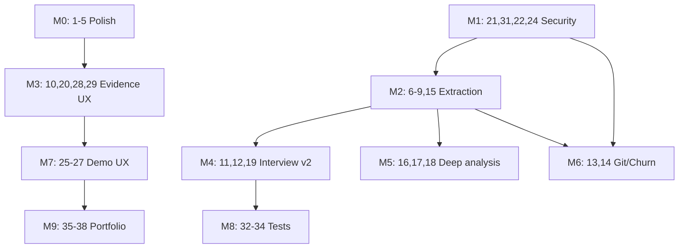

# RepoAtlas Roadmap

Evidence-backed Candidate Briefs for interviews, take-homes, and open-source contribution prep — without AI.

This document maps improvement items **1–38** to concrete files, dependencies, acceptance criteria, and suggested PR sequence. Work is grouped into **milestones** that can ship incrementally; you do not need to implement everything at once.

**Related docs:** [spec.md](./spec.md) (engineering spec), [guardrails.md](./guardrails.md) (constraints)

---

## Table of Contents

- [Current State](#current-state)
- [Guiding Principles](#guiding-principles)
- [Milestone Overview](#milestone-overview)
- [M0 — Product Polish (1–5)](#m0--product-polish-15)
- [M1 — Security & Reliability (21, 31, 22, 24)](#m1--security--reliability-21-31-22-24)
- [M2 — Evidence Extraction v1 (6–9, 15)](#m2--evidence-extraction-v1-69-15)
- [M3 — Evidence UX (10, 20, 28, 29)](#m3--evidence-ux-10-20-28-29)
- [M4 — Interview Content v2 (11, 12, 19)](#m4--interview-content-v2-11-12-19)
- [M5 — Deep Analysis (16, 17, 18)](#m5--deep-analysis-16-17-18)
- [M6 — History & Churn (13, 14)](#m6--history--churn-13-14)
- [M7 — Platform UX (23, 25–27, 30)](#m7--platform-ux-23-2527-30)
- [M8 — Test Matrix (32, 33, 34)](#m8--test-matrix-32-33-34)
- [M9 — Portfolio (35–38)](#m9--portfolio-3538)
- [Schema Evolution](#schema-evolution)
- [Suggested PR Sequence](#suggested-pr-sequence)
- [Definition of Done](#definition-of-done)

---

## Current State

RepoAtlas already has a working analysis pipeline and Candidate Brief layer:

```
Zip / zipRef → POST /api/analyze → ingest → pipeline → language packs → scoring → interview builder → storage → UI + export
```

| Area | Status | Key files |
|------|--------|-----------|
| Candidate Brief types | Done | `src/types/report.ts` |
| Deterministic brief builder | Done | `src/analyzer/interview.ts` |
| Candidate Brief UI (first tab) | Done | `src/components/CandidateBriefPanel.tsx`, `ReportTabs.tsx` |
| Markdown export | Done | `src/lib/export.ts` |
| Run commands | Partial | `src/analyzer/pipeline.ts` — `package.json` scripts only |
| Zip extraction | Partial | `src/lib/ingest.ts` — `extractAllTo`, 100MB limit, no traversal checks |
| Project type / purpose | Missing | Heuristics in `scoring.ts` / packs only |
| Source snippets | Missing | Evidence refs are file paths only |
| Commit / churn | Missing | Homepage mentions churn; `scoring.ts` does not compute it |
| README positioning | Stale | Describes "Repo Brief" for onboarding; omits Candidate Brief |
| Demo sample | Partial | `SAMPLE_REPORT` in `page.tsx` lacks `candidate_brief` |
| E2E tests | Missing | Vitest only |

**Core insight:** The brief builder (`buildCandidateBrief`) synthesizes everything from `startHere`, `dangerZones`, `runCommands`, `contributeSignals`, `architecture`, and `warnings`. Improving upstream signals improves the UI, markdown export, and PDF in one pass.

---

## Guiding Principles

1. **Evidence first** — Every new claim in Candidate Brief must trace to an `EvidenceRef` (ideally with line snippets after item 15).
2. **Deterministic only** — No LLM calls; templates plus extracted signals.
3. **Naming contract**
   - **Candidate Brief** — interview-facing output (tab, export section, filenames)
   - **Repo Analysis** — raw maps, scores, architecture (other tabs)
   - Retire **Repo Brief** and **Interview Mode**
4. **Do not overpromise** — Remove or gate marketing copy (e.g. "churn") until the signal exists.
5. **Security before scale** — Zip hardening (21) before optional git ingest modes (13).

---

## Milestone Overview

| Milestone | Items | Theme | Outcome |
|-----------|-------|-------|---------|
| **M0** | 1–5 | Product polish | Story, naming, microcopy, copy UX |
| **M1** | 21, 31, 22, 24 | Security & reliability | Safe ingest, partial reports, consistent filtering |
| **M2** | 6–9, 15 | Evidence extraction v1 | Commands, project type, purpose, decisions, snippets |
| **M3** | 10, 20, 28, 29 | Evidence UX | Trustworthy, navigable evidence |
| **M4** | 11, 12, 19 | Interview content v2 | Walkthrough script, behavioral hooks, questions |
| **M5** | 16, 17, 18 | Deep analysis | Symbols, tests, architecture boundaries |
| **M6** | 13, 14 | History & churn | Optional git modes, churn × risk |
| **M7** | 23, 25–27, 30 | Platform UX | Progress, demo, cleanup, sharing |
| **M8** | 32–34 | Test matrix | Fixtures, snapshots, Playwright |
| **M9** | 35–38 | Portfolio | Screenshots, demo media, trust positioning |

**Recommended ship order:** M0 → M1 → M2 → M3 → M4 → (M5 ∥ M6) → M7 → M8 → M9

M8 can start earlier (item 31 with M1; item 33 after M2/M4).

**Highest-leverage first slice:** M0 + M1 + M2 through items 6–8.

---

## M0 — Product Polish (1–5)

### 1. Fix README positioning

**Goal:** README sells Candidate Brief as the primary outcome.

**Files**

- `README.md` — hero, features, usage tabs, export, how-it-works
- `docs/spec.md` — product definition, data model example
- `src/app/layout.tsx` — metadata description

**Changes**

- Top line: *"RepoAtlas turns unfamiliar codebases into evidence-backed Candidate Briefs for interviews, take-homes, and open-source contribution prep."*
- Add Candidate Brief to feature list, tab list, export section, architecture flow.
- Document naming: Candidate Brief vs Repo Analysis.
- Cross-link this roadmap.

**Acceptance**

- README mentions Candidate Brief in at least four sections.
- Tab list matches `src/components/ReportTabs.tsx` (Candidate Brief is first).
- No contradiction with zip-primary workflow.

**Depends on:** nothing  
**Enables:** 35–38

---

### 2. Rename "Repo Brief" consistently

**Goal:** Single vocabulary across UI, export, API, and docs.

**Files**

- `src/lib/export.ts` — title `# Repo Analysis: {name}`; keep `## Candidate Brief` subsection
- `src/components/ReportTabs.tsx` — heading, export filenames
- `src/app/api/reports/[id]/export/md/route.ts` — `Content-Disposition`
- `src/app/page.tsx` — marketing copy
- Tests: `src/lib/export.test.ts`, `src/app/api/reports/reports-api.integration.test.ts`, export route tests
- `README.md`, `docs/spec.md`

**Naming rules**

| Context | Label |
|---------|-------|
| Interview tab & export section | Candidate Brief |
| Full report / other tabs | Repo Analysis |
| Deprecated | Repo Brief, Interview Mode |

**Acceptance**

- No user-facing "Repo Brief" strings remain (or one explicit deprecation note).
- All tests updated.

**Depends on:** 1  
**Enables:** 29, 35

---

### 3. Improve empty/fallback messages

**Goal:** Actionable guidance when `candidate_brief` is missing.

**Files**

- `src/components/CandidateBriefPanel.tsx` (lines 94–99)
- `src/components/ReportDocument.tsx` (if separate fallback exists)

**Target copy**

> Candidate Brief is not available for this report. Re-run analysis with the latest analyzer, or check whether the repository has supported source files, docs, and run commands.

**Acceptance**

- Preview and stale reports show new copy.
- Message does not use retired term "interview-mode".

**Depends on:** 2  
**Enables:** 26, 34

---

### 4. Add "why this matters" microcopy

**Goal:** Each section frames interview use.

**Files**

- `src/components/CandidateBriefPanel.tsx` — subtitle under each `Section`
- `src/components/StartHereTable.tsx`
- `src/components/DangerZonesTable.tsx`
- `src/components/RunContributeSection.tsx`
- `src/lib/export.ts` — optional one-line intros in markdown export

**Examples**

| Section | Microcopy |
|---------|-----------|
| Reading Path | Use this to decide what to review first before an interview. |
| Interview Talking Points | Ready-made answers tied to evidence in this repo. |
| First PR Plan | Use this to explain how you would contribute after joining a team. |
| Danger Zones tab | Prepare for questions about tradeoffs and future improvements. |
| Run & Contribute | Validate how you'd run and test the project locally. |

**Acceptance**

- Every Candidate Brief section and Start Here / Danger Zones tabs have interview-oriented helper text (one sentence each).

**Depends on:** 2  
**Enables:** 27, 35

---

### 5. Add copy buttons

**Goal:** One-click copy for job-search outputs.

**Files**

- New `src/components/CopyButton.tsx`
- `src/components/CandidateBriefPanel.tsx`:
  - Resume bullet (`audience: resume`)
  - LinkedIn bullet (`audience: linkedin`)
  - `walk_me_through_codebase` answer
  - `first_week_contribution` answer

**Acceptance**

- Four copy targets work in modern browsers.
- Graceful fallback if `navigator.clipboard` is denied.
- Optional: same buttons on `ReportDocument.tsx` export canvas.

**Depends on:** 4  
**Enables:** 35, 36

---

## M1 — Security & Reliability (21, 31, 22, 24)

### 21. Fix zip extraction hardening

**Goal:** Safe extraction aligned with `docs/spec.md` Zip Upload Strategy.

**Files**

- `src/lib/ingest.ts` — replace naive `extractAllTo` (lines ~300, ~389)
- New `src/lib/safeZipExtract.ts` (recommended isolated module)
- `src/lib/errors.ts` — emit `ZIP_INVALID` (code exists but is unused today)

**Implementation checklist**

- [ ] Validate magic bytes `PK\x03\x04` / `PK\x05\x06`
- [ ] Reject `..`, absolute paths, drive prefixes
- [ ] Resolve each entry under extract root (path jail)
- [ ] Reject symlinks if the library exposes them
- [ ] Max cumulative uncompressed size (align with spec: 50–100 MB)
- [ ] Max file count (align with pipeline cap: 10,000)
- [ ] Max single-file uncompressed size
- [ ] Clean up temp dir on any rejection

**Note:** `docs/spec.md` suggests `yauzl` for streaming extract; evaluate vs hardened `adm-zip` wrapper.

**Acceptance**

- Malicious zips never write outside temp root.
- Valid fixture zips still analyze successfully.

**Depends on:** nothing — prioritize early  
**Enables:** 13 Mode A, 26 sample zip upload

---

### 31. Security tests for malicious zips

**Goal:** Regression suite for item 21.

**Files**

- `src/lib/ingest.test.ts` or `src/lib/safeZipExtract.test.ts`
- `fixtures/zips/` — minimal evil zips (generated in test or checked in)

**Test cases**

- `../../../evil.txt` path traversal
- Absolute path entries
- Oversized uncompressed (zip bomb pattern)
- Too many entries
- Corrupted / non-zip with `.zip` extension
- Nested zip bomb pattern

**Acceptance**

- All cases expect typed `AppError`, not uncaught exceptions.
- Runs in CI via `npm run test`.

**Depends on:** 21 — ship in same PR when possible

---

### 22. Server-side timeout and partial report behavior

**Goal:** On timeout, return useful partial output when safe.

**Files**

- `src/app/api/analyze/route.ts` — `MAX_ANALYSIS_TIME_MS = 120_000`
- `src/analyzer/index.ts` — staged analysis with checkpoint `Report` builder
- `src/types/report.ts` — `partial?: boolean` or warning convention
- `src/lib/errors.ts` — partial success vs hard fail

**Behavior**

| Failure | Response |
|---------|----------|
| Zip / security fail | No report, 4xx |
| Timeout after folder map | 200 + `reportId`, warnings, partial sections |
| Timeout before any output | 504 TIMEOUT |

**Checkpoint stages**

1. Metadata + folder map  
2. Run commands + docs  
3. Language packs + architecture  
4. Scoring  
5. Candidate Brief  

**Acceptance**

- Integration test: slow stage → partial report saved.
- UI shows timeout warning in Confidence Notes.

**Depends on:** 21  
**Enables:** 25

---

### 24. Improve binary and generated-file filtering

**Goal:** One shared skip list across pipeline and packs.

**Files**

- New `src/analyzer/ignoreRules.ts`
- `src/analyzer/pipeline.ts` — folder walk
- `src/analyzer/packs/tsjs.ts`, `python.ts`, `java.ts`

**Skip targets**

- `dist`, `.next`, `coverage`, `build`, `target`
- `node_modules`, `vendor`, `.git`
- Images, fonts, videos, minified `*.min.js`
- Lockfiles: optional parse for deps, skip content indexing

**Acceptance**

- Fixture analysis ignores `.next` if present.
- Packs import shared `shouldSkipPath()`.

**Depends on:** nothing  
**Enables:** 6, 15, 16

---

## M2 — Evidence Extraction v1 (6–9, 15)

### 6. Command extraction beyond package.json

**Goal:** Interview-useful run/test commands from many sources.

**Files**

- `src/analyzer/pipeline.ts` — expand `extractRunCommands()`
- New `src/analyzer/commands/` modules:
  - `makefile.ts`
  - `python.ts` — pyproject, Poetry, Pipfile
  - `java.ts` — pom.xml, build.gradle
  - `docker.ts` — docker-compose.yml
  - `readme.ts` — fenced bash blocks, common patterns
- `src/types/report.ts` — expand `RunCommand.source`
- `src/analyzer/integration.test.ts`

**Parser priority**

1. `package.json` (existing)
2. `Makefile`
3. `pyproject.toml` / `setup.py`
4. `pom.xml` / `build.gradle`
5. `docker-compose.yml`
6. README fences (tag `source: "README"`, lower confidence)

**Acceptance**

- `fixtures/repo-python` yields non–package.json commands.
- `fixtures/repo-java-maven` yields Maven commands.
- Commands deduped by normalized string.

**Depends on:** 24  
**Enables:** 7, 8, 11, 17

---

### 7. Project type detection

**Goal:** Explicit `project_profile` on report with evidence-backed label.

**Files**

- New `src/analyzer/projectType.ts`
- `src/types/report.ts` — new optional field (see [Schema Evolution](#schema-evolution))
- `src/analyzer/index.ts`
- `src/analyzer/interview.ts` — `buildRepoSummary()`
- `src/components/CandidateBriefPanel.tsx`

**Rule examples**

| Type | Signals |
|------|---------|
| Next.js app | `src/app/**/page.tsx`, `next` dependency |
| React SPA | `react`, no `next`, Vite or `src/App.tsx` |
| Node API | `express` / `fastify`, routes dir |
| FastAPI | `fastapi` dep, `FastAPI()` in entry |
| Django | `manage.py`, `django` dep |
| Spring Boot | `@SpringBootApplication` |
| library/package | bin/main only, no app entry |
| docs-only | no code files, README present |

**Acceptance**

- Summary states type **because** of specific files/deps.
- Conflicting signals → `confidence: low`, no false label.

**Depends on:** 6, language packs  
**Enables:** 9, 11, 19

---

### 8. Project purpose evidence (extracted, not inferred)

**Goal:** Purpose from docs/metadata only — never guessed.

**Files**

- New `src/analyzer/purpose.ts`
- `src/types/report.ts` — `project_purpose` field
- `src/analyzer/pipeline.ts`
- `src/analyzer/interview.ts` — replace signal-count paragraph in `buildRepoSummary()` when purpose exists

**Extractors**

- README first `# heading`
- README first non-empty paragraph (max ~500 chars)
- `package.json` `description`
- `pyproject.toml` `description`

**Acceptance**

- No README/description → omit purpose, keep current fallback.
- Markdown attributes source ("Extracted from README").

**Depends on:** 24  
**Enables:** 11, 19, 20

---

### 9. Technical decision detector

**Goal:** "Technical decisions detected" list for project interviews.

**Files**

- New `src/analyzer/decisions.ts`
- `src/types/report.ts` — `technical_decisions[]`
- `src/analyzer/interview.ts`
- `src/components/CandidateBriefPanel.tsx`

**Categories**

| Category | Signals |
|----------|---------|
| Framework | deps, `next.config.js`, Django files |
| Database | prisma, sqlalchemy, `DATABASE_URL` in `.env.example` |
| Auth | next-auth, passport |
| Deployment | vercel.json, Dockerfile, railway.json, render.yaml |
| Testing | vitest, jest, pytest, junit |
| Styling | tailwind.config, styled-components |

**Acceptance**

- Self-analysis of RepoAtlas lists Next.js, Tailwind, Vitest, etc.
- Each decision has at least one evidence ref.
- Missing category omitted, not guessed.

**Depends on:** 6, 7  
**Enables:** 11, 12, 19

---

### 15. Real source snippets

**Goal:** Evidence refs include line-bounded excerpts.

**Files**

- New `src/analyzer/snippets.ts`
- `src/types/report.ts` — extend `EvidenceRef` with `line_start`, `line_end`, `snippet`
- `src/analyzer/pipeline.ts` / packs
- `src/components/CandidateBriefPanel.tsx`
- `src/lib/export.ts`

**Snippet sources (v1)**

- README intro
- package.json scripts block
- Import lines for top architecture edges
- Entrypoint signatures
- Danger zone file header (first N lines)

**Limits:** max 5 lines or 300 chars; never snippet `.env` secrets.

**Acceptance**

- Evidence cards show `path:line` + excerpt.
- Integration test asserts snippet on README fixture.

**Depends on:** 24  
**Enables:** 10, 28, 33

---

## M3 — Evidence UX (10, 20, 28, 29)

### 10. Improve Evidence UI

**Goal:** Evidence feels auditable and navigable.

**Files**

- `src/components/CandidateBriefPanel.tsx`
- New `src/lib/evidenceIndex.ts` — reverse map `evidenceId → usedBySections[]`
- Optional `src/components/EvidenceSection.tsx`

**Features**

- Click evidence badge → scroll to `#evidence-{id}` card
- Evidence cards grouped by `kind`: docs, commands, architecture, risk, warnings
- "Used by" chips on each card
- Tooltip shows path, detail, snippet (after 15)

**Depends on:** 15  
**Enables:** 27, 28

---

### 20. Confidence model with reasons

**Goal:** Explainable confidence, not just high/medium/low.

**Files**

- `src/analyzer/interview.ts` — replace `confidenceFor()` with `buildConfidenceAssessment()`
- `src/types/report.ts` — `confidence_assessment`
- `src/components/CandidateBriefPanel.tsx` — "Why confidence is medium" expandable

**Rubric (deterministic)**

| Increases confidence | Decreases confidence |
|---------------------|----------------------|
| README exists | No README |
| Run commands found | No commands |
| Supported language pack ran | Unsupported language only |
| Architecture edges > 0 | Zero edges |
| Tests detected | Many warnings |
| Purpose extracted | Docs-only / empty repo |

**Depends on:** 6, 8, 17  
**Enables:** 38

---

### 28. Side-by-side "answer vs evidence"

**Goal:** Make "evidence-backed" visually obvious.

**Files**

- `src/components/CandidateBriefPanel.tsx`
- New `src/components/BriefSectionSplit.tsx`

**Layout:** left = generated answer; right = evidence cards for that section. Mobile: stacked with toggle.

**Depends on:** 10, 15  
**Enables:** 27, 35

---

### 29. Better export filenames

**Goal:** Professional, shareable filenames.

**Files**

- `src/components/ReportTabs.tsx`
- `src/app/api/reports/[id]/export/md/route.ts`
- New `src/lib/exportNames.ts`

**Pattern:** `repoatlas-candidate-brief-{slug(repoName)}-{YYYY-MM-DD}.md`

**Depends on:** 2  
**Enables:** 35, 36

---

## M4 — Interview Content v2 (11, 12, 19)

### 11. Project Walkthrough Script

**Goal:** Tiered scripts for "tell me about this project."

**Files**

- `src/analyzer/interview.ts` — `buildWalkthroughScript()`
- `src/types/report.ts` — `walkthrough_script`
- `src/components/CandidateBriefPanel.tsx`
- `src/lib/export.ts`

**Sections**

- 30-second version
- 2-minute version
- Deep technical walkthrough
- Tradeoffs to mention
- What I would improve next

**Template inputs:** project_profile, project_purpose, technical_decisions, reading path, architecture, commands, top danger zones.

**Acceptance**

- Low confidence → subsection says "Not enough evidence".
- Copy buttons on 30s and 2min (extends item 5).

**Depends on:** 7, 8, 9, 6  
**Enables:** 19, 36

---

### 12. Behavioral Interview Hooks

**Goal:** STAR-style prompts grounded in repo evidence.

**Files**

- `src/analyzer/interview.ts` — `buildBehavioralHooks()`
- `src/types/report.ts` — `behavioral_hooks[]`
- `src/components/CandidateBriefPanel.tsx`

**Hooks**

- Challenge I solved
- Tradeoff I made
- What I learned
- What I would do differently
- How I debugged/validated

**Acceptance**

- `sufficient_evidence: false` → show "Not enough evidence", no fabricated narrative.
- True hooks cite at least two evidence refs.

**Depends on:** 9, 11, 17  
**Enables:** 19, 33

---

### 19. Interview question generator (deterministic)

**Goal:** Practice questions an interviewer might ask.

**Files**

- New `src/analyzer/questions.ts`
- `src/types/report.ts` — `interview_questions[]`
- `src/components/CandidateBriefPanel.tsx`
- `src/lib/export.ts`

**Example templates**

- "Why is analysis in `src/analyzer` instead of API routes?"
- "How does the app avoid executing uploaded code?"
- "What makes `{path}` a Danger Zone?"
- "How would you improve test coverage around `{untestedRiskFile}`?"
- "What are the limits of static analysis here?"

**Acceptance**

- 5–10 questions when confidence ≥ medium.
- No question without `evidence_refs`.

**Depends on:** 7, 9, 11; 18 optional for layer questions  
**Enables:** 33, 36

---

## M5 — Deep Analysis (16, 17, 18)

### 16. Symbol extraction

**Goal:** Name real surfaces — components, routes, classes.

**Files**

- Extend `src/analyzer/packs/tsjs.ts`, `python.ts`, `java.ts`
- `src/types/report.ts` — `symbols[]`
- `src/analyzer/interview.ts` — deep walkthrough section

**v1:** regex/heuristic, not full AST. Cap at 50 symbols; rank by fan-in or start_here overlap.

**Depends on:** 24  
**Enables:** 11, 19

---

### 17. Test inventory

**Goal:** User-facing test picture beyond `test_proximity` in danger zones.

**Files**

- New `src/analyzer/testInventory.ts` — aggregate pack `testFiles` (already computed in packs)
- `src/types/report.ts` — `test_inventory`
- `ReportTabs.tsx` or Candidate Brief subsection
- `src/analyzer/interview.ts` — sharpen `first_pr_plan`

**Fields**

- test_file_count, frameworks detected
- tested_areas, untested_high_risk_files
- suggested_test_targets

**Depends on:** packs, 6  
**Enables:** 12, 19, 20

---

### 18. Dependency and architecture boundary analysis

**Goal:** Architecture tab explains structure, not just a graph.

**Files**

- New `src/analyzer/boundaries.ts`
- `src/types/report.ts` — `architecture_insights`
- `src/analyzer/packs/tsjs.ts` (primary)
- `src/components/ElkArchitectureGraph.tsx`

**TS/JS v1**

- Layer heuristics: app → components → lib
- Cross-layer import violations
- Circular dependencies (SCC)
- Hub nodes (high fan-in)

**Effort:** High — defer until M2/M4 stable.

**Depends on:** packs, 16  
**Enables:** 19

---

## M6 — History & Churn (13, 14)

### 13. Commit history analysis (optional modes)

**Goal:** Historical context when git or GitHub API is available.

**Files**

- `src/lib/ingest.ts` — mode detection
- New `src/analyzer/gitHistory.ts` — local `.git`
- New `src/lib/githubCommits.ts` — API client
- `src/types/report.ts` — `commit_insights`
- `src/app/api/analyze/route.ts` — optional `githubToken`, `mode`
- `src/analyzer/interview.ts`

**Mode A: local folder with `.git`**

- Commit count, churn per file, co-change pairs, commit message themes

**Mode B: GitHub URL + optional token**

- Recent commits via API, file change frequency
- No private repos without token

**Zip upload default:** `commit_insights: null` with warning that history is unavailable.

**Depends on:** 21  
**Enables:** 14, 19

---

### 14. Churn × Risk scoring

**Goal:** Danger zones reflect recent change plus structural risk.

**Files**

- `src/analyzer/scoring.ts` — `computeDangerZones()`
- `src/types/report.ts` — `metrics.churn`
- `src/app/page.tsx` — remove or gate churn marketing until implemented
- `src/components/DangerZonesTable.tsx`

**Example formula**

```
risk = 0.18*size + 0.22*fan_in + 0.18*fan_out + 0.22*complexity
     + 0.10*weak_test + 0.10*churn_percentile
```

**Acceptance**

- Without git: identical to current behavior (churn weight 0).
- Breakdown string mentions churn when non-zero.

**Depends on:** 13  
**Enables:** 11, 12, 19

---

## M7 — Platform UX (23, 25–27, 30)

### 23. Old report cleanup

**Goal:** Storage does not grow unbounded.

**Files**

- `src/lib/storage.ts` — `deleteReport`, `listReports`, TTL sweep
- `src/app/api/reports/[id]/route.ts` — add `DELETE`
- Optional `src/app/api/cron/cleanup/route.ts`
- `README.md`

**Suggested policy**

- TTL: 30 days local, 7 days Blob (env-configurable)
- Max reports: 100 per instance
- Max report JSON: 5 MB
- UI warning when local storage is ephemeral

**Enables:** 30

---

### 25. Analysis progress stages

**Goal:** Replace generic loading with staged progress.

**Files**

- `src/components/InputForm.tsx`
- Analyze route — SSE, status polling, or client-side stage simulation

**Stages:** Uploading → Extracting → Folder map → Languages → Risk → Candidate Brief → Saving

**Depends on:** 22 for accurate server progress

---

### 26. "Analyze RepoAtlas sample" button

**Goal:** Zero-friction demo.

**Files**

- `src/app/page.tsx`
- `fixtures/repo-atlas-mini.zip` or `public/sample.zip`
- Fix `SAMPLE_REPORT` to include full `candidate_brief`

**Acceptance**

- One click produces real report ID with populated Candidate Brief.
- Works in production without local filesystem `zipRef` paths.

**Depends on:** 3; M2 improves quality  
**Enables:** 34, 36

---

### 27. Screenshot-ready report mode

**Goal:** One-click polished view for portfolio and demos.

**Files**

- `src/components/ReportTabs.tsx` — `demoMode` toggle
- `src/app/globals.css`

**When enabled:** hide raw evidence IDs, expand key sections, optional Candidate-Brief-only view, larger type.

**Depends on:** 10, 28, 11  
**Enables:** 35

---

### 30. Report sharing (later)

**Goal:** Read-only shareable URL without exposing uploaded source.

**Files**

- `src/app/api/reports/[id]/share/route.ts`
- `src/app/share/[token]/page.tsx`
- `storage.ts` — share metadata + expiry

**Policy:** 7-day expiry, opt-in, report JSON only.

**Depends on:** 23

---

## M8 — Test Matrix (32, 33, 34)

### 32. Fixture repos by type

**New fixtures under `fixtures/`**

| Fixture | Purpose |
|---------|---------|
| `repo-nextjs` | App router, next deps |
| `repo-node-api` | Express/Fastify style |
| `repo-fastapi` | FastAPI app |
| `repo-monorepo` | packages/* layout |
| `repo-no-readme` | Low-confidence path |
| `repo-docs-only` | exists — extend coverage |

**Roll out incrementally** as parsers land (item 6, 7).

---

### 33. Snapshot tests for Candidate Brief

**Files**

- `src/analyzer/interview.snapshot.test.ts` or `fixtures/*/expected-brief.json`

**Assert**

- All `evidence_refs` resolve
- No unsupported claims / denylist phrases
- Reading path order stable
- First PR files exist in fixture tree
- No raw JSON in markdown export

**Depends on:** 11, 32 — start basic version after M2

---

### 34. Playwright smoke tests

**Files**

- `playwright.config.ts`
- `e2e/candidate-brief.spec.ts`

**Scenarios**

- Load homepage
- Upload sample zip or click sample button (26)
- Candidate Brief tab visible
- Export MD works
- No crash when `candidate_brief` missing

**Depends on:** 26, 29

---

## M9 — Portfolio (35–38)

### 35. Real screenshots

**Assets:** `docs/images/` or `public/screenshots/`

Include: landing, Candidate Brief, Reading Path, First PR Plan, Evidence (with snippets), export preview.

**Depends on:** 27, M2, M3

---

### 36. 60-second demo GIF/video

**Script:** upload → Candidate Brief → Reading Path → Talking Points → export.

**Deliverable:** `docs/demo.gif` or hosted link in README.

**Depends on:** 26, 27, 35

---

### 37. "No AI required" selling point

**Files:** `README.md`, `src/app/page.tsx`

> RepoAtlas does not rely on model-generated guesses. Candidate Briefs are built from deterministic static signals and evidence references.

**Can ship in M0** (item 1).

---

### 38. "What RepoAtlas will not claim"

**Files:** `README.md`, optional footer in `CandidateBriefPanel.tsx`

**Examples**

- Will not claim a bug exists without evidence
- Will not infer business purpose unless docs say so
- Will not execute uploaded code
- Will not label something "easy" without supporting evidence

**Depends on:** 20, 8 — draft in M0, finalize after confidence model

---

## Schema Evolution

Add fields to `src/types/report.ts` incrementally. All optional for backward compatibility.

```ts
// Item 7
project_profile?: {
  type: string;
  label: string;
  confidence: "high" | "medium" | "low";
  signals: string[];
  evidence_refs: string[];
};

// Item 8
project_purpose?: {
  text: string;
  source: "readme_heading" | "readme_intro" | "package.json" | "pyproject" | "app_metadata";
  path: string;
  extracted: true;
  evidence_refs: string[];
};

// Item 9
technical_decisions?: Array<{
  category: "framework" | "database" | "auth" | "deployment" | "testing" | "styling" | "storage";
  decision: string;
  signals: string[];
  evidence_refs: string[];
}>;

// Item 15 — extend EvidenceRef
line_start?: number;
line_end?: number;
snippet?: string;

// Item 20
confidence_assessment?: {
  level: "high" | "medium" | "low";
  reasons: string[];
  gaps: string[];
};

// Item 11
walkthrough_script?: {
  thirty_second: string;
  two_minute: string;
  deep_technical: string;
  tradeoffs_to_mention: string[];
  improvements_next: string[];
  evidence_refs: string[];
};

// Item 12
behavioral_hooks?: Array<{
  prompt: string;
  answer_starter: string;
  evidence_refs: string[];
  sufficient_evidence: boolean;
}>;

// Item 19
interview_questions?: Array<{
  question: string;
  rationale: string;
  evidence_refs: string[];
}>;

// Item 16
symbols?: Array<{
  name: string;
  kind: "function" | "class" | "component" | "route" | "export";
  path: string;
  line?: number;
}>;

// Item 17
test_inventory?: {
  test_file_count: number;
  frameworks: string[];
  tested_areas: string[];
  untested_high_risk_files: string[];
  suggested_test_targets: string[];
  evidence_refs: string[];
};

// Item 18
architecture_insights?: {
  layers: string[];
  violations: Array<{ from: string; to: string; reason: string }>;
  circular_deps: string[][];
  hubs: string[];
};

// Item 13
commit_insights?: {
  mode: "local_git" | "github_api" | "unavailable";
  recent_work_areas: string[];
  high_churn_files: string[];
  co_changed_pairs: Array<{ files: [string, string]; count: number }>;
  evidence_refs: string[];
};

// Item 14 — extend DangerZoneItem.metrics
churn?: number;

// Item 22
partial?: boolean;
```

---

## Suggested PR Sequence

| PR | Items | Scope |
|----|-------|-------|
| PR-1 | 1, 2, 3, 37 | Docs, naming, fallback, No-AI positioning |
| PR-2 | 4, 5 | Microcopy, copy buttons |
| PR-3 | 21, 31 | Zip hardening + security tests |
| PR-4 | 24 | Shared ignore rules |
| PR-5 | 6 (pt 1) | Makefile + Python commands |
| PR-6 | 6 (pt 2) | Java + Docker + README commands |
| PR-7 | 7, 8 | Project type + purpose |
| PR-8 | 9, 15 | Technical decisions + snippets |
| PR-9 | 10, 20, 29 | Evidence UI, confidence, filenames |
| PR-10 | 17 | Test inventory |
| PR-11 | 11, 12 | Walkthrough script + behavioral hooks |
| PR-12 | 16, 19 | Symbols + interview questions |
| PR-13 | 22, 25 | Partial reports + progress stages |
| PR-14 | 26, 27 | Sample button + demo mode |
| PR-15 | 13, 14 | Git history + churn (fix homepage copy) |
| PR-16 | 18 | Architecture boundaries |
| PR-17 | 23, 30 | Cleanup + sharing |
| PR-18 | 32, 33, 34 | Fixtures, snapshots, Playwright |
| PR-19 | 35, 36, 38 | Screenshots, demo media, trust section |

---

## Definition of Done

RepoAtlas reaches "elite" interview-prep status when:

1. **Coherent story** — Candidate Brief-first positioning in README, landing, and exports.
2. **Provable claims** — Snippets, grouped evidence, explainable confidence.
3. **Interview-ready content** — Tiered walkthrough, behavioral hooks, generated questions.
4. **Safe ingest** — Hardened zip extraction with attack regression tests.
5. **Credible demo** — Sample analyze, screenshot mode, demo GIF.
6. **Regression-safe** — Fixture matrix, brief snapshots, Playwright smoke tests.

---

## Dependency Graph



---

*Last updated: 2026-07-08*
