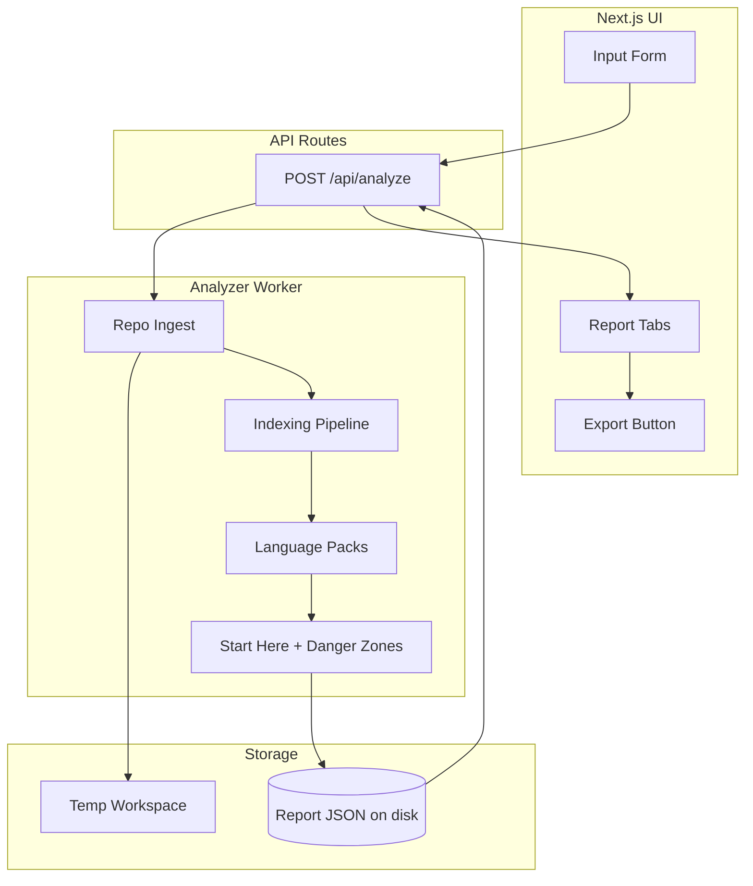
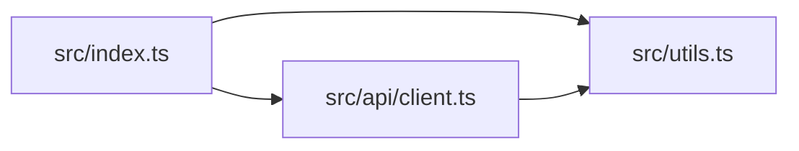

# RepoAtlas Engineering Specification

**Version:** 1.0  
**Status:** Implementation-ready  
**Target:** Local dev first, then container deployment  

---

## 1. Product Summary

### Problem

Engineers joining unfamiliar repositories waste significant time exploring ad hoc: finding entrypoints, understanding structure, and identifying high-risk areas. There is no structured, automated way to produce a concise "Repo Brief" for onboarding.

### Target Users

- **New contributors** – Need a reading order and contribution workflow.
- **Code reviewers** – Need architecture context and risk hotspots.
- **Architects** – Need dependency maps and module boundaries.
- **Maintainers** – Need onboarding materials and run/contribute instructions.

### Key Value Proposition

**One input** (zip upload, or JSON `zipRef` for testing) → **Structured Repo Brief** with:

- **Folder Map** – Directory tree of the repo.
- **Architecture Map** – Interactive dependency graph in the runtime UI (ELK layout + pan/zoom).
- **Start Here** – Prioritized reading list with explanations.
- **Danger Zones** – Risk-ranked files/modules with breakdown.
- **Run and Contribute** – Commands extracted from configs and docs.
- **Markdown Export** – Full report as downloadable `.md`, including Mermaid graph artifact text for markdown consumers.

### What RepoAtlas Is

- A **static analysis tool** that ingests repositories and produces structured briefs.
- Supports **language packs** (TS/JS, Python, Java) for deeper analysis.
- Works for **any repo** at a basic level; provides richer signals for supported languages.

### What RepoAtlas Is Not

- Not a runtime profiler or debugger.
- Not a security vulnerability scanner.
- Not a CI/CD replacement.
- Does **not** execute or run repository code.

---

## 2. User Experience

### User Flow

```
Input (zip upload) → Validation → Analysis (loading) → Report Tabs
```

1. User uploads a zip of the repository (primary flow). Optional testing flow sends JSON `zipRef`.
2. Client sends zip via multipart; on submit, `POST /api/analyze`.
3. Server saves zip to temp, extracts, runs analyzer.
4. UI shows loading state (spinner/skeleton).
5. On success: `reportId` returned; UI fetches report and renders tabs.
6. User can export report views client-side (PDF/PNG) from the UI.

### UI Page Map

Single-page application at `/`:

| Tab | Content | Acceptance Criteria |
|-----|---------|---------------------|
| Overview | Repo metadata, key docs links, run commands summary | Shows name, URL, analyzed_at; at least placeholder if no run commands |
| Folder Map | Recursive tree with expand/collapse | Renders `folder_map`; depth limit respected |
| Architecture Map | Interactive ELK-based dependency graph (pan/zoom) | Renders `architecture`; collapses if nodes > 50 |
| Start Here | Sortable table: path, score, explanation | Sorted by score desc; explanations visible |
| Danger Zones | Sortable table: path, score, breakdown | Sorted by score desc; metrics breakdown visible |
| Run & Contribute | Run commands + contribute signals (docs, CI) | Lists commands with source; lists found docs/CI |

### Loading States

- **Idle**: Input form visible.
- **Analyzing**: Spinner + "Analyzing repository..." message. Disable submit.
- **Fetching report**: After `reportId` returned, optional skeleton for tabs until report loads.

### Error States

| Error | User-facing message | HTTP/Code |
|-------|---------------------|-----------|
| Invalid input | "Upload a zip file or send JSON with zipRef." | 400 / INVALID_INPUT |
| Zip invalid | "Invalid or corrupted zip file." | 400 / ZIP_INVALID |
| Timeout | "Analysis timed out. Try a smaller repository." | 504 / TIMEOUT |
| Analysis failed | "Analysis failed. Check server logs." | 500 / ANALYSIS_FAILED |
| Zip path not found | "Zip path not found. Check the path or re-upload." | 404 / ZIP_NOT_FOUND |

### Export Experience

- UI supports client-side export workflows (PDF/PNG snapshots).
- No `/api/reports/:id/export/md` route exists in the current implementation.

---

## 3. System Architecture

### High-Level Diagram



### Components

| Component | Description |
|-----------|-------------|
| **Next.js UI** | React + TypeScript + Tailwind CSS. Single page with input form and tabbed report. |
| **API Routes** | Next.js Route Handler in App Router. Current API surface is `app/api/analyze/route.ts`. |
| **Analyzer Worker** | Node.js (TypeScript) module. Runs in-process; not a separate Go process. |
| **Temp Workspace** | `os.tmpdir()` subdir per analysis. Clone or extract zip here. |
| **Report Storage** | JSON files on disk. Path: `{REPORTS_DIR}/{reportId}.json`. No database. |

### Data Flow

1. **Request**: Client `POST /api/analyze` with multipart zip file (primary), or JSON `{ zipRef }` for testing.
2. **Ingest**: Server extracts uploaded zip (or uses zipRef path) into temp workspace.
3. **Analysis**: Analyzer walks workspace, runs common pipeline + applicable language packs.
4. **Report**: Analyzer produces `Report` JSON; server writes to disk and returns `{ reportId }`.
5. **Render**: UI immediately renders report data already returned by the analyze call path.

---

## 4. Repo Ingest

**Primary flow:** Zip file is uploaded to `POST /api/analyze` (multipart); server writes to temp, passes path as `zipRef` to ingest, which extracts and analyzes.

### GitHub URL Validation Rules (internal / legacy support in ingest module)

**Valid patterns** (regex):

```
^https?://github\.com/([a-zA-Z0-9_-]+)/([a-zA-Z0-9_.-]+)(?:\.git)?(?:(?:/tree|/blob)/([^/]+))?/?$
```

- Captures: `owner`, `repo`, optional `ref` (branch/tag).
- Reject: non-GitHub hosts, invalid characters, empty owner/repo.

**Normalization**: Strip fragment (`#...`), query (`?...#`); use `ref` if present, else `main` or `master`.

**Acceptance criteria**: `https://github.com/vercel/next.js` and `https://github.com/vercel/next.js/tree/canary` both accepted; `https://gitlab.com/foo/bar` rejected.

### Clone Strategy (internal / legacy)

- **Command**: `git clone --depth 1 [--branch <ref>] <url> <dest>`
- **Depth**: Default 1 (shallow). Configurable via env `GIT_CLONE_DEPTH` (default 1).
- **Timeout**: 60 seconds. Abort and clean up on timeout.
- **Destination**: `{tempDir}/repo-{uuid}`

**Acceptance criteria**: Clone completes for public repos within 60s; timeout returns TIMEOUT error.

### Zip Upload Strategy

- **Endpoint**: Multipart form upload to `POST /api/analyze` with `file` or `zip` field.
- **Validation**: Check magic bytes `50 4B 03 04` or `50 4B 05 06` (PK) for zip.
- **Extraction**: Use `yauzl` or Node `unzip`; extract to `{tempDir}/zip-{uuid}`.
- **Path traversal**: For each entry, resolve path relative to extract root; reject if resolved path is outside root or contains `..`.
- **Size limit**: Max uncompressed size 50MB; abort extraction if exceeded.

**Acceptance criteria**: Valid zip extracts; zip with `../../../etc/passwd` entries rejected; oversized zip aborted.

### Workspace Cleanup Rules

- Delete temp dir on analysis completion (success or failure).
- Optional TTL: if analysis crashes, orphan dirs cleaned by cron/job after 1 hour.
- Report files: retained on disk; no automatic expiry in MVP.

### Limits

| Limit | Value | Behavior |
|-------|-------|----------|
| Max repo size (clone/extract) | 100MB | Abort clone/extract if exceeded |
| Max file count | 10,000 | Stop indexing; add warning to report |
| Max analysis time | 120s | Abort; return partial report + TIMEOUT warning if supported |

---

## 5. Analyzer Design

### Common Indexing Pipeline (All Repos)

| Step | Description | Output |
|------|-------------|--------|
| Folder tree | Recursive `fs.readdirSync` with depth limit (default 10) | `FolderMapNode[]` |
| File metadata | For each file: path, size, extension | `FileMetadata[]` |
| Language detection | Extension → language map; `.gitattributes` overrides if present | `language` per file |
| Key docs discovery | Glob: `README*`, `CONTRIBUTING*`, `LICENSE*`, `CHANGELOG*` | `keyDocs: string[]` |
| CI discovery | Glob: `.github/workflows/*.yml`, `.gitlab-ci.yml`, `Jenkinsfile` | `ciConfigs: string[]` |
| Run command extraction | Parse `package.json` scripts, `Makefile`, `pyproject.toml`, `pom.xml`, `build.gradle`; scan README for common patterns | `RunCommand[]` |

### Language Pack: TS/JS

| Aspect | Rules |
|--------|-------|
| **Import extraction** | Regex: `import\s+.*\s+from\s+['"]([^'"]+)['"]`, `require\s*\(\s*['"]([^'"]+)['"]\s*\)`, `import\s+['"]([^'"]+)['"]`. Resolve relative paths (., ..) to absolute repo paths. |
| **Entrypoint heuristics** | `package.json` `main`, `bin` values; files named `index.{js,ts,mjs,cjs}`; `__main__` in JS (rare). |
| **Test proximity** | Test files: `*.test.{js,ts}`, `*.spec.{js,ts}`, `__tests__/*`, `*.test.{jsx,tsx}`. Proximity = same dir or nearest test dir distance. |
| **Complexity proxy** | Line-based: `(if|else|for|while|switch|catch|\?\s*:|\&\&|\|\|)` count per file. Or AST cyclomatic if `@babel/parser` available. |
| **Graph collapse** | Module = file; folder = directory. Collapse: group nodes by parent dir; edge A→B becomes dir(A)→dir(B). |

**Acceptance criteria**: TS repo with `src/index.ts` importing `./utils` produces edge `index.ts → utils.ts`; `index.ts` detected as entrypoint.

### Language Pack: Python

| Aspect | Rules |
|--------|-------|
| **Import extraction** | Regex: `import\s+([a-zA-Z0-9_.]+)`, `from\s+([a-zA-Z0-9_.]+)\s+import`. Resolve relative (`.` package) to file path. |
| **Entrypoint heuristics** | `if __name__ == "__main__"`; `setup.py` entry_points; `pyproject.toml` `[project.scripts]`; `-m` targets from docs. |
| **Test proximity** | `test_*.py`, `*_test.py`, `tests/` dir. |
| **Complexity proxy** | McCabe complexity via AST or line-based proxy (same as TS). |
| **Graph collapse** | Module = file; package = dir with `__init__.py`. |

**Acceptance criteria**: `main.py` with `from utils import foo` produces edge; `main.py` with `if __name__ == "__main__"` marked as entrypoint.

### Language Pack: Java

| Aspect | Rules |
|--------|-------|
| **Import extraction** | Regex: `import\s+([a-zA-Z0-9_.]+)\s*;`. Map to file path via package/class convention. |
| **Entrypoint heuristics** | `public static void main`; `@SpringBootApplication`; JAR manifest `Main-Class`. |
| **Test proximity** | `*Test.java`, `*IT.java`, `src/test/java` layout. |
| **Complexity proxy** | Cyclomatic via line-based or simple AST. |
| **Graph collapse** | Class = file; package = folder. |

**Acceptance criteria**: Java file with `public static void main` marked as entrypoint; imports produce edges.

---

## 6. Algorithms and Scoring

### Start Here Ranking

**Candidates**: Key docs (README, CONTRIBUTING, etc.), entrypoint files, root README, config files (package.json, pyproject.toml, etc.).

**StartHereScore formula**:

```
StartHereScore = (
  (is_root_readme ? 40 : 0) +
  (is_key_doc ? 30 : 0) +
  (is_entrypoint ? 50 : 0) +
  min(20, fan_in) +  // popularity proxy, cap at 20
  (is_root_config ? 15 : 0)
)
```

- Normalize to 0–100 by dividing by max observed score in repo, then * 100.
- Sort candidates by score descending.

**Explanation strings** (derived from signals):

| Condition | Explanation |
|-----------|-------------|
| Root README | "Root README" |
| package.json main | "Main entrypoint (package.json main)" |
| index.ts/js | "Module entrypoint (index file)" |
| CONTRIBUTING | "Contribution guide" |
| High fan-in | "Frequently imported" |
| Root config | "Root configuration" |

**Acceptance criteria**: Root README and main entrypoint appear in top 3 with appropriate explanations.

### Danger Zones Ranking

**Metrics**:

| Metric | Definition | Source |
|--------|------------|--------|
| Size | LOC or file size in bytes | File metadata |
| Fan-in | Number of files importing this file | Import graph |
| Fan-out | Number of files this file imports | Import graph |
| Complexity | Complexity proxy value | Language pack |
| Test proximity penalty | 0 if nearby test else 1 | Test proximity |
| Churn (optional) | Commit count in last N commits | Git log, if available |

**Normalization**: For each metric, compute percentile rank (0–100) within repo.

**RiskScore formula**:

```
RiskScore = (
  0.20 * size_percentile +
  0.25 * fan_in_percentile +
  0.20 * fan_out_percentile +
  0.25 * complexity_percentile +
  0.10 * (100 - test_proximity_score)  // no tests = higher risk
)
```

- Clamp to 0–100.
- Sort by RiskScore descending.

**Explanation breakdown**: e.g. "High fan-in (15), high complexity (42), no nearby tests".

**Acceptance criteria**: File with high fan-in, high complexity, no tests ranks in top 5 danger zones with correct breakdown.

---

## 7. Data Models

### Report JSON Schema

```json
{
  "repo_metadata": {
    "name": "string",
    "url": "string",
    "branch": "string",
    "clone_hash": "string | null",
    "analyzed_at": "string (ISO 8601)"
  },
  "folder_map": { },
  "architecture": {
    "nodes": [],
    "edges": []
  },
  "start_here": [],
  "danger_zones": [],
  "run_commands": [],
  "contribute_signals": {
    "key_docs": [],
    "ci_configs": []
  },
  "warnings": []
}
```

### TypeScript Types

```typescript
export interface RepoMetadata {
  name: string;
  url: string;
  branch: string;
  clone_hash: string | null;
  analyzed_at: string; // ISO 8601
}

export type FolderMapNode = {
  path: string;
  type: 'file' | 'dir';
  children?: FolderMapNode[];
};

export interface ArchitectureNode {
  id: string;      // file path or module id
  label: string;   // display name
  type?: 'file' | 'module' | 'folder';
}

export interface ArchitectureEdge {
  from: string;    // node id
  to: string;      // node id
  type?: 'import' | 'dependency';
}

export interface Architecture {
  nodes: ArchitectureNode[];
  edges: ArchitectureEdge[];
}

export interface StartHereItem {
  path: string;
  score: number;
  explanation: string;
}

export interface DangerZoneItem {
  path: string;
  score: number;
  breakdown: string;
  metrics: {
    size?: number;
    fan_in?: number;
    fan_out?: number;
    complexity?: number;
    test_proximity?: number;
  };
}

export interface RunCommand {
  source: string;      // e.g. "package.json", "README"
  command: string;
  description?: string;
}

export interface ContributeSignals {
  key_docs: string[];
  ci_configs: string[];
}

export interface Report {
  repo_metadata: RepoMetadata;
  folder_map: FolderMapNode;
  architecture: Architecture;
  start_here: StartHereItem[];
  danger_zones: DangerZoneItem[];
  run_commands: RunCommand[];
  contribute_signals: ContributeSignals;
  warnings: string[];
}
```

---

## 8. API Design

### POST /api/analyze

**Request (primary):** `multipart/form-data` with a single zip file (field `file` or `zip`). Max 100MB.

**Request (testing/CLI):** `Content-Type: application/json` with body:

```json
{
  "zipRef": "path-to-local-repo-or-fixture"
}
```

**Response (200)**:

```json
{
  "reportId": "uuid-string"
}
```

**Error responses**:

| Status | Body | Code |
|--------|------|------|
| 400 | `{ "code": "INVALID_INPUT", "message": "..." }` | Missing upload or `zipRef`; unsupported content type |
| 400 | `{ "code": "ZIP_INVALID", "message": "..." }` | Invalid zip |
| 404 | `{ "code": "ZIP_NOT_FOUND", "message": "..." }` | zipRef not found |
| 413 | `{ "code": "REPO_TOO_LARGE", "message": "..." }` | Upload/zip exceeds 100MB |
| 504 | `{ "code": "TIMEOUT", "message": "..." }` | Analysis timeout |
| 500 | `{ "code": "ANALYSIS_FAILED", "message": "..." }` | Analysis error |

### API availability

- **Required for full current UI flow:** `POST /api/analyze`.
- **Not currently implemented in `src/app/api/**`:** `/api/reports/:id`, `/api/reports/:id/export/md`, `/api/upload`.
- UI report rendering and export actions operate without additional API routes.

### Retry Behavior

- Client: Retry on 5xx with exponential backoff (e.g. 1s, 2s, 4s); max 3 retries.
- Server: No automatic retry for clone; single attempt.

---

## 9. Frontend Implementation Plan

### Pages and Components

| Component | Responsibility |
|-----------|----------------|
| `Page` | Root layout; input form + report tabs container |
| `InputForm` | Zip file input, submit; calls POST /api/analyze with multipart |
| `ReportTabs` | Tab bar + tab content; receives `Report` |
| `FolderMapTree` | Recursive tree; expand/collapse |
| `ArchitectureGraph` | Interactive ELK graph rendering; collapse to folder if nodes > 50 |
| `StartHereTable` | Sortable table; path, score, explanation |
| `DangerZonesTable` | Sortable table; path, score, breakdown |
| `RunContributeSection` | Lists run commands + contribute signals |

### Runtime Graph Rendering Strategy (ELK)

- Use `elkjs` for layout and the UI graph component for runtime rendering.
- Input: `architecture.nodes` and `architecture.edges`.
- Generate positioned nodes/edges for an interactive graph view (zoom/pan, fit-to-view).
- **Reduction**: If `nodes.length > 50`, collapse to folder level: group by parent dir; edges between folders.
- Fallback: If layout/rendering fails, show raw node/edge list.

### Mermaid in Markdown Export (Artifact-Only)

- Mermaid is **not** the runtime UI renderer.
- Mermaid output is retained for markdown artifact rendering/export compatibility.
- Input for markdown export Mermaid remains `architecture.nodes` and `architecture.edges`.

### Graph Reduction Strategy

```
if (nodes.length <= 50) use file-level graph
else {
  group nodes by directory (e.g. src/utils, src/api)
  create folder nodes
  edge (A, B) => edge (dir(A), dir(B))
  deduplicate edges
}
```

### Report Caching

- Store report in React state after fetch.
- Optional: `localStorage.setItem(`repoatlas:${reportId}`, JSON.stringify(report))` for revisit during session.
- No persistent cross-session cache in MVP.

---

## 10. Security and Safety

| Concern | Mitigation |
|---------|------------|
| Path traversal (zip) | Resolve all extracted paths; reject `..`; jail to extract root |
| Code execution | Never `require()`, `import()`, or `exec()` repo code; parse as text only |
| Network | Only `git clone` to GitHub; no arbitrary HTTP/fetch from analyzer |
| Rate limiting | Per-IP: 10 analyses per hour; return 429 with `Retry-After` |
| Zip bombs | Enforce max uncompressed size (50MB); abort if exceeded |

**Acceptance criteria**: Zip with `../../etc/passwd` does not write outside extract dir; analyzer never executes repo code.

---

## 11. Performance

| Strategy | Description |
|----------|-------------|
| Progressive analysis | Optional: emit folder_map first, then architecture, then scoring; UI can show partial results |
| Clone cache | Optional: cache by `owner/repo@commit`; reuse if same commit requested within TTL |
| Timeouts | Clone: 60s; analysis: 120s; abort and clean up on timeout |
| Graceful degradation | On timeout: return partial report with `warnings: ["Analysis timed out; partial results"]` |

---

## 12. Testing Plan

### Unit Tests

- Parsers: import extraction (TS/JS, Python, Java regex).
- Language detection: extension → language.
- Scoring: `StartHereScore` and `RiskScore` with mock inputs.
- Path traversal: zip extraction rejects malicious paths.

### Integration Tests

- Full analyze flow: POST /api/analyze with multipart fixture zip or JSON `zipRef` → assert `{ reportId }` response and persisted report artifact.
- Error mapping: send invalid payloads/content types and assert documented `INVALID_INPUT`, `ZIP_INVALID`, `ZIP_NOT_FOUND`, `REPO_TOO_LARGE`, `TIMEOUT`.

### Fixtures

| Fixture | Description | Path |
|---------|-------------|------|
| `fixtures/repo-ts` | Small TS repo (5 files): index, utils, 1 test | `fixtures/repo-ts/` |
| `fixtures/repo-python` | Small Python repo: main, utils, test | `fixtures/repo-python/` |
| `fixtures/repo-java` | Small Java repo: Main, Util, Test | `fixtures/repo-java/` |

### Acceptance Tests

- **Folder Map tab**: Renders non-empty tree for fixture.
- **Architecture tab**: Renders at least one node and edge for TS fixture.
- **Start Here tab**: Root README and entrypoint in list.
- **Danger Zones tab**: At least one file with score and breakdown.
- **Run & Contribute tab**: At least run commands or contribute signals.
- **Export**: Markdown download succeeds and contains expected sections.

---

## 13. Milestones

| Milestone | Outputs | Definition of Done |
|-----------|---------|--------------------|
| **M1** | Repo skeleton, ingest, basic indexing | Clone works; zip extract works; folder_map and file metadata in report |
| **M2** | TS/JS pack, architecture graph, ELK UI renderer | Import graph built; interactive ELK graph renders in UI |
| **M3** | Start Here, Danger Zones, UI tabs | All tabs render; scoring produces ranked lists |
| **M4** | Markdown export (including Mermaid artifact), Python/Java packs | Export downloads .md; Python/Java produce basic graphs |
| **M5** | Tests, fixtures, polish, demo | Unit + integration tests pass; demo script runs; acceptance criteria met |

---

## 14. Examples

### Example Markdown Mermaid Graph Artifact

For a minimal TS repo:

```
src/index.ts  ->  src/utils.ts
src/index.ts  ->  src/api/client.ts
src/api/client.ts  ->  src/utils.ts
```

Generated Mermaid (for markdown artifact rendering, not runtime UI):



### Example Report JSON (Tiny Repo)

```json
{
  "repo_metadata": {
    "name": "tiny-app",
    "url": "https://github.com/example/tiny-app",
    "branch": "main",
    "clone_hash": "abc123",
    "analyzed_at": "2025-02-14T12:00:00.000Z"
  },
  "folder_map": {
    "path": ".",
    "type": "dir",
    "children": [
      {
        "path": "README.md",
        "type": "file"
      },
      {
        "path": "src",
        "type": "dir",
        "children": [
          { "path": "src/index.ts", "type": "file" },
          { "path": "src/utils.ts", "type": "file" }
        ]
      }
    ]
  },
  "architecture": {
    "nodes": [
      { "id": "src/index.ts", "label": "index.ts" },
      { "id": "src/utils.ts", "label": "utils.ts" }
    ],
    "edges": [
      { "from": "src/index.ts", "to": "src/utils.ts", "type": "import" }
    ]
  },
  "start_here": [
    { "path": "README.md", "score": 100, "explanation": "Root README" },
    { "path": "src/index.ts", "score": 85, "explanation": "Main entrypoint (package.json main)" }
  ],
  "danger_zones": [
    {
      "path": "src/utils.ts",
      "score": 72,
      "breakdown": "High fan-in (1), no nearby tests",
      "metrics": { "fan_in": 1, "fan_out": 0, "complexity": 5, "test_proximity": 0 }
    }
  ],
  "run_commands": [
    { "source": "package.json", "command": "npm run dev", "description": "Start dev server" }
  ],
  "contribute_signals": {
    "key_docs": ["README.md"],
    "ci_configs": [".github/workflows/ci.yml"]
  },
  "warnings": []
}
```

### Demo Script (2 Minutes)

1. **0:00–0:15** – Open RepoAtlas; upload a zip of a repo (e.g. download from GitHub Code → Download ZIP, then select the file).
2. **0:15–0:45** – Click "Analyze Repository"; show loading state; wait for completion.
3. **0:45–1:30** – Walk through tabs: Overview (metadata), Folder Map (expand tree), Architecture (interactive ELK graph), Start Here (table), Danger Zones (table), Run & Contribute.
4. **1:30–2:00** – Click "Export Markdown"; download; show Markdown file structure.

---

## 15. Implementation Checklist

- [ ] Create `docs/spec.md` and paste the generated spec.
- [ ] Create repo skeleton: Next.js app, API route placeholders, analyzer worker folder, shared types.
- [ ] Implement repo ingest: GitHub clone path, zip upload path (optional).
- [ ] Implement analyzer indexing pipeline (all repos).
- [ ] Implement TS/JS language pack: imports, entrypoints, test proximity, complexity proxy.
- [ ] Implement Start Here and Danger Zones scoring with explanation strings.
- [ ] Build UI tabs and render report JSON.
- [ ] Add Markdown export.
- [ ] Add tests and fixtures.
- [ ] Record demo and ensure acceptance tests pass.

---

## 16. Non-Goals (Explicit)

- Database or persistent storage beyond JSON on disk
- Serverless or edge deployment assumptions
- Security vulnerability scanning
- Executing or profiling repository code
- Full AST parsing for all languages (use heuristics where AST is costly)
- Real-time collaboration
- Private GitHub repo support (MVP: public only)
