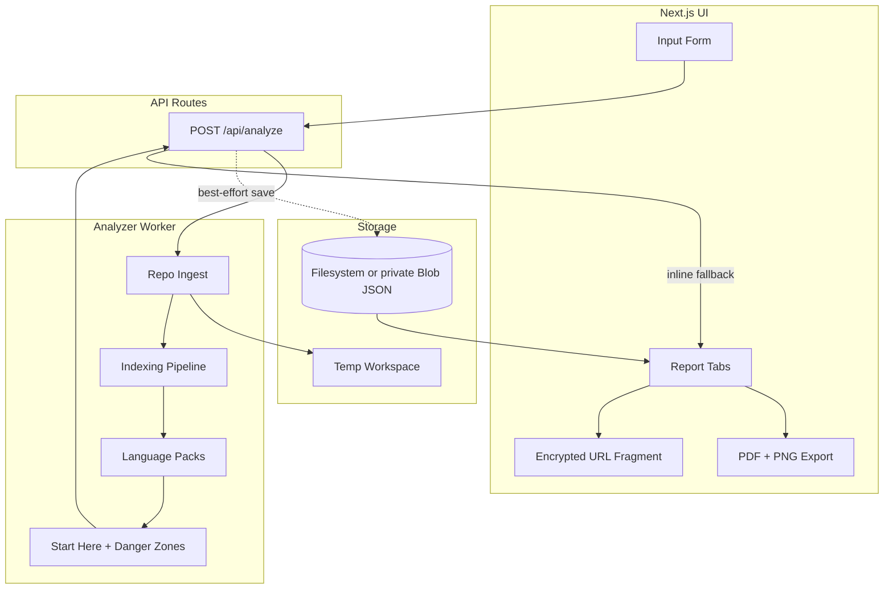
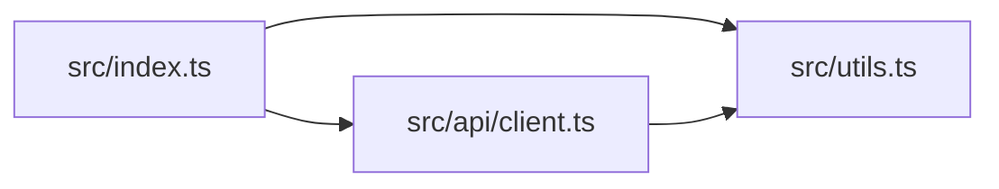

# RepoAtlas Engineering Specification

**Version:** 1.4
**Status:** Living spec (validated against `main` 2026-07-20)
**Target:** Local dev first; optional Vercel Blob storage  

---

## 1. Product Summary

### Problem

Engineers preparing to discuss a repository need to find entrypoints, understand structure, and identify high-risk areas quickly. RepoAtlas produces an evidence-backed **Candidate Brief** for an interview walkthrough, bug investigation, planned change, or pull-request discussion without AI-generated claims.

### Key Value Proposition

**Two supported inputs** — a **zip upload** or a **public GitHub repository URL** — produce a **Candidate Brief** + **Repo Analysis** with:

- **Candidate Brief** – Interview-facing output: reading path, talking points, first PR plan, resume bullets, evidence index (deterministic, no AI).
- **Folder Map** – Directory tree of the repo.
- **Architecture Map** – Interactive dependency graph in the runtime UI (ELK layout + pan/zoom).
- **Start Here** – Prioritized reading list with explanations.
- **Danger Zones** – Risk-ranked files/modules with breakdown.
- **Run and Contribute** – Commands extracted from configs and docs.
- **Export** – Full report as client-generated PDF or PNG in every completed session. Saved reports also support downloadable Markdown with Mermaid graph artifact text.

### What RepoAtlas Is

- A **static analysis tool** that ingests repositories and produces structured briefs.
- Supports **language packs** (TS/JS, Python, Java) for deeper analysis.
- Works for **any repo** at a basic level; provides richer signals for supported languages.

### What RepoAtlas Is Not

- Not a runtime profiler or debugger.
- Not a security vulnerability scanner.
- Not a CI/CD replacement.
- Does **not** execute or run repository code.
- Does **not** use LLMs or external AI APIs — all brief text is deterministic.

### What RepoAtlas Will Not Claim

RepoAtlas does **not** assert vulnerabilities, production readiness, business purpose beyond extracted README/metadata, bug counts, or code correctness. Danger zones reflect structural risk signals (size, coupling, complexity, test proximity, optional churn) — not defect counts.

---

## 2. User Experience

### User Flow

```
Input (zip upload OR public GitHub URL) → Validation → Analysis (loading) → Report Tabs
```

1. User picks an input method via an accessible tablist:
   - **Public GitHub URL** — pastes a canonical `https://github.com/owner/repo` URL with an optional branch/tag ref (default), or
   - **Upload ZIP** — selects a `.zip` of the repository.
2. Client validates input client-side (mirroring server rules) and submits `POST /api/analyze` (multipart for zip, JSON `{ githubUrl, ref? }` for GitHub).
3. Server saves zip to temp / downloads the public GitHub archive, extracts, runs analyzer.
4. UI shows an honest loading state ("Analyzing… (up to 2 min)").
5. On success, the API always returns a valid `reportId` plus a persistence status:
   - Saved: `{ reportId, persisted: true }`; the UI fetches the stored report by ID.
   - Inline fallback: `{ reportId, report, persisted: false }`; the UI renders the returned report and does not expose the unsaved ID as a report capability.
6. User can export report views client-side (PDF/PNG) from either result. Markdown requires a saved report.
7. Sharing uses a 7-day stored token when the report was saved or a 7-day encrypted browser-only URL fragment when it was returned inline.

The legacy JSON `zipRef` field is **not** accepted over the network (see §10); internal code and tests call `analyzeRepository()` directly for that path.

### UI page map

Public product and trust pages:

| Route | Purpose |
|-----|---------|
| `/` | Analysis input, bundled sample, and completed saved or inline report workspace |
| `/interview-preparation` | Interview-preparation use case with a direct path to analysis |
| `/privacy` | Repository and report handling boundaries |
| `/terms` | Service and output interpretation boundaries |
| `/contact` | Managed support contact |
| `/report/:id` | Legacy direct view for a saved report |
| `/share/:token` | Read-only stored-token or portable encrypted share view |

Completed report workspace at `/`, `/report/:id`, or `/share/:token`:

| Tab | Content | Acceptance Criteria |
|-----|---------|---------------------|
| Candidate Brief | Repo summary, reading path, talking points, first PR plan, resume bullets, evidence | Default tab; every claim links to evidence refs |
| Overview | Repo metadata, deep analysis panels, share link, run commands summary | Shows `project_profile`, `test_inventory`, `architecture_insights`, `commit_insights` when present; `partial` badge when timed out |
| Folder Map | Recursive tree with expand/collapse | Renders `folder_map`; depth limit respected |
| Architecture Map | Interactive ELK-based dependency graph (pan/zoom) | Renders `architecture`; collapses if nodes > 50 |
| Start Here | Sortable table: path, score, explanation | Sorted by score desc; explanations visible |
| Danger Zones | Sortable table: path, score, breakdown | Sorted by score desc; metrics breakdown visible |
| Run & Contribute | Run commands + contribute signals (docs, CI) | Lists commands with source; lists found docs/CI |

### Loading States

- **Idle**: Input form visible with ZIP / GitHub URL tabs.
- **Analyzing**: A single honest indicator ("Analyzing… (up to 2 min)"). No fabricated staged progress — the analyzer does not stream stage events, so the UI does not pretend to. Submit is disabled.
- **Fetching saved report**: After `{ persisted: true }` and a validated `reportId` are returned, an optional skeleton for tabs until the stored report loads.
- **Rendering inline report**: After `{ persisted: false, report }` is returned, the UI renders the report immediately without a second API request.

### Error States

| Error | User-facing message | HTTP/Code |
|-------|---------------------|-----------|
| Invalid input | "Provide a GitHub repository URL, upload a zip file, or request the sample." | 400 / INVALID_INPUT |
| Invalid URL | "Enter a canonical GitHub repository URL like https://github.com/owner/repo." | 400 / INVALID_URL |
| Repository not found | "Repository not found (it may be private)." | 404 / REPO_NOT_FOUND |
| Private repository | "Repository is private." | 403 / REPO_PRIVATE |
| Missing ref | "Requested branch or tag was not found." | 404 / MISSING_REF |
| GitHub rate limit | "GitHub rate limit reached. Try again later." | 429 / RATE_LIMITED |
| Download timeout | "GitHub request timed out." | 504 / DOWNLOAD_TIMEOUT |
| Repo too large | "Repository archive exceeds the size limit." | 413 / REPO_TOO_LARGE |
| Zip/archive invalid | "Invalid or corrupted zip file." | 400 / ZIP_INVALID |
| Timeout | "Analysis timed out. Try a smaller repository." | 504 / TIMEOUT — or partial report saved with `partial: true` when indexing completed before deadline |
| Too many requests | "Too many analysis requests. Please wait and try again." | 429 / RATE_LIMIT_EXCEEDED |
| Analysis failed | "Analysis failed. Check server logs." | 500 / ANALYSIS_FAILED |
| Zip path not found | "Zip path not found. Check the path or re-upload." | 404 / ZIP_NOT_FOUND (internal path only) |

### Export Experience

- UI supports client-side export workflows (PDF/PNG full-report raster snapshots via `html2canvas` + `jspdf`) for saved and inline reports.
- Markdown export is available at `GET /api/reports/:id/export/md` only after successful persistence. The UI disables it for inline reports and explains the storage requirement.
- Saved-report sharing: `POST /api/reports/:id/share` → `/share/:token` (7-day TTL; report JSON only).
- Inline-report sharing: the browser compresses and AES-GCM-encrypts the validated report into `/share/portable#…`. The URL fragment is not sent to the server; the recipient browser decrypts it and enforces the encoded 7-day expiry. URLs over 24,000 characters are rejected with PDF fallback guidance.

---

## 3. System Architecture

### High-Level Diagram



### Components

| Component | Description |
|-----------|-------------|
| **Next.js UI** | React + TypeScript + Tailwind CSS. Public product and trust pages plus tabbed report views. |
| **API Routes** | Next.js Route Handlers for analysis, saved reports, Markdown export, stored-token sharing, and cleanup. |
| **Analyzer Worker** | Node.js (TypeScript) module. Runs in-process; not a separate Go process. |
| **Temp Workspace** | `os.tmpdir()` subdir per analysis. Clone or extract zip here. |
| **Report Storage** | JSON files on disk locally (`{REPORTS_DIR}/{reportId}.json`) or in a connected private Vercel Blob store. Production without usable Blob credentials returns reports inline instead of failing the completed analysis. |
| **Portable Sharing** | Browser-only compression, AES-GCM encryption, expiry validation, and report validation for inline report links. |

### Data Flow

1. **Request**: Client `POST /api/analyze` with multipart zip (`file` or `zip`), JSON `{ githubUrl, ref? }`, or `{ sample: true }`. JSON `zipRef` is **rejected**.
2. **Ingest**: Server extracts uploaded zip (server-created temp path only) or downloads a public GitHub archive into temp workspace.
3. **Analysis**: Analyzer walks workspace, runs common pipeline + applicable language packs.
4. **Report**: Analyzer produces validated `Report` JSON and attempts persistence when the runtime has storage credentials.
5. **Response**: Successful persistence returns `{ reportId, persisted: true }`. Unavailable storage or a best-effort save failure returns `{ reportId, report, persisted: false }`.
6. **Render**: The UI fetches a saved report by ID or renders the inline report directly. Stored JSON and portable shared JSON are validated before use (`src/lib/reportSchema.ts`).

---

## 4. Repo Ingest

**Discriminated input model** (`src/lib/ingest.ts`):

- `{ kind: "zip", zipRef, zipName? }` — server-created temp path (multipart upload) or a server-owned fixture path (sample flow). Never a caller-supplied network path.
- `{ kind: "github", githubUrl, ref? }` — a canonical public GitHub URL with an optional validated branch/tag ref.

### Public GitHub URL Ingestion (`src/lib/github.ts`, `src/lib/ingest.ts`)

**Accepted URLs** — canonical repository URLs only:

- `https://github.com/owner/repository`
- `https://github.com/owner/repository.git`

Rejected: non-HTTPS, non-`github.com` hosts, `tree`/`blob` subpaths, query strings, fragments, non-default ports, and malformed owner/repo. A custom branch/tag is provided through a **separate validated `ref` field** (`isValidGitRef`), not by parsing tree/blob URLs.

**Security properties (all enforced and tested):**

1. **Public-only, unauthenticated.** GitHub API and archive requests are always sent **without** an `Authorization` header. The server `GITHUB_TOKEN` is never attached to user-supplied URL ingestion, so an unauthenticated caller can never borrow privileged server access to read a private repository. A repository the API reports as `private: true`, or that returns 404/403, is refused before any download (Phase 1 finding B).
2. **Exact-SHA first.** The requested ref (or default branch) is resolved to an exact commit SHA via the commits API **before** downloading. The archive for that exact SHA is downloaded and the same SHA is recorded as `clone_hash` (finding C).
3. **Streaming with caps.** The archive is streamed to a temp file and aborted if it exceeds `MAX_COMPRESSED_BYTES`; it is never buffered whole in memory (finding D). A `content-length` over the cap is rejected up front.
4. **Redirect policy.** Redirects are followed only when the finally-resolved host is a known GitHub host (`github.com`, `codeload.github.com`, `objects.githubusercontent.com`); any other host is rejected.
5. **Timeouts.** GitHub API requests use `GITHUB_API_TIMEOUT_MS`; archive downloads use `DOWNLOAD_TIMEOUT_MS`. Aborts map to `DOWNLOAD_TIMEOUT`.
6. **Cleanup.** The per-analysis temp directory is removed on success, failure, and cancellation.

**Error taxonomy** (finding E): `INVALID_URL`, `REPO_NOT_FOUND`, `REPO_PRIVATE`, `MISSING_REF`, `RATE_LIMITED`, `DOWNLOAD_TIMEOUT`, `REPO_TOO_LARGE`, `ZIP_INVALID`.

**Acceptance criteria**: `https://github.com/vercel/next.js` accepted; `https://github.com/vercel/next.js/tree/canary`, `https://gitlab.com/foo/bar` rejected. See `src/lib/github.test.ts` and `src/lib/ingest.github.test.ts` (mocked API/archive — CI never hits live GitHub).

### Zip Upload Strategy

- **Endpoint**: Multipart form upload to `POST /api/analyze` with `file` or `zip` field.
- **Compressed limit (environment-aware)**:
  - **Vercel deployment:** `MAX_DEPLOYED_ZIP_BYTES` = **4 MB** (Function body cap ~4.5 MB). Direct users to GitHub URL mode for larger public repos.
  - **Local dev:** `MAX_COMPRESSED_BYTES` = **100 MB**.
  - Selected by `maxCompressedBytesForZipUpload()` in `src/lib/ingestLimits.ts`.
- **Validation**: Check magic bytes `50 4B 03 04` or `50 4B 05 06` (PK) for zip.
- **Extraction**: `adm-zip` via `src/lib/safeZipExtract.ts` — path jail, normalized-target collision preflight, entry count cap, uncompressed size cap.
- **Path traversal**: For each entry, resolve path relative to extract root; reject if resolved path is outside root or contains `..`.
- **Path collisions**: Reject duplicate normalized destinations (including dot-segment and platform separator aliases) and file/child-path conflicts before writing any entry.
- **Size limit**: Max cumulative uncompressed **50 MB**; abort extraction if exceeded.

**Acceptance criteria**: Valid zip extracts; zip with `../../../etc/passwd` entries, normalized duplicate destinations, or file/child-path conflicts is rejected; oversized zip is aborted. See `src/lib/safeZipExtract.test.ts`.

### Workspace Cleanup Rules

- Delete temp dir on analysis completion (success **or** failure). `analyzeRepository()` wraps the whole run in `try/finally` and always invokes `workspace.cleanup()`, including when report persistence throws (regression test: `src/analyzer/cleanup.test.ts`).
- Report files: filesystem and Vercel Blob storage support deletion and a TTL/max-count sweep. `sweepExpiredReports()` uses `analyzed_at` on the filesystem and blob upload timestamps for blob storage. Retention is `REPORT_TTL_DAYS` (default 7 with Blob storage credentials, otherwise 30) and `REPORT_MAX_COUNT` (default 100).
- Share tokens: 7-day TTL; `sweepExpiredShareTokens()` lists and deletes expired records on **both** filesystem and Blob (`src/lib/sharing.ts`).
- Cron: `POST /api/cron/cleanup` runs report + share sweeps. On Vercel (`VERCEL=1`), the route **fails closed** with `503 MISCONFIGURED` when `CRON_SECRET` is unset; when set, it requires `Authorization: Bearer <CRON_SECRET>`.
- Production without usable Blob credentials returns reports inline. Saved report retention and stored-token cleanup cannot operate until both Blob storage and the protected cleanup schedule are connected.

### Centralized Limits (`src/lib/ingestLimits.ts`)

All size/count/timeout budgets live in one module so the API route, ZIP extractor, GitHub downloader, indexing pipeline, and UI cannot disagree (finding D / Phase 2 requirement 8).

| Limit | Constant | Value | Behavior |
|-------|----------|-------|----------|
| Max ZIP upload (Vercel) | `MAX_DEPLOYED_ZIP_BYTES` | 4 MB | Multipart body cap on deployed Functions |
| Max compressed archive (local ZIP + GitHub) | `MAX_COMPRESSED_BYTES` | 100 MB | Abort upload/download if exceeded |
| Max uncompressed total | `MAX_UNCOMPRESSED_BYTES` | 50 MB | Abort extraction if exceeded |
| Max entries | `MAX_ENTRIES` | 10,000 | Abort extraction |
| Max single file | `MAX_SINGLE_FILE_BYTES` | 10 MB | Abort extraction |
| Max indexed files | `MAX_FILE_COUNT` | 10,000 | Stop indexing; add warning |
| Max folder depth | `MAX_DEPTH` | 10 | Stop recursing; mark node `truncated` + add warning (no longer silent) |
| Max analysis time | `MAX_ANALYSIS_TIME_MS` | 120 s | Abort; return partial report |
| Archive download timeout | `DOWNLOAD_TIMEOUT_MS` | 60 s | Abort → DOWNLOAD_TIMEOUT |
| GitHub API timeout | `GITHUB_API_TIMEOUT_MS` | 15 s | Abort → DOWNLOAD_TIMEOUT |

---

## 5. Analyzer Design

### Common Indexing Pipeline (All Repos)

| Step | Description | Output |
|------|-------------|--------|
| Folder tree | Recursive `fs.readdirSync` with depth limit (`MAX_DEPTH`); over-depth directories are marked `truncated` and a warning is emitted | `FolderMapNode` |
| File metadata | For each file: path, size, extension | `FileMetadata[]` |
| Language detection | Extension → language map; `.gitattributes` overrides if present | `language` per file |
| Key docs discovery | `README*`, `CONTRIBUTING*`, `LICENSE*`, `CHANGELOG*`, **deterministically sorted** (root docs first, then lexicographic) | `keyDocs: string[]` |
| CI discovery | Glob: `.github/workflows/*.yml`, `.gitlab-ci.yml`, `Jenkinsfile` | `ciConfigs: string[]` |
| Run command extraction | Parse `package.json` scripts, `Makefile`, `pyproject.toml`, `pom.xml`, `build.gradle`, Docker Compose, README fenced blocks | `RunCommand[]` via `src/analyzer/commands/index.ts` |

### Documentation Discovery and Canonicalization (`src/analyzer/docs.ts`)

To stop duplicated documentation from producing repetitive or misleading briefs (Phase 3), a deterministic discovery step builds a `document_inventory`:

1. **Classify & prioritize.** Each doc is classified (`readme`, `contributing`, `architecture`, `docs`, `changelog`, `license`) and scoped (`root`, `docs`, `nested`). Root docs outrank `docs/`, which outrank nested package docs.
2. **Deterministic order.** Documents are sorted by (category, scope, path depth, path) before any grouping, independent of filesystem traversal order.
3. **Duplicate detection.** Content is hashed both raw (`content_hash`) and normalized (`normalized_hash`). Normalization strips a UTF-8 BOM, converts CRLF/CR → LF, trims trailing whitespace per line, and collapses surrounding blank lines. Documents sharing a normalized hash form a duplicate group; the highest-priority member is `canonical`, others record `duplicate_of`.
4. **Similarity flagging.** Same-category canonical docs with Jaccard line similarity ≥ 0.85 (and < 1) are recorded in `similar_groups` as *possible* redundancy — never suppressed.
5. **Nothing hidden.** Every document remains in the inventory and folder map. Duplicates are grouped, not deleted, so users can see what was suppressed and why.
6. **Canonical selection.** One canonical document per duplicate group is used for purpose extraction, run-command extraction, and Candidate Brief evidence, so equivalent content does not generate repeated evidence cards. Different nested package READMEs are treated as legitimate and each keep their own card.

**Purpose extraction** (`src/analyzer/purpose.ts`) prefers the canonical README, and will **not** use a heading that is only the repository name; it falls back to the first meaningful paragraph or a manifest description, preserving the source path and evidence.

Tests: `src/analyzer/docs.test.ts`, `src/analyzer/docs.integration.test.ts`, `src/analyzer/purpose.test.ts`, `src/analyzer/pipeline.test.ts`. Fixture: `fixtures/repo-docs-dedup`.

### Language Pack: TS/JS

| Aspect | Rules |
|--------|-------|
| **Import extraction** | TypeScript Compiler API AST walk (`src/analyzer/packs/tsjsExtract.ts`). Collects static `import`, side-effect imports, `import()`, `require()`, `export … from`, `export * from`, and type-only import/export. Comments and string literals never produce edges. |
| **Module resolution** | `ts.resolveModuleName` with `tsconfig.json` / `jsconfig.json` (`baseUrl`, `paths`), relative/extensionless/index resolution, `package.json` `main`/`module`/`exports`, and npm/pnpm workspace package names (`src/analyzer/packs/tsjsResolve.ts`). Never leaves the extracted workspace. |
| **Semantic graph** | Language-neutral `semantic_graph` (optional on Report, `report_version` 3+) stores nodes/edges with resolution status, line-bounded evidence, and stats. Folder-level `architecture` is **derived** from `resolved_internal` edges only. Unresolved edges are recorded and must not inflate fan-in/fan-out. External package edges are recorded separately. |
| **Entrypoint heuristics** | Next.js App Router `page`/`layout`/`route`/`middleware`, package `main`/`module`/`browser`/`bin`/`exports`, narrow `dev`/`start`/`build` script path literals, and common `src/index|main|server|cli` files — each with an evidence reason. |
| **Test proximity** | Test files: `*.test.{js,ts}`, `*.spec.{js,ts}`, `__tests__/*`, `*.test.{jsx,tsx}`. Proximity = same dir or nearest test dir distance. |
| **Structural complexity** | AST decision-point count (if/for/while/do/switch cases/catch/conditionals/`&&`/`\|\|`/`??`) plus block nesting depth and LOC. Score = `branches*3 + nesting*2 + round(loc/40)`. This is a **structural complexity score**, not claimed as cyclomatic complexity. |
| **Graph collapse** | Module = file; folder = directory. Collapse: group nodes by parent dir; edge A→B becomes dir(A)→dir(B). Caps: 50 nodes / 200 edges. |

**Acceptance criteria**: TS repo with `src/index.ts` importing `./utils` produces a `resolved_internal` semantic edge and folder architecture edge; fake `import` text in comments/strings does not; unresolved imports appear in `semantic_graph.stats.unresolved` without inflating fan-out.

### Language Pack: Python

| Aspect | Rules |
|--------|-------|
| **Import extraction** | Regex: `import\s+([a-zA-Z0-9_.]+)`, `from\s+([a-zA-Z0-9_.]+)\s+import`. Resolve relative (`.` package) to file path. |
| **Entrypoint heuristics** | `if __name__ == "__main__"`; `setup.py` entry_points; `pyproject.toml` `[project.scripts]`; `-m` targets from docs. |
| **Test proximity** | `test_*.py`, `*_test.py`, `tests/` dir. |
| **Complexity proxy** | McCabe complexity via AST or line-based proxy (same as TS). |
| **Graph collapse** | Module = file; package = dir with `__init__.py`. |

**Acceptance criteria**: `main.py` with `from utils import foo` produces edge; `main.py` with `if __name__ == "__main__"` marked as entrypoint.

### Language Pack: Java

| Aspect | Rules |
|--------|-------|
| **Import extraction** | Regex: `import\s+([a-zA-Z0-9_.]+)\s*;`. Map to file path via package/class convention. |
| **Entrypoint heuristics** | `public static void main`; `@SpringBootApplication`; JAR manifest `Main-Class`. |
| **Test proximity** | `*Test.java`, `*IT.java`, `src/test/java` layout. |
| **Complexity proxy** | Cyclomatic via line-based or simple AST. |
| **Graph collapse** | Class = file; package = folder. |

**Acceptance criteria**: Java file with `public static void main` marked as entrypoint; imports produce edges.

---

## 6. Algorithms and Scoring

### Start Here Ranking

**Candidates**: Key docs (README, CONTRIBUTING, etc.), entrypoint files, root README, config files (package.json, pyproject.toml, etc.).

**StartHereScore formula**:

```
StartHereScore = (
  (is_root_readme ? 40 : 0) +
  (is_key_doc ? 30 : 0) +
  (is_entrypoint ? 50 : 0) +
  min(20, fan_in) +  // popularity proxy, cap at 20
  (is_root_config ? 15 : 0)
)
```

- Normalize to 0–100 by dividing by max observed score in repo, then * 100.
- Sort candidates by score descending.

**Explanation strings** (derived from signals):

| Condition | Explanation |
|-----------|-------------|
| Root README | "Root README" |
| package.json main | "Main entrypoint (package.json main)" |
| index.ts/js | "Module entrypoint (index file)" |
| CONTRIBUTING | "Contribution guide" |
| High fan-in | "Frequently imported" |
| Root config | "Root configuration" |

**Acceptance criteria**: Root README and main entrypoint appear in top 3 with appropriate explanations.

### Danger Zones Ranking

**Metrics**:

| Metric | Definition | Source |
|--------|------------|--------|
| Size | LOC or file size in bytes | File metadata |
| Fan-in | Number of files importing this file | Import graph |
| Fan-out | Number of files this file imports | Import graph |
| Complexity | Complexity proxy value | Language pack |
| Test proximity penalty | 0 if nearby test else 1 | Test proximity |
| Churn (optional) | Commit count in last N commits | Git log or GitHub API when available (`src/analyzer/gitHistory.ts`) |

**Normalization**: For each metric, compute percentile rank (0–100) within repo.

**RiskScore formula** (test files excluded from ranking; when churn unavailable — default for zip uploads without `.git`):

```
RiskScore = (
  0.20 * size_percentile +
  0.25 * fan_in_percentile +
  0.20 * fan_out_percentile +
  0.25 * complexity_percentile +
  0.10 * (100 - test_proximity_percentile)
)
```

When `commit_insights.mode` is `local_git` or `github_api` and churn data exists:

```
RiskScore = (
  0.18 * size_percentile +
  0.22 * fan_in_percentile +
  0.18 * fan_out_percentile +
  0.22 * complexity_percentile +
  0.10 * (100 - test_proximity_percentile) +
  0.10 * churn_percentile
)
```

See `src/analyzer/scoring.ts` and [adr/003-scoring-semantics.md](./adr/003-scoring-semantics.md).

- Clamp to 0–100.
- Sort by RiskScore descending.

**Explanation breakdown**: e.g. "High fan-in (15), high complexity (42), no nearby tests".

**Acceptance criteria**: File with high fan-in, high complexity, no tests ranks in top 5 danger zones with correct breakdown.

---

## 7. Data Models

### Report JSON Schema

```json
{
  "report_version": 3,
  "partial": false,
  "repo_metadata": {
    "name": "string",
    "url": "string",
    "branch": "string",
    "clone_hash": "string | null",
    "analyzed_at": "string (ISO 8601)"
  },
  "folder_map": { },
  "architecture": {
    "nodes": [],
    "edges": []
  },
  "semantic_graph": {
    "version": 1,
    "language": "typescript",
    "adapter": "tsjs-typescript-compiler-api",
    "nodes": [],
    "edges": [],
    "stats": {},
    "warnings": []
  },
  "start_here": [],
  "danger_zones": [],
  "run_commands": [],
  "contribute_signals": {
    "key_docs": [],
    "ci_configs": []
  },
  "candidate_brief": { },
  "project_profile": { },
  "project_purpose": { },
  "document_inventory": {
    "documents": [],
    "duplicate_groups": [],
    "similar_groups": [],
    "canonical_readme": "string | undefined"
  },
  "technical_decisions": [],
  "symbols": [],
  "test_inventory": { },
  "architecture_insights": { },
  "commit_insights": {
    "mode": "local_git | github_api | unavailable"
  },
  "warnings": []
}
```

`candidate_brief` is the primary interview-facing output. `partial: true` indicates a timeout after folder map was saved. Deep-analysis fields (`project_profile`, `test_inventory`, `architecture_insights`, `commit_insights`, `semantic_graph`) are optional and populated when signals are available. `report_version` is **3** when `semantic_graph` may be present; older stored reports without it remain readable.

### Runtime validation (`src/lib/reportSchema.ts`)

Stored report JSON is validated at read time in `getReport()`:

- **corrupt** — missing required fields, wrong types, invalid JSON → treated as not found
- **incompatible** — `report_version` greater than `REPORT_VERSION` → treated as not found

New reports are stamped `report_version: 3`. Older v2 reports without `semantic_graph` remain readable. A broader migration layer is future work (see [roadmap.md](./roadmap.md)).

### TypeScript Types

```typescript
export interface RepoMetadata {
  name: string;
  url: string;
  branch: string;
  clone_hash: string | null;
  analyzed_at: string; // ISO 8601
}

export type FolderMapNode = {
  path: string;
  type: 'file' | 'dir';
  children?: FolderMapNode[];
  truncated?: boolean; // true when depth-limited entries were not walked
};

export interface ArchitectureNode {
  id: string;      // file path or module id
  label: string;   // display name
  type?: 'file' | 'module' | 'folder';
}

export interface ArchitectureEdge {
  from: string;    // node id
  to: string;      // node id
  type?: 'import' | 'dependency';
}

export interface Architecture {
  nodes: ArchitectureNode[];
  edges: ArchitectureEdge[];
}

export interface StartHereItem {
  path: string;
  score: number;
  explanation: string;
}

export interface DangerZoneItem {
  path: string;
  score: number;
  breakdown: string;
  metrics: {
    size?: number;
    fan_in?: number;
    fan_out?: number;
    complexity?: number;
    test_proximity?: number;
    churn?: number;
  };
}

export interface RunCommand {
  source: string;      // e.g. "package.json", "README"
  command: string;
  description?: string;
}

export interface ContributeSignals {
  key_docs: string[];
  ci_configs: string[];
}

export interface Report {
  report_version?: number;
  partial?: boolean;
  repo_metadata: RepoMetadata;
  folder_map: FolderMapNode;
  architecture: Architecture;
  semantic_graph?: SemanticGraph;
  start_here: StartHereItem[];
  danger_zones: DangerZoneItem[];
  run_commands: RunCommand[];
  contribute_signals: ContributeSignals;
  candidate_brief?: CandidateBrief;
  project_profile?: ProjectProfile;
  project_purpose?: ProjectPurpose;
  document_inventory?: DocumentInventory;
  technical_decisions?: TechnicalDecision[];
  symbols?: CodeSymbol[];
  test_inventory?: TestInventory;
  architecture_insights?: ArchitectureInsights;
  commit_insights?: CommitInsights;
  warnings: string[];
}
```

`SemanticGraph` is defined in `src/types/semanticGraph.ts` (versioned nodes/edges with resolution status and line-bounded evidence). TS/JS, Python, and Java adapters are implemented and covered by fixtures.
`document_inventory` (see `src/types/report.ts`) captures every discovered document, duplicate groups (with canonical + suppressed paths and a reason), optional similar groups, and the chosen `canonical_readme`.

See `src/types/report.ts` for full `CandidateBrief`, `EvidenceRef`, and deep-analysis type definitions.

---

## 8. API Design

### Source-of-truth route table (from `src/app/api/**/route.ts`)

| Route file | Methods | Public endpoint | Notes |
|---|---|---|---|
| `src/app/api/analyze/route.ts` | `POST` | `/api/analyze` | Accepts multipart upload (`file` or `zip`), JSON `{ "githubUrl", "ref"? }`, or JSON `{ "sample": true }`. JSON `zipRef` is rejected. Rate-limited + concurrency-gated. |
| `src/app/api/reports/[id]/route.ts` | `GET` | `/api/reports/:id` | Returns persisted report JSON with `Cache-Control: no-store`. UUID validated before storage access. **No public DELETE** — see [adr/001-capability-access.md](./adr/001-capability-access.md). Stored JSON validated at read time (`parseAndValidateReport`). |
| `src/app/api/reports/[id]/share/route.ts` | `POST` | `/api/reports/:id/share` | Creates 7-day read-only share token |
| `src/app/api/share/[token]/route.ts` | `GET` | `/api/share/:token` | Resolves share token to report JSON |
| `src/app/api/reports/[id]/export/md/route.ts` | `GET` | `/api/reports/:id/export/md` | Returns `text/markdown` with attachment headers |
| `src/app/api/cron/cleanup/route.ts` | `GET`, `POST` | `/api/cron/cleanup` | `GET` health (auth when secret set); `POST` sweeps expired reports + share tokens. **Fails closed in production** without `CRON_SECRET`. |

Maintenance rule: when route handlers are added/removed/renamed, update this table in the same PR by checking the route files directly.

### POST /api/analyze

**Request (zip):** `multipart/form-data` with a single zip file (field `file` or `zip`). Max **4 MB** on Vercel, **100 MB** locally (`maxCompressedBytesForZipUpload()`).

**Request (GitHub):** `Content-Type: application/json`:

```json
{ "githubUrl": "https://github.com/owner/repo", "ref": "optional-branch-or-tag" }
```

**Request (sample):** `Content-Type: application/json` with `{ "sample": true }` (analyzes the bundled `fixtures/repo-ts`).

> The old JSON `zipRef` field is intentionally **rejected** with `400 / INVALID_INPUT` — caller-controlled server paths are never analyzable through the public API (Phase 1 finding A). Internal callers/tests use `analyzeRepository({ zipRef })` directly.

**Response (200, saved report)**:

```json
{
  "reportId": "uuid-string",
  "persisted": true
}
```

**Response (200, inline fallback)**:

```json
{
  "reportId": "uuid-string",
  "persisted": false,
  "report": {
    "report_version": 3
  }
}
```

The inline response contains the complete validated `Report`. It is used when persistence is not configured or a best-effort write fails.

**Error responses**:

| Status | Body | Code |
|--------|------|------|
| 400 | `{ "code": "INVALID_INPUT", "message": "..." }` | Missing/invalid body, unsupported content type, or `zipRef` sent over the network |
| 400 | `{ "code": "INVALID_URL", "message": "..." }` | Non-canonical GitHub URL or invalid ref |
| 400 | `{ "code": "ZIP_INVALID", "message": "..." }` | Invalid zip / archive |
| 403 | `{ "code": "REPO_PRIVATE", "message": "..." }` | Repository is private/restricted |
| 404 | `{ "code": "REPO_NOT_FOUND", "message": "..." }` | Repository not found (or private, unauthenticated) |
| 404 | `{ "code": "MISSING_REF", "message": "..." }` | Requested branch/tag not found |
| 413 | `{ "code": "REPO_TOO_LARGE", "message": "..." }` | Upload/archive exceeds compressed limit (4 MB on Vercel, 100 MB otherwise) |
| 429 | `{ "code": "RATE_LIMITED", "message": "..." }` | GitHub API rate limit |
| 429 | `{ "code": "RATE_LIMIT_EXCEEDED", "message": "..." }` | Per-instance request limit / concurrency cap |
| 504 | `{ "code": "DOWNLOAD_TIMEOUT", "message": "..." }` | GitHub request/download timed out |
| 504 | `{ "code": "TIMEOUT", "message": "..." }` | Analysis timeout (may instead return `partial: true`) |
| 500 | `{ "code": "ANALYSIS_FAILED", "message": "..." }` | Analysis error |

### GET /api/reports/:id

Returns persisted report JSON. The id must match a strict UUID shape. Loaded JSON is validated via `parseAndValidateReport()`; corrupt or future-incompatible (`report_version` > supported) payloads are treated as **not found** (404), not served as partial data.

There is **no public DELETE**. Report ids are read-only capabilities; retention is server-side TTL sweep only ([adr/001-capability-access.md](./adr/001-capability-access.md)).

### API availability

- **Current API routes:** `POST /api/analyze`, `GET /api/reports/:id`, `POST /api/reports/:id/share`, `GET /api/share/:token`, `GET /api/reports/:id/export/md`, and `GET`/`POST /api/cron/cleanup`. There is no public `DELETE` route (removed; retention via server-side TTL sweep).
- There is no separate `POST /api/upload`; uploads are handled by `POST /api/analyze` via multipart fields `file` or `zip`.
- Saved reports use `/api/reports/:id`, `/api/reports/:id/export/md`, and the stored-token share routes. Inline reports render from the analysis response, retain PDF/PNG export, and use `/share/portable#…` for encrypted browser-only sharing.

### Retry Behavior

- Client: Retry on 5xx with exponential backoff (e.g. 1s, 2s, 4s); max 3 retries.
- Server: No automatic retry for clone; single attempt.

---

## 9. Frontend Implementation Plan

### Pages and Components

| Component | Responsibility |
|-----------|----------------|
| `Page` | Root layout; input form + report tabs container |
| `InputForm` | Zip file input, submit; calls POST /api/analyze with multipart |
| `ReportTabs` | Tab bar + tab content; receives `Report` |
| `CandidateBriefPanel` | Candidate Brief sections with evidence navigation |
| `DeepAnalysisSection` | Overview panels for project profile, tests, boundaries, commits |
| `FolderMapTree` | Recursive tree; expand/collapse |
| `ArchitectureGraph` | Interactive ELK graph rendering; collapse to folder if nodes > 50 |
| `StartHereTable` | Sortable table; path, score, explanation |
| `DangerZonesTable` | Sortable table; path, score, breakdown |
| `RunContributeSection` | Lists run commands + contribute signals |
| `ReportTabs` sharing | Creates a stored-token link for saved reports or an encrypted portable link for inline reports |

### Runtime Graph Rendering Strategy (ELK)

- Use `elkjs` for layout and the UI graph component for runtime rendering.
- Input: `architecture.nodes` and `architecture.edges`.
- Generate positioned nodes/edges for an interactive graph view (zoom/pan, fit-to-view).
- **Reduction**: If `nodes.length > 50`, collapse to folder level: group by parent dir; edges between folders.
- Fallback: If layout/rendering fails, show raw node/edge list.

### Mermaid in Markdown Export (Artifact-Only)

- Mermaid is **not** the runtime UI renderer.
- Mermaid output is retained for markdown artifact rendering/export compatibility.
- Input for markdown export Mermaid remains `architecture.nodes` and `architecture.edges`.

### Graph Reduction Strategy

```
if (nodes.length <= 50) use file-level graph
else {
  group nodes by directory (e.g. src/utils, src/api)
  create folder nodes
  edge (A, B) => edge (dir(A), dir(B))
  deduplicate edges
}
```

### Report Caching

- Store the saved or inline report in React state for the active page.
- RepoAtlas does not write inline reports to local storage or another persistent browser cache.
- Cross-session access requires a saved report route or an encrypted portable share URL.

---

## 10. Security and Safety

| Concern | Mitigation |
|---------|------------|
| Capability-link access | Report UUID is a read-only capability; public `DELETE` removed. See [adr/001-capability-access.md](./adr/001-capability-access.md). |
| Portable share exposure | Inline reports are compressed and AES-GCM-encrypted in the URL fragment. Fragments are not sent in HTTP requests; the recipient browser validates the report and encoded 7-day expiry before rendering. Anyone with the complete link can read it. |
| Browser content execution | Production responses use the tested CSP in `securityHeaders.js`: same-origin scripts/connections, `object-src 'none'`, `frame-src 'none'`, and no `unsafe-eval`; `data:`/`blob:` are limited to client export image/font/worker capabilities. |
| Arbitrary server file read | Public API rejects JSON `zipRef`; only server-created temp paths and server-owned fixtures reach the zip ingest path. Report ids validated as UUID before storage access. |
| Corrupt stored JSON | `parseAndValidateReport()` at read time; invalid payloads return not found. |
| Path traversal (zip) | `src/lib/safeZipExtract.ts` — resolve paths; reject `..`; jail to extract root |
| Code execution | Never `require()`, `import()`, or `exec()` repo code; parse as text only |
| Private repo exposure | User-supplied GitHub ingestion is **always unauthenticated** — no `GITHUB_TOKEN` on user requests. Repos reported private, or 404/403, are refused before download. |
| SSRF / redirect abuse | Only canonical `github.com` URLs are accepted; archive redirects are followed only to known GitHub hosts. |
| Zip bombs / oversized archives | Deployment-aware compressed caps ([adr/002-zip-limits.md](./adr/002-zip-limits.md)), uncompressed caps, entry-count and per-file caps, streamed GitHub download with abort-on-cap. |
| Fetch hangs | GitHub API and archive requests have `AbortController` timeouts. |
| Rate limiting | Process-local concurrency gate (`MAX_CONCURRENT_ANALYSES`) plus best-effort sliding window (`ANALYZE_RATE_LIMIT_PER_MIN`). `RateLimiter` interface swappable for Redis/KV. |
| Cron misconfiguration | Production cleanup returns `503` when `CRON_SECRET` unset; mutation requires bearer secret when configured. |
| Share token cleanup on Blob | `listShareTokens()` and `deleteShareRecord()` use Vercel Blob list/del with `shares/` prefix. |

**Security assumptions & remaining limitations:**

- Only **public** GitHub repositories are supported. There is no user-scoped GitHub auth; private-repo support would require a deliberately designed OAuth flow.
- The default rate limiter is per-instance. Production quotas require a shared-store backend (or a WAF/API-gateway rule) injected through the isolated interface.
- Blob-store retention relies on the cron sweep (`POST /api/cron/cleanup`); schedule it (e.g. Vercel Cron) in production and set `CRON_SECRET`.

**Acceptance criteria**: Zip with `../../etc/passwd` does not write outside extract dir; analyzer never executes repo code; a private repo cannot be read via server credentials; JSON `zipRef` cannot analyze an arbitrary server path; corrupt stored report JSON is not served (see `src/lib/reportSchema.test.ts`, `src/app/api/reports/reports-api.integration.test.ts`).

---

## 11. Performance

| Strategy | Description |
|----------|-------------|
| Progressive analysis | Optional: emit folder_map first, then architecture, then scoring; UI can show partial results |
| Clone cache | Optional: cache by `owner/repo@commit`; reuse if same commit requested within TTL |
| Timeouts | Clone: 60s; analysis: 120s; partial report saved when deadline hit after folder map |
| Graceful degradation | On timeout after indexing: return `partial: true` report with Candidate Brief and `warnings` (see `src/analyzer/index.ts`) |

---

## 12. Testing Plan

### Unit Tests

- Parsers: import extraction (TS/JS, Python, Java regex).
- Language detection: extension → language.
- Scoring: `StartHereScore` and `RiskScore` with mock inputs.
- Path traversal: zip extraction rejects malicious paths.

### Integration Tests

- Full analyze flow: POST `/api/analyze` with a multipart fixture or call `analyzeRepository({ zipRef })` internally, then assert either `{ reportId, persisted: true }` plus a saved artifact or `{ reportId, report, persisted: false }` plus a renderable inline report.
- Public API rejects JSON `zipRef` with `400 INVALID_INPUT`.
- Error mapping: invalid payloads/content types → documented `INVALID_INPUT`, `ZIP_INVALID`, `REPO_TOO_LARGE`, `TIMEOUT`.
- Stored report validation: corrupt JSON → `404` on GET.

### Fixtures

| Fixture | Description | Path |
|---------|-------------|------|
| `fixtures/repo-ts` | Small TS repo (5 files): index, utils, 1 test | `fixtures/repo-ts/` |
| `fixtures/repo-python` | Small Python repo: main, utils, test | `fixtures/repo-python/` |
| `fixtures/repo-java` | Small Java repo: Main, Util, Test | `fixtures/repo-java/` |
| `fixtures/repo-java-maven` | Maven Java app with tests | `fixtures/repo-java-maven/` |
| `fixtures/repo-fastapi` | FastAPI service with tests | `fixtures/repo-fastapi/` |
| `fixtures/repo-node-api` | Express API with package scripts | `fixtures/repo-node-api/` |
| `fixtures/repo-monorepo` | npm workspaces monorepo | `fixtures/repo-monorepo/` |
| `fixtures/repo-docs-only` | README-only repo (no source) | `fixtures/repo-docs-only/` |
| `fixtures/repo-no-readme` | Minimal JS without README | `fixtures/repo-no-readme/` |
| `fixtures/repo-docs-dedup` | Root + nested READMEs, byte-identical duplicate, distinct package README, duplicate run commands | `fixtures/repo-docs-dedup/` |

Documentation-discovery edge cases (whitespace-only duplicates, similar-but-different docs, no-README repos, monorepo package docs) are additionally covered by programmatic temp-dir fixtures in `src/analyzer/docs.test.ts`.

### Acceptance Tests

- **Folder Map tab**: Renders non-empty tree for fixture.
- **Architecture tab**: Renders at least one node and edge for TS fixture.
- **Start Here tab**: Root README and entrypoint in list.
- **Danger Zones tab**: At least one file with score and breakdown.
- **Run & Contribute tab**: At least run commands or contribute signals.
- **Export**: PDF and PNG produce valid files for saved and inline reports; Markdown succeeds for a saved report and is unavailable with accurate guidance for an inline report.

---

## 13. Milestones

| Milestone | Outputs | Definition of Done |
|-----------|---------|--------------------|
| **M1** | Repo skeleton, ingest, basic indexing | Clone works; zip extract works; folder_map and file metadata in report |
| **M2** | TS/JS pack, architecture graph, ELK UI renderer | Import graph built; interactive ELK graph renders in UI |
| **M3** | Start Here, Danger Zones, UI tabs | All tabs render; scoring produces ranked lists |
| **M4** | Markdown export (including Mermaid artifact), Python/Java packs | Export downloads .md; Python/Java produce basic graphs |
| **M5** | Tests, fixtures, polish, demo | Unit + integration tests pass; demo script runs; acceptance criteria met |

---

## 14. Examples

### Example Markdown Mermaid Graph Artifact

For a minimal TS repo:

```
src/index.ts  ->  src/utils.ts
src/index.ts  ->  src/api/client.ts
src/api/client.ts  ->  src/utils.ts
```

Generated Mermaid (for markdown artifact rendering, not runtime UI):



### Example Report JSON (Tiny Repo)

```json
{
  "repo_metadata": {
    "name": "tiny-app",
    "url": "https://github.com/example/tiny-app",
    "branch": "main",
    "clone_hash": "abc123",
    "analyzed_at": "2025-02-14T12:00:00.000Z"
  },
  "folder_map": {
    "path": ".",
    "type": "dir",
    "children": [
      {
        "path": "README.md",
        "type": "file"
      },
      {
        "path": "src",
        "type": "dir",
        "children": [
          { "path": "src/index.ts", "type": "file" },
          { "path": "src/utils.ts", "type": "file" }
        ]
      }
    ]
  },
  "architecture": {
    "nodes": [
      { "id": "src/index.ts", "label": "index.ts" },
      { "id": "src/utils.ts", "label": "utils.ts" }
    ],
    "edges": [
      { "from": "src/index.ts", "to": "src/utils.ts", "type": "import" }
    ]
  },
  "start_here": [
    { "path": "README.md", "score": 100, "explanation": "Root README" },
    { "path": "src/index.ts", "score": 85, "explanation": "Main entrypoint (package.json main)" }
  ],
  "danger_zones": [
    {
      "path": "src/utils.ts",
      "score": 72,
      "breakdown": "High fan-in (1), no nearby tests",
      "metrics": { "fan_in": 1, "fan_out": 0, "complexity": 5, "test_proximity": 0 }
    }
  ],
  "run_commands": [
    { "source": "package.json", "command": "npm run dev", "description": "Start dev server" }
  ],
  "contribute_signals": {
    "key_docs": ["README.md"],
    "ci_configs": [".github/workflows/ci.yml"]
  },
  "warnings": []
}
```

### Demo Script (2 Minutes)

1. **0:00–0:15** – Open RepoAtlas; upload a zip of a repo (e.g. download from GitHub Code → Download ZIP, then select the file).
2. **0:15–0:45** – Click "Analyze Repository"; show loading state; wait for completion.
3. **0:45–1:30** – Walk through tabs: Overview (metadata), Folder Map (expand tree), Architecture (interactive ELK graph), Start Here (table), Danger Zones (table), Run & Contribute.
4. **1:30–2:00** – Export PDF or PNG. If the report was saved, export Markdown; otherwise show the storage-dependent Markdown message and create an encrypted private link.

---

## 15. Implementation Checklist

MVP items are shipped. For current status see [CHANGELOG.md](../CHANGELOG.md); for planned work see [roadmap.md](./roadmap.md). When changing enforced behavior, update this spec and add an ADR under `docs/adr/` when the decision is security- or policy-sensitive.

---

## 16. Non-Goals (Explicit)

- Account-based or database-backed report ownership
- Persistent report storage beyond local JSON files or optional private Vercel Blob JSON
- Security vulnerability scanning
- Executing or profiling repository code
- Full AST parsing for all languages (use heuristics where AST is costly)
- Real-time collaboration
- Private GitHub repo support (MVP: public only)
