# RepoAtlas Engineering Specification

**Version:** 1.1  
**Status:** Current implementation  
**Primary workflow:** Local zip upload  

## 1. Product Summary

RepoAtlas is a static repository-analysis application focused on job-search and interview preparation. It turns an uploaded repository zip into an evidence-backed Candidate Brief plus supporting repository maps and scores.

### Target Use Cases

- Understand an unfamiliar repository before an interview.
- Prepare to explain a take-home codebase.
- Evaluate an open-source repository before contributing.
- Produce a portable technical brief for review.

### Candidate Brief

The deterministic Candidate Brief includes:

- plain-English repo summary
- ranked reading path
- interview talking points
- three first PR ideas
- resume and LinkedIn bullets
- evidence references
- warnings and confidence notes

Candidate Brief statements are assembled from existing report signals. RepoAtlas does not use an AI model or require an API key.

### Supporting Report Views

- Folder Map
- Architecture Map
- Start Here
- Danger Zones
- Run & Contribute
- Export

### Non-Goals

- Runtime profiling or debugging
- Vulnerability scanning
- Executing repository code
- Full semantic understanding of arbitrary languages
- Unconstrained AI-generated claims
- Private GitHub authentication

## 2. User Experience

### Primary Flow

```text
Zip upload -> POST /api/analyze -> reportId -> GET /api/reports/:id -> report tabs
```

1. User uploads a repository zip from `/`.
2. `InputForm` posts multipart data to `POST /api/analyze`.
3. The API saves the upload to a temporary zip path.
4. `analyzeRepository` ingests and analyzes the repository.
5. The report is stored on the filesystem or Vercel Blob.
6. The analyze endpoint returns `{ reportId }`.
7. The UI fetches `GET /api/reports/:id`.
8. Candidate Brief is the first and default report tab.

JSON `{ "zipRef": "..." }` is supported for tests and local CLI-style requests. The web UI does not currently expose GitHub URL input.

### UI Tabs

| Tab | Current content |
| --- | --- |
| Candidate Brief | Summary, reading path, interview talking points, first PR plan, resume/LinkedIn bullets, confidence notes, evidence |
| Overview | Repository metadata and run-command summary |
| Folder Map | Expandable repository tree |
| Architecture Map | ELK-positioned folder/package dependency graph with pan and zoom |
| Start Here | Sortable deterministic reading-priority table |
| Danger Zones | Sortable risk table with metric breakdown |
| Run & Contribute | Detected commands, key docs, and CI configs |
| Export | PDF, PNG, and Markdown controls |

Older stored reports may not include `candidate_brief`. The Candidate Brief component shows a clear fallback instead of crashing.

### Export

- PDF and PNG are generated client-side from `ReportDocument` with `html2canvas` and jsPDF.
- `ReportDocument` includes Candidate Brief before the supporting maps and tables.
- Markdown is generated server-side by `exportReportToMarkdown`.
- Markdown includes Candidate Brief, evidence references, architecture Mermaid, and existing report sections.
- Missing `candidate_brief` is supported and does not prevent legacy report export.

## 3. System Architecture

```mermaid
flowchart LR
    Input["Zip upload"] --> Analyze["POST /api/analyze"]
    Analyze --> Ingest["ingestRepo"]
    Ingest --> Pipeline["Indexing pipeline"]
    Pipeline --> Packs["Language packs"]
    Packs --> Scores["Start Here + Danger Zones"]
    Scores --> Brief["buildCandidateBrief"]
    Brief --> Save["saveReport"]
    Save --> ReportAPI["GET /api/reports/:id"]
    ReportAPI --> Tabs["ReportTabs"]
    Tabs --> Exports["Markdown / PDF / PNG"]
```



### Runtime Components

| Component | Implementation |
| --- | --- |
| UI | Next.js App Router, React, TypeScript, Tailwind |
| Analyzer | In-process TypeScript module |
| Graph layout | ELK.js plus `react-zoom-pan-pinch` |
| Zip extraction | `adm-zip` |
| Local storage | JSON files under `REPORTS_DIR` or `<project>/reports` |
| Hosted storage | Vercel Blob when `BLOB_READ_WRITE_TOKEN` is set |
| Tests | Vitest |

## 4. Ingest and Limits

### Zip Upload

- `POST /api/analyze` accepts multipart field `file` or `zip`.
- The route rejects uploads larger than 100 MB based on the uploaded blob size.
- The route writes the blob to the OS temp directory.
- `ingestFromZip` uses `adm-zip` to extract the archive into a temporary directory.
- If the archive contains a single top-level directory, analysis uses that directory as the repository root.
- Temporary uploaded and extracted files are cleaned up after analysis.

Current code does not implement a separate explicit zip magic-byte validator, uncompressed zip-bomb accounting, or custom path-traversal validation layer. Those controls must not be claimed as implemented until code and tests exist.

### Internal GitHub Ingest

`src/lib/ingest.ts` retains an internal GitHub archive-download path used by `analyzeRepository` when `githubUrl` is supplied directly. The current `/api/analyze` route and web UI do not expose that input.

The implementation downloads a GitHub branch archive rather than running `git clone`.

### Enforced Limits

| Limit | Value | Current behavior |
| --- | --- | --- |
| Upload/archive size | 100 MB | Reject upload or local zip above the limit |
| Indexed files | 10,000 | Stop recording metadata and add a warning |
| Folder depth | 10 | Stop recursively expanding deeper directories |
| Analysis request | 120 seconds | Reject API request with timeout error |
| GitHub archive fetch | 60 seconds | Abort internal archive download |

## 5. Common Indexing Pipeline

`src/analyzer/pipeline.ts` produces:

- recursive folder map
- file metadata: path, byte size, extension, language hint
- key docs matching README, CONTRIBUTING, LICENSE, and CHANGELOG names
- CI paths matching GitHub Actions, GitLab CI, Jenkins, and Azure Pipelines patterns
- run commands from `package.json` scripts
- warnings

Run-command extraction does not currently parse Makefile, `pyproject.toml`, `pom.xml`, `build.gradle`, or README command blocks.

Language detection is extension-based. There is no `.gitattributes` override.

## 6. Language Packs

### TypeScript and JavaScript

- Handles `.ts`, `.tsx`, `.js`, `.jsx`, `.mjs`, and `.cjs`.
- Extracts static imports, dynamic imports, and `require()` calls.
- Resolves relative imports to repository files.
- Detects Next.js App Router pages, layouts, route handlers, common source entry files, and script-referenced files for selected scripts.
- Detects common test filename and `__tests__` patterns.
- Computes fan-in, fan-out, line-count, nesting, complexity proxy, and test proximity.
- Reduces architecture to folder nodes.

### Python

- Handles `.py`.
- Extracts common absolute and relative import forms.
- Resolves repository package imports with root and `src/` layout heuristics.
- Detects common entry filenames plus selected `pyproject.toml` and `setup.py` script definitions.
- Detects common test filename and directory patterns.
- Computes fan-in, fan-out, line-count, indentation nesting, complexity proxy, and test proximity.
- Reduces architecture to folder nodes.

The current entrypoint detector does not inspect `if __name__ == "__main__"` blocks directly.

### Java

- Handles `.java`.
- Builds a fully-qualified-name index and resolves repository imports.
- Detects `main()` methods, Spring Boot applications, Spring controllers, and JAX-RS annotations.
- Detects common unit and integration test suffixes.
- Computes fan-in, fan-out, line-count, nesting, complexity proxy, and test proximity.
- Reduces architecture to package nodes.

Maven and Gradle module settings are inspected internally, but their detected module lists are not currently persisted or used in the report. JAR manifest entrypoints are not detected.

### Mixed-Language Repositories

All applicable language packs run, and scoring can use signals from each pack. The persisted architecture currently selects the first available graph in this order:

1. TypeScript/JavaScript
2. Python
3. Java

## 7. Scoring

### Start Here

`computeStartHere` ranks up to 12 candidates using explicit additive signals:

- root and nested README files
- CONTRIBUTING and other key docs
- Next.js pages, layouts, and route handlers
- language-specific entrypoints
- fan-in
- distance from entrypoints through resolved imports
- Java build definitions
- test-file penalty

Scores are normalized within the ranked result set to 0 through 100. Explanations list the signals that contributed to each result.

### Danger Zones

For supported source files:

```text
risk =
  0.20 * size percentile +
  0.25 * fan-in percentile +
  0.20 * fan-out percentile +
  0.25 * complexity percentile +
  0.10 * weak-test percentile
```

Scores are clamped to 0 through 100 and sorted descending. Each item includes raw metrics and a breakdown.

Danger Zones are risk signals, not bug or vulnerability claims. Git churn is not currently included.

## 8. Candidate Brief

`src/analyzer/interview.ts` builds the Candidate Brief after Start Here and Danger Zones are computed.

### Inputs

- repository name
- Start Here items
- Danger Zone items
- run commands
- key docs and CI configs
- architecture node/edge counts
- analyzer warnings

### Deterministic Rules

- Reading path uses the top Start Here items.
- Risk talking points use the top Danger Zones.
- First PR ideas are selected from missing or available commands, contribution docs, CI, weak test proximity, top risk files, architecture, and warnings.
- Resume and LinkedIn bullets describe the static analysis performed and do not invent product impact.
- Evidence IDs resolve to files, commands, docs, CI, architecture summaries, ranked items, or warnings.
- Sparse reports degrade to lower confidence and explicit warnings.

The builder must not claim bugs, vulnerabilities, production readiness, or unsupported business purpose.

## 9. Report Data Model

`src/types/report.ts` is authoritative.

```typescript
interface Report {
  repo_metadata: RepoMetadata;
  folder_map: FolderMapNode;
  architecture: Architecture;
  start_here: StartHereItem[];
  danger_zones: DangerZoneItem[];
  run_commands: RunCommand[];
  contribute_signals: ContributeSignals;
  candidate_brief?: CandidateBrief;
  warnings: string[];
}
```

Candidate Brief shape:

```typescript
interface CandidateBrief {
  repo_summary: {
    headline: string;
    plain_english: string;
    primary_evidence: string[];
    confidence: "high" | "medium" | "low";
  };
  reading_path: Array<{
    order: number;
    title: string;
    path: string;
    why: string;
    evidence_refs: string[];
  }>;
  interview_talking_points: {
    walk_me_through_codebase: BriefAnswer;
    riskiest_areas: BriefAnswer;
    improve_first: BriefAnswer;
    first_week_contribution: BriefAnswer;
  };
  first_pr_plan: Array<{
    title: string;
    rationale: string;
    suggested_files: string[];
    evidence_refs: string[];
    risk: "low" | "medium" | "high";
  }>;
  resume_bullets: Array<{
    audience: "resume" | "linkedin";
    text: string;
    evidence_refs: string[];
  }>;
  evidence_refs: EvidenceRef[];
  warnings: Array<{
    message: string;
    evidence_refs?: string[];
  }>;
}
```

The field is optional so older persisted reports remain readable.

## 10. API

| Method | Endpoint | Current behavior |
| --- | --- | --- |
| `POST` | `/api/analyze` | Accept multipart zip or JSON `zipRef`; return `{ reportId }` |
| `GET` | `/api/reports/:id` | Return persisted report JSON |
| `GET` | `/api/reports/:id/export/md` | Return Markdown attachment |

The analyze endpoint does not return the full report. `InputForm` uses the returned ID to fetch the report separately.

Report IDs must be UUID-like for report and export retrieval.

## 11. Storage

- Local filesystem storage is used by default.
- `REPORTS_DIR` can override the local directory.
- Vercel Blob is used when `BLOB_READ_WRITE_TOKEN` is configured.
- A Vercel runtime without Blob configuration rejects report persistence.
- Stored JSON is read without runtime schema validation.

## 12. Safety

- Repository source is read as text.
- RepoAtlas does not import, require, execute, or run repository project code.
- Known input and analysis failures are mapped to typed API errors.
- Temporary workspaces are cleaned up after analysis.
- No rate limiter is currently implemented.
- No explicit custom zip traversal or uncompressed-size defense is currently implemented beyond the archive library and compressed-size limit.

## 13. Testing

Vitest coverage includes:

- TS/JS, Python, and Java language packs
- Start Here and Danger Zone scoring
- deterministic Candidate Brief generation and evidence integrity
- ingest validation helpers
- report retrieval API
- Markdown export with and without Candidate Brief
- multipart and JSON `zipRef` integration flow

Fixtures:

- `fixtures/repo-ts`
- `fixtures/repo-python`
- `fixtures/repo-java`
- `fixtures/repo-java-maven`
- `fixtures/repo-docs-only`

Required verification:

```bash
npm test
npm run build
```

## 14. Current Limits and Future Work

Current limits:

- no repository code execution
- no vulnerability scanning
- no full semantic analysis
- no AI rewrite layer
- no primary GitHub URL UI
- command extraction limited to `package.json`
- architecture graph reduction and caps

Realistic next steps:

- stronger command extraction for Makefile, `pyproject.toml`, `pom.xml`, `build.gradle`, and README
- improved test-gap signals
- explicit zip safety validation and tests
- optional evidence-constrained AI rewriting
- screenshots and demo video
- improved GitHub URL ingestion before exposing it in the UI
